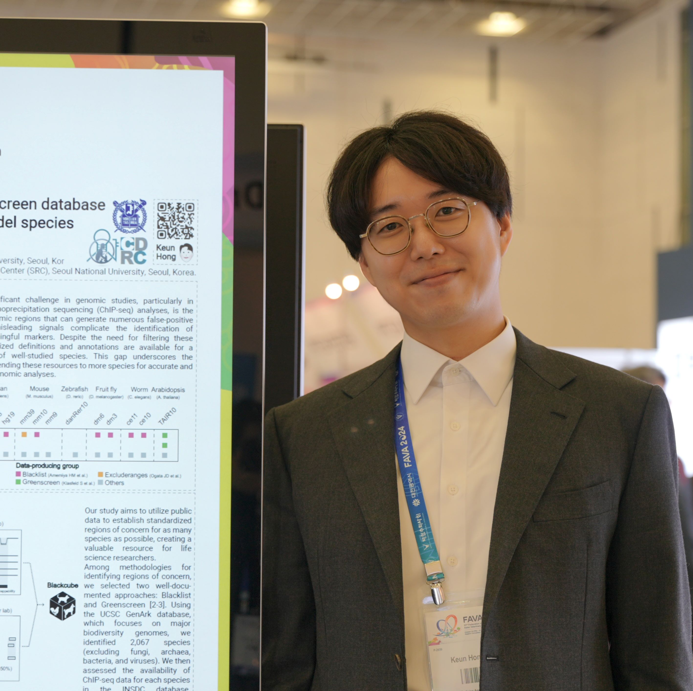

<head>
    <meta charset="UTF-8">
    <meta name="viewport" content="width=device-width, initial-scale=1.0">
    <title>News - Responsive Layout</title>
    
</head>
<body>

    <!-- Instagram Gallery -->
    

        
        
        
        <!---->
        
        
        
        
        <!---->
        <!---->
        
        
    

    <!-- Twitter Embed -->
    

        <blockquote class="twitter-tweet">
            
Exciting news! Our lab’s latest paper in @ScienceAdvances on mapping the dog epigenome is out 🐕🎶! Close collaboration with my co-first authors...

            
        </blockquote>
        
    

</body>
