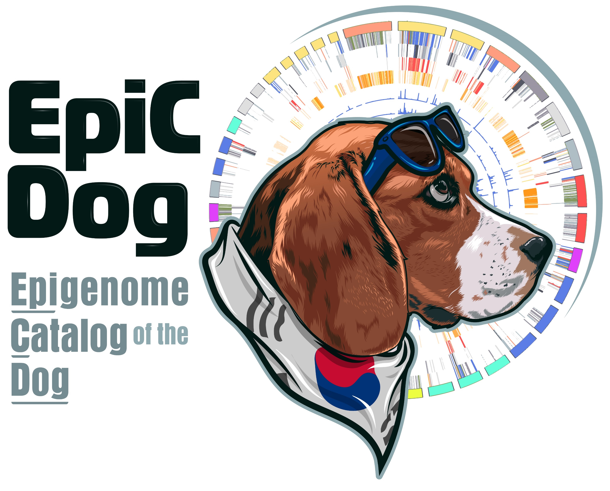
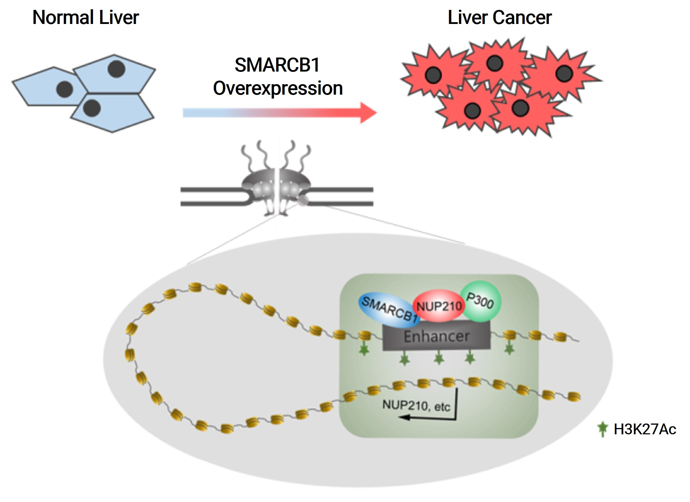
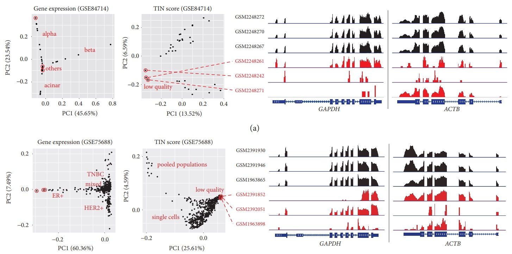

<!-- CSS -->
<h3>Research Interests</h3> 

    <ul>
        <li>Cancer Biology (Tumor Ecology)
        
tumor evolution, tumor microenvironment
</li>
        <li>Comparative Biology (Cancer & Aging)
        
cross-species multi-omics (genomics, epigenomics, proteomics)
</li>
        <li>Stem Cell Engineering
        
organoids, assembloids, extracellular matrix (ECM)
</li>
    </ul> 
    <h3>Education</h3>
    <ul>
        <li>Ph.D., Bioinformatics and cancer biology (2019 - )
        
Seoul National University Veterinary Medicine, Seoul, Republic of Korea Advisor: Prof.Je-Yeol Cho
</li>
        <li>MS, Bioinformatics (2016 - 2018)
        
Dankook University, Cheonan, Republic of Korea Advisor: Prof. Keunsoo Kang
</li>
        <li>BS, Microbiology (2010 -2016)
        
Dankook University, Cheonan, Republic of Korea
</li>
    </ul> 
    <h3>Honors & Awards</h3>
    <ul>
        <li>Young Scientist Award (2022), KSMCB 2022</li>
        <li>Thesis Presentation (2022), SNU College of Veterinary Medicine ERD Day</li>
    </ul> 

    <h3>First-Authored Publications</h3>

    
    

    <strong class="special-text">Integrative mapping of the dog epigenome: reference annotation for comparative intertissue and cross-species studies</strong>  
    <strong>Son KH*</strong>, Aldonza MBD*, Nam AR*, Lee K, Lee J, Shin K, Kang K, &amp; Cho J&#8224;. 
    <strong><em>Science Advances.</em></strong> 2023 (<a href="https://www.science.org/doi/10.1126/sciadv.ade3399">Article</a>, <a href="https://www.science.org/doi/epdf/10.1126/sciadv.ade3399">PDF</a>)
    

    
    

    <strong class="special-text">Nucleoporin 210 Serves a Key Scaffold for SMARCB1 in Liver Cancer</strong>  
    Hong SH*, <strong>Son KH*</strong>, Ha SY, Wee  TI, Choi SK, Won JE, Han HD, Ro Y, Park Y, Eun JW, Nam SW, Han J, Kang K, &amp; You JS&#8224;. 
    <strong><em>Cancer Research.</em></strong> 2021 (<a href="https://aacrjournals.org/cancerres/article/81/2/356/648678/Nucleoporin-210-Serves-a-Key-Scaffold-for-SMARCB1">Article</a>, <a href="https://watermark.silverchair.com/356.pdf?token=AQECAHi208BE49Ooan9kkhW_Ercy7Dm3ZL_9Cf3qfKAc485ysgAAAq4wggKqBgkqhkiG9w0BBwagggKbMIIClwIBADCCApAGCSqGSIb3DQEHATAeBglghkgBZQMEAS4wEQQMAzOIhwS0TWN0ciuWAgEQgIICYYJOMDTAAaQbaeAbArnxFmeex1EOop1d9TNHCvLEePjeJjBBfdn_JVxfq76RJod_qK1uMtPhryFjzwfhy-igweWuMT8z2YBIl3ZCNSRgiJX3ph2X_5CxnByACCaCrp4Sdr0-3zU9gu00dot9g8il8_1NJX3h050usSrRJ1Zq5NeOg-BNO8H3EjWKspL42vdqJRt39yZ88YEnNj5NL1t4t-pLBilKwDCzqihNypuD6Ud84ezczrQIOQ27NhCZdqmUXf-7fM10-S6Zjddfa1eTVv_1cOw0XqaKpRnTX6a-wzNuk-MdfLXz3asTDdMQCY_yBQtnnZ7HNz0gHN2AVG5abDI9mnArLpAfu30lmNAsPoDNlXIAHTVPz2YmgZ9Gh3d09im3ytOW1SQsAMeQeZOwxJyM7VJVN9nAZLQUu2dLUkRd8il7B3NGXllGyd7uYt5Y3adCCMHOmqTirxS-Rmqw8zUTYE58fFHr8yrqie0LF0S6rLTjuNDE81NHktqtY77YvEh8QrtMwhEXSDPih0tpyfzYrkjr5yt6oEHbcnGHTEGPiev1REkDv8-P5hLZIHtV56fSvBDyCr-t-RfTg-fNs_9bkS1erbqv_-Ea-_59b5IhruM4FHnhPT1OmnCULTHV7w2uafYltD7BlJX1KSyJANM5Ds5HIdykTDlp_R2W-C-I2wRBPgAr-ThnLwqbNhB7DINcH1vE_-GRcvvWyOkYBBUurDeeGdRhuV8EIK1hHv46Ve-PHUKiZ0tgXT1ebMXfgVm6FRe8Bz-6dGVhOZ1pAs2OzjUAGPCtI9FanLFUXLY7DQ">PDF</a>)
    

    
    

    <strong class="special-text">A Simple Guideline to Assess the Characteristics of RNA-Seq Data</strong>  
    <strong>Son K*</strong>, Yu S, Shin W, Han K, &amp; Kang K&#8224;. 
    <strong><em>Biomed Res Int.</em></strong> 2018 (<a href="https://www.hindawi.com/journals/bmri/2018/2906292/">Article</a>, <a href="https://downloads.hindawi.com/journals/bmri/2018/2906292.pdf">PDF</a>)
    

    <h3>Co-Authored Publications</h3>

    <strong>Extracellular vesicle-mediated transfer of miR-1 from primary tumor repress distant metastasis growth</strong> 
    

    Kim H<em>*</em>, Lee K, <strong>Son KH</strong>, Shin T, &amp; Cho J&#8224;. 
    <strong><em>bioRxiv.</em></strong> 2023 (<a href="https://www.biorxiv.org/content/10.1101/2023.05.19.541440v1.full">Article</a>)
    

    <strong>ADAR1-dependent miR-3144-3p editing simultaneously induces MSI2 expression and suppresses SLC38A4 expression in liver cancer</strong> 
    

    Kim HS<em>*</em>, Na MJ<em>*</em>, <strong>Son KH</strong>, Yang HD, Kim SY, Shin E, Ha JW, Jeon S, Kang K, Moon K, Park WS, &amp; Nam SW&#8224;. 
    <strong><em>Exp Mol Med.</em></strong> 2023 (<a href="https://www.nature.com/articles/s12276-022-00916-8">Article</a>, <a href="https://www.nature.com/articles/s12276-022-00916-8.pdf">PDF</a>)
    

    <strong>Senescence and impaired DNA damage responses in alpha-synucleinopathy models</strong> 
    

    Yoon Y<em>*</em>, You JS<em>*</em>, Kim T, Ahn WJ, Kim MJ, <strong>Son KH</strong>, Ricarte D, Ortiz D, Lee S&#8224;, &amp; Lee H&#8224;. 
    <strong><em>Exp Mol Med.</em></strong> 2022 (<a href="https://www.nature.com/articles/s12276-022-00727-x">Article</a>, <a href="https://www.nature.com/articles/s12276-022-00727-x.pdf">PDF</a>)
    

    <strong>SMARCA4 oncogenic potential via IRAK1 enhancer to activate Gankyrin and AKR1B10 in liver cancer</strong> 
    

    Kim SY<em>*</em>, Shen Q, <strong>Son K</strong>, Kim HS, Yang HD, Na MJ, Shin E, Yu S, Kang K, You JS, Yu K, Jeong SM, Lee EK, Ahn YM, Park WS, &amp; Nam SW&#8224;. 
    <strong><em>Oncogene.</em></strong> 2021 (<a href="https://www.nature.com/articles/s41388-021-01875-6">Article</a>, <a href="https://www.nature.com/articles/s41388-021-01875-6.pdf">PDF</a>)
    

    <strong>Transcriptome Signatures of Canine Mammary Gland Tumors and Its Comparison to Human Breast Cancers</strong> 
    

    Lee K<em>*</em>, Park H<em>*</em>, <strong>Son K</strong>, Shin T, &amp; Cho J&#8224;. 
    <strong><em>Cancers (Basel).</em></strong> 2018 (<a href="https://www.mdpi.com/2072-6694/10/9/317">Article</a>, <a href="https://www.mdpi.com/2072-6694/10/9/317/pdf?version=1536322358">PDF</a>)
    

    <a href="https://www.researchgate.net/profile/Keun-Hong-Son">ResearchGate</a> 
    <a href="https://loop.frontiersin.org/people/2356993/overview">Loop</a>

