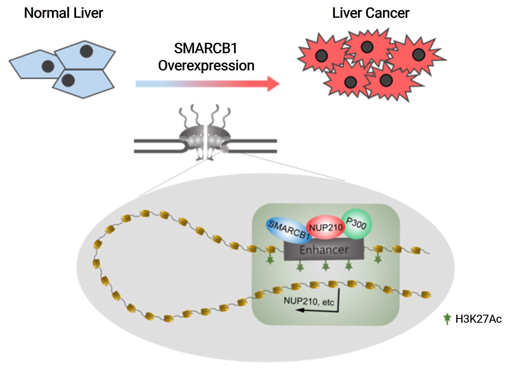

    <h3>Research Focus</h3>

  

    <h3>First-Authored Publications</h3>

    
    

    <strong class="special-text">Gencube: Centralized retrieval and integration of multi-omics resources from leading databases</strong> 
    <strong>Son KH&#8224;</strong> &amp; Cho J*. 
    <strong><em>Bioinformatics.</em></strong> 2025 (<a href="https://doi.org/10.1093/bioinformatics/btaf128" target="_blank" style="color: inherit; ">Article</a>, <a href="https://academic.oup.com/bioinformatics/advance-article-pdf/doi/10.1093/bioinformatics/btaf128/63011550/btaf128.pdf" target="_blank" style="color: inherit; ">PDF</a>) 
    
        
        
    
    

    
    

    <strong class="special-text">Integrative mapping of the dog epigenome: reference annotation for comparative intertissue and cross-species studies</strong> 
    <strong>Son KH&#8224;</strong>, Aldonza MBD&#8224;, Nam AR&#8224;, Lee K, Lee J, Shin K, Kang K, &amp; Cho J*. 
    <strong><em>Science Advances.</em></strong> 2023 (<a href="https://www.science.org/doi/10.1126/sciadv.ade3399" target="_blank" style="color: inherit; ">Article</a>, <a href="https://www.science.org/doi/epdf/10.1126/sciadv.ade3399" target="_blank" style="color: inherit; ">PDF</a>) 
    Featured in <strong><em><a href="https://www.eurekalert.org/news-releases/994987" target="_blank" style="color: inherit; ">Eureka Alert</a></em></strong>, <strong><em><a href="https://www.ibric.org/bric/hanbitsa/treatise.do?mode=treatise-view&id=88641&authorId=41749#!/list" target="_blank" style="color: inherit; ">BRIC한빛사</a></em></strong>
    
        
        
    
    
    

    
    

    <strong class="special-text">Nucleoporin 210 Serves a Key Scaffold for SMARCB1 in Liver Cancer</strong> 
    Hong SH&#8224;, <strong>Son KH&#8224;</strong>, Ha SY, Wee  TI, Choi SK, Won JE, Han HD, Ro Y, Park Y, Eun JW, Nam SW, Han J, Kang K, &amp; You JS*. 
    <strong><em>Cancer Research.</em></strong> 2021 (<a href="https://aacrjournals.org/cancerres/article/81/2/356/648678/Nucleoporin-210-Serves-a-Key-Scaffold-for-SMARCB1" target="_blank" style="color: inherit; ">Article</a>, <a href="https://watermark.silverchair.com/356.pdf?token=AQECAHi208BE49Ooan9kkhW_Ercy7Dm3ZL_9Cf3qfKAc485ysgAAAq4wggKqBgkqhkiG9w0BBwagggKbMIIClwIBADCCApAGCSqGSIb3DQEHATAeBglghkgBZQMEAS4wEQQMAzOIhwS0TWN0ciuWAgEQgIICYYJOMDTAAaQbaeAbArnxFmeex1EOop1d9TNHCvLEePjeJjBBfdn_JVxfq76RJod_qK1uMtPhryFjzwfhy-igweWuMT8z2YBIl3ZCNSRgiJX3ph2X_5CxnByACCaCrp4Sdr0-3zU9gu00dot9g8il8_1NJX3h050usSrRJ1Zq5NeOg-BNO8H3EjWKspL42vdqJRt39yZ88YEnNj5NL1t4t-pLBilKwDCzqihNypuD6Ud84ezczrQIOQ27NhCZdqmUXf-7fM10-S6Zjddfa1eTVv_1cOw0XqaKpRnTX6a-wzNuk-MdfLXz3asTDdMQCY_yBQtnnZ7HNz0gHN2AVG5abDI9mnArLpAfu30lmNAsPoDNlXIAHTVPz2YmgZ9Gh3d09im3ytOW1SQsAMeQeZOwxJyM7VJVN9nAZLQUu2dLUkRd8il7B3NGXllGyd7uYt5Y3adCCMHOmqTirxS-Rmqw8zUTYE58fFHr8yrqie0LF0S6rLTjuNDE81NHktqtY77YvEh8QrtMwhEXSDPih0tpyfzYrkjr5yt6oEHbcnGHTEGPiev1REkDv8-P5hLZIHtV56fSvBDyCr-t-RfTg-fNs_9bkS1erbqv_-Ea-_59b5IhruM4FHnhPT1OmnCULTHV7w2uafYltD7BlJX1KSyJANM5Ds5HIdykTDlp_R2W-C-I2wRBPgAr-ThnLwqbNhB7DINcH1vE_-GRcvvWyOkYBBUurDeeGdRhuV8EIK1hHv46Ve-PHUKiZ0tgXT1ebMXfgVm6FRe8Bz-6dGVhOZ1pAs2OzjUAGPCtI9FanLFUXLY7DQ" target="_blank" style="color: inherit; ">PDF</a>) 
    Featured in <strong><em><a href="https://www.youtube.com/watch?v=Z9S5iFksCXg" target="_blank" style="color: inherit; ">F&P partners</a></em></strong>, <strong><em><a href="https://m.dhnews.co.kr/news/view/179522668215231" target="_blank" style="color: inherit; ">e대학저널</a></em></strong>
    
        
    
    

    
    

    <strong class="special-text">A Simple Guideline to Assess the Characteristics of RNA-Seq Data</strong> 
    <strong>Son K&#8224;</strong>, Yu S, Shin W, Han K, &amp; Kang K*. 
    <strong><em>Biomed Res Int.</em></strong> 2018 (<a href="https://www.hindawi.com/journals/bmri/2018/2906292/" target="_blank" style="color: inherit; ">Article</a>, <a href="https://downloads.hindawi.com/journals/bmri/2018/2906292.pdf" target="_blank" style="color: inherit; ">PDF</a>)
    
        
    
    

    <h3>Co-Authored Publications</h3>

    <strong>CEBPD Regulates CD47 and MAP4K4 via Chromatin Accessibility in Canine Mammary Tumor Monocytes</strong> 
    

    Lee J&#8224;, Lee D, Shin K, <strong>Son KH</strong>, &amp; Cho J*. 
    <strong><em>Sci. Pep.</em></strong> 2025 (accepted)
    

    <strong>Extracellular vesicle-mediated transfer of miRNA-1 from primary tumor repress distant metastasis growth</strong> 
    

    Kim C&#8224;, Lee K, <strong>Son KH</strong>, Shin T, &amp; Cho J*. 
    <strong><em>Exp Mol Med.</em></strong> 2024 (<a href="https://www.nature.com/articles/s12276-024-01181-7" target="_blank" style="color: inherit; ">Article</a>, <a href="https://www.nature.com/articles/s12276-024-01181-7.pdf" target="_blank" style="color: inherit; ">PDF</a>)
    

    <strong>ADAR1-dependent miR-3144-3p editing simultaneously induces MSI2 expression and suppresses SLC38A4 expression in liver cancer</strong> 
    

    Kim HS&#8224;, Na MJ&#8224;, <strong>Son KH</strong>, Yang HD, Kim SY, Shin E, Ha JW, Jeon S, Kang K, Moon K, Park WS, &amp; Nam SW*. 
    <strong><em>Exp Mol Med.</em></strong> 2023 (<a href="https://www.nature.com/articles/s12276-022-00916-8" target="_blank" style="color: inherit; ">Article</a>, <a href="https://www.nature.com/articles/s12276-022-00916-8.pdf" target="_blank" style="color: inherit; ">PDF</a>)
    

    <strong>Senescence and impaired DNA damage responses in alpha-synucleinopathy models</strong> 
    

    Yoon Y&#8224;, You JS&#8224;, Kim T, Ahn WJ, Kim MJ, <strong>Son KH</strong>, Ricarte D, Ortiz D, Lee S*, &amp; Lee H*. 
    <strong><em>Exp Mol Med.</em></strong> 2022 (<a href="https://www.nature.com/articles/s12276-022-00727-x" target="_blank" style="color: inherit; ">Article</a>, <a href="https://www.nature.com/articles/s12276-022-00727-x.pdf" target="_blank" style="color: inherit; ">PDF</a>)
    

    <strong>SMARCA4 oncogenic potential via IRAK1 enhancer to activate Gankyrin and AKR1B10 in liver cancer</strong> 
    

    Kim SY&#8224;, Shen Q, <strong>Son K</strong>, Kim HS, Yang HD, Na MJ, Shin E, Yu S, Kang K, You JS, Yu K, Jeong SM, Lee EK, Ahn YM, Park WS, &amp; Nam SW*. 
    <strong><em>Oncogene.</em></strong> 2021 (<a href="https://www.nature.com/articles/s41388-021-01875-6" target="_blank" style="color: inherit; ">Article</a>, <a href="https://www.nature.com/articles/s41388-021-01875-6.pdf" target="_blank" style="color: inherit; ">PDF</a>)
    

    <strong>Transcriptome Signatures of Canine Mammary Gland Tumors and Its Comparison to Human Breast Cancers</strong> 
    

    Lee K&#8224;, Park H&#8224;, <strong>Son KH</strong>, Shin T, &amp; Cho J*. 
    <strong><em>Cancers (Basel).</em></strong> 2018 (<a href="https://www.mdpi.com/2072-6694/10/9/317" target="_blank" style="color: inherit; ">Article</a>, <a href="https://www.mdpi.com/2072-6694/10/9/317/pdf?version=1536322358" target="_blank" style="color: inherit; ">PDF</a>)
    

