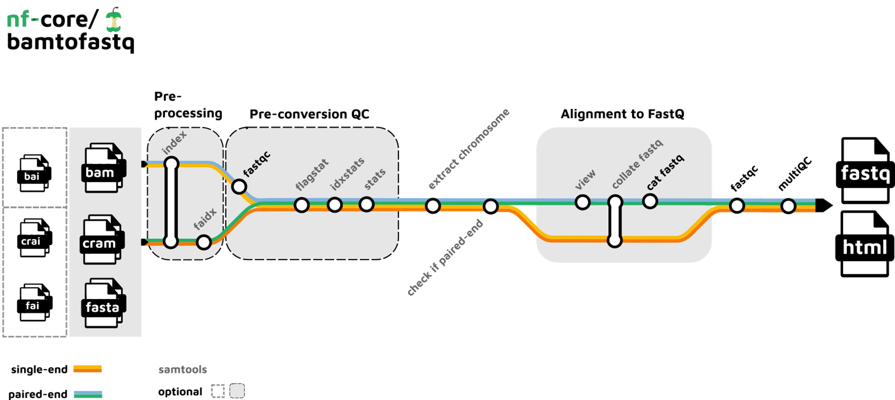
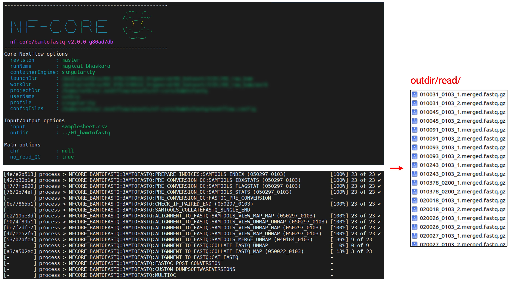

If you've ever downloaded public NGS data from databases like TCGA or ICDC (refer the previous post), you know that these usually come in a "bam" format. While bam is great, sometimes you need to flex your bioinformatic muscles and run these datasets through a custom pipeline. This usually means converting bam to the fastq format. Today, I'll instroduce this transformation process using the incredible nf-core pipeline powered by Nextflow.

### Nextflow and nf-core

**Nextflow** [Nature methods](https://www.nature.com/articles/s41592-021-01254-9)

- **Snapshot**: Your one-stop-shop for designing and deploying data-driven computational workflows.
- **Pros**: Highly flexible, ensures reproducibility, offers intuitive scripting, scales efficiently, has robust error-handling, and seamlessly integrates with Git and GitHub.

**nf-core** [Nature Biotechnology](https://www.nature.com/articles/s41587-020-0439-x)

- **Snapshot**: The bioinformatics community—bringing you top-tier, peer-reviewed analysis pipelines crafted in Nextflow.
- **Learn More?** Here's a [tutorial](https://carpentries-incubator.github.io/workflows-nextflow/#:~:text=Nextflow%20is%20workflow%20management%20software,Docker%2C%20Singularity%2C%20and%20Conda) to get you started!

### Pipeline summary

Alright, let's get down to the nitty-gritty. Here's a step-by-step summary of the [nf-core/bamtofastq](https://nf-co.re/bamtofastq) pipeline:



<div style="font-size: 20px;">
1. Quality control (QC) of input (bam/cram) files (FastQC).<br>
2. Check if input files are single- or paired-end (Samtools).<br>
3. Compute statistics on input files (Samtools).<br>
4. Convert to fastq reads (Samtools).<br>
5. QC of converted fastq reads (FastQC).<br>
6. Summarize QC and statistics before and after format conversion (MultiQC).
</div>

### How to Convert BAM to FASTQ?

[Docs: Installation](https://nf-co.re/docs/usage/installation)

For the uninitiated, transitioning from BAM to FASTQ might sound like a daunting task. Fret not! Here's a detailed guide using the nf-core pipeline.

1. **Setting Up the Environment**:
   Before the conversion, you'll need to set up your bioinformatics environment. Let's begin with installing Nextflow using the conda environment:
   **a. Configure Conda Channels**
   First, I'll assume you're using the conda environment.
   Run these commands to add the necessary channels:
   
   ```shell
   conda config --add channels defaults
   conda config --add channels bioconda
   conda config --add channels conda-forge
   ```
   
    **b. Create and Activate the Conda Environment**
    Now, let's create a new conda environment and activate it:
   
   ```shell
   conda create --name env_nf nextflow
   conda activate env_nf
   ```

2. **Install Singularity**
   Singularity is the container of choice for this pipeline. A quick heads up - the Singularity version can significantly influence the success of your pipeline execution.
   
   **a. Choose the Right Version**
   My tests showed that the version of Singularity is crucial. For me, the most downloaded version in [conda-forge/singularity/files](https://anaconda.org/conda-forge/singularity/files) was error-free.
   
   **b. Install Singularity**
   Here's how I did it with version singularity-3.8.6:
   
   ```shell
   # version 3.8.6
   wget https://anaconda.org/conda-forge/singularity/3.8.6/download/linux-64/singularity-3.8.6-h9c2343c_0.tar.bz2
   conda install singularity-3.8.6-h9c2343c_0.tar.bz2
   ```

3. **Preparing Your Input**
   
   Before you can run the pipeline, you'll need an input file. Here's how you can generate one:
   
   ```shell
   # Ensure you're in the directory containing your bam files
   echo "sample_id,mapped,index,file_type" > samplesheet.csv
   for bam in *.bam;do pre=${bam%.bam}
       echo "${pre},${bam},,bam" >> samplesheet.csv
   done
   ```
   
   Your input file will resemble the format shown in this
   
   ```tex
   sample_id,mapped,index,file_type
   010015_0103,010015_0103.bam,,bam
   010031_0103,010031_0103.bam,,bam
   010031_0200,010031_0200.bam,,bam
   010045_0103,010045_0103.bam,,bam
   010072_0103,010072_0103.bam,,bam
   010091_0103,010091_0103.bam,,bam
   ```

4. **Run the pipeline!!**
   
   Finally, it's time to run the pipeline:
   
   ```shell
   nextflow run nf-core/bamtofastq \
       -profile singularity \
       --input samplesheet.csv \
       --outdir ../01_bamtofastq \
       --no_read_QC
   ```
   
   I encountered an issue with the singularity image pull for FastQC. So, I bypassed this step using the --no_read_QC option.
   
   As the pipeline runs, you'll see key information and progress updates. Depending on your sample's size and count, the process might take a few hours. But, in the end, your much-awaited FASTQ files will be ready!



---

### Details of the Conversion Steps

**2. Check if input files are single- or paired-end (Samtools).**

Here's a simple way to check using `samtools`:

1. **View the first few reads in the file**:
   
   ```shell
   samtools view your_file.bam | head
   ```

2. **Inspect the flags**: The second column in the output represents the bitwise flag for each read. If the read is paired-end, the flag will contain the value `1` in its bitwise representation.
   However, to programmatically determine if a file is primarily single-end or paired-end, you can use the following approach:
   
   ```shell
   samtools view your_file.bam | \
       awk '{if(and($2,1)) print "paired-end"; else print "single-end";}' | \
       sort | uniq -c
   ```
   
   This command will give you a count of single-end vs. paired-end reads. If the vast majority of reads are one type, that defines the sequencing type for the dataset. Note that in rare cases, there may be a mix, **but typically a sequencing run will produce one type or the other.**
   
   Keep in mind, however, that this method only checks a small subset of reads. For a more definitive assessment, a larger subset or even the entire file may need to be checked.

**4. Convert to fastq reads (Samtools).**

1. **samtools collate**: `samtools collate` is used to reorder reads in a BAM file such that paired-end reads are adjacent. This is especially useful when you need to process the BAM file in a way that requires the pairs to be together, such as converting to FASTQ.
   
   ```shell
   samtools collate input.bam output.prefix
   ```
   
   This will generate a BAM file named `output.prefix.bam` in which paired-end reads are adjacent.

2. **samtools fastq**:
   Once you have your BAM file with paired-end reads adjacent (either from `samtools collate` or if you are certain they are already ordered), you can then use `samtools fastq` to convert it to FASTQ format.
   
   Usage for single-end reads:
   
   ```shell
   samtools fastq input.bam > output.fastq
   ```
   
   Usage for paired-end reads:
   
   ```shell
   samtools fastq -1 output_1.fastq -2 output_2.fastq input.bam
   ```
   
   Here, `-1` specifies the output file for the first read of each pair, and `-2` specifies the output file for the second read.
   
   In conclusion, `samtools collate` is useful for reordering paired-end reads in a BAM file, and `samtools fastq` is used for the actual conversion of BAM to FASTQ. Always ensure your reads are properly ordered before trying to convert to FASTQ, especially for paired-end data.
