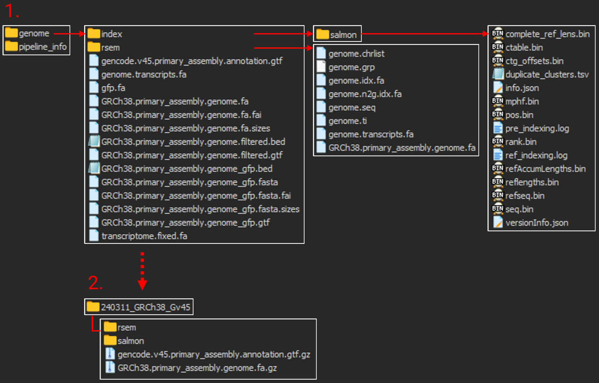

--

Link: [**nf-core rnaseq pipeline**](https://nf-co.re/rnaseq)

### 1. Download the reference genome and genome annotation files

Link: [**GENCODE**](https://www.gencodegenes.org/#)

```bash
# Reference genome file
address='https://ftp.ebi.ac.uk/pub/databases/gencode/Gencode_human/release_45'
wget $address/GRCh38.primary_assembly.genome.fa.gz
wget $address/gencode.v45.primary_assembly.annotation.gtf.gz
```

### 2. Prepare the alignment index

```bash
# Activate the nf-core environment
conda activate env_nf

# Indexing
fasta="GRCh38.primary_assembly.genome.fa.gz"
gtf="gencode.v45.primary_assembly.annotation.gtf.gz"
outdir="out_index"

nextflow run nf-core/rnaseq -profile singularity \
        -r 3.14.0 \
        --input samplesheet.csv \
        --outdir $outdir \
        --fasta $fasta --gtf $gtf \
        --gencode --aligner star_rsem \
        --save_reference \
        --skip_qc --skip_multiqc --skip_trimming \
        --skip_alignment --skip_pseudo_alignment

## --save_reference: save the indices generated
## --skip_*: skip steps except for indexing
```

**Output folders structure** 



1. Output folders including indices generated

2. A folder restructured for future pipeline runs

### 3. Prepare a samplesheet

```bash
# Move to raw file folder
cd ${path}/00_raw

# Make samplesheet file
echo 'sample,fastq_1,fastq_2,strandedness' > samplesheet.csv
for fq in *_1.fq.gz;do \
    pre=${fq%%_1.fq.gz}\
    echo "${pre},${pre}_1.fq.gz,${pre}_2.fq.gz,auto" >> samplesheet_n79.csv\
done
```

### 4. Run the RNA-seq pipeline

```bash
idx="${path}/240311_GRCh38_Gv45/"
outdir="../out_result"

nextflow run nf-core/rnaseq -profile singularity -r 3.14.0 \
        --input samplesheet.csv \
        --outdir $outdir \
        --fasta $idx/*.fa.gz --gtf $idx/*.gtf.gz \
        --rsem_index $idx/rsem/ --salmon_index $idx/salmon/ \
        --gencode --aligner star_rsem
```

### 5. Result folder structure

Link: [**rnaseq: Results**](https://nf-co.re/rnaseq/3.14.0/results/rnaseq/results-b89fac32650aacc86fcda9ee77e00612a1d77066)