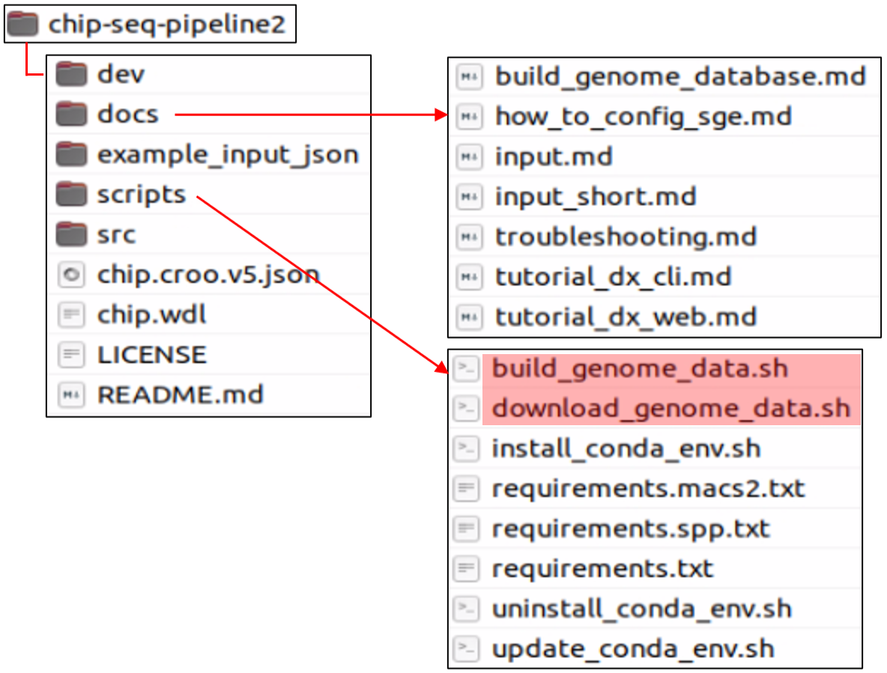

Link: [**GitHub - ENCODE3 ChIP-seq pipeline**](https://github.com/ENCODE-DCC/chip-seq-pipeline2?tab=readme-ov-file) & [**Google Docs**](https://docs.google.com/document/d/1lG_Rd7fnYgRpSIqrIfuVlAz2dW1VaSQThzk836Db99c/edit#heading=h.9ecc41kilcvq)

****

### 1. Install miniconda & create conda environment

[Miniconda installation](https://docs.anaconda.com/free/miniconda/index.html)

```bash
# Install miniconda
mkdir -p ~/miniconda3
wget https://repo.anaconda.com/miniconda/Miniconda3-latest-Linux-x86_64.sh -O ~/miniconda3/miniconda.sh
bash ~/miniconda3/miniconda.sh -b -u -p ~/miniconda3
rm -rf ~/miniconda3/miniconda.sh

# Initialize your newly-installed Miniconda
~/miniconda3/bin/conda init bash
~/miniconda3/bin/conda init zsh

# Clone the pipeline.
git clone https://github.com/ENCODE-DCC/chip-seq-pipeline2
```

**Structure of downloaded folder**



```bash
# Install pipeline's Conda environment
bash scripts/uninstall_conda_env.sh  # to remove any existing pipeline env
bash scripts/install_conda_env.sh

# Activate created environment
conda activate encd-chip
```

### 2. Prepare genome data

Refer the 'buid_genome_database.md' file.

```bash
# Choose 'GENOME' from hg38, hg19, mm10 and mm9 and
# specify a destination directory.
# ex) bash scripts/build_genome_data.sh [GENOME] [DESTINATION_DIR]
bash scripts/build_genome_data.sh hg38 encode_genome_hg38
```

### 3. Pipeline setup

```bash
# 1. Install Caper.
pip install caper

# 2. Choose a backend for your system.
caper init local #or slurm, sge, pbs lsf

# 4. Define test input JSON.
INPUT_JSON="https://storage.googleapis.com/encode-pipeline-test-samples/encode-chip-seq-pipeline/ENCSR000DYI_subsampled_chr19_only.json"

# 5. Check if Singularity works on your machine
singularity exec docker://ubuntu:latest echo hello

# 6. Run the test input
caper run chip.wdl -i "${INPUT_JSON}" --singularity --max-concurrent-tasks 1
## --max-concurrent-tasks 1: for computers with limited resources (local)
```

### 4. Prepare input JSON file

```json
# Example of input JSON format
{
    "chip.title" : "ChIP_A",
    "chip.description" : "ChIP_A",

    "chip.pipeline_type" : "histone",
    "chip.aligner" : "bowtie2",
    "chip.align_only" : false,
    "chip.true_rep_only" : false,

    "chip.genome_tsv" : "encd-genome_hg38/hg38.tsv",

    "chip.paired_end" : true,
    "chip.ctl_paired_end" : true,
    "chip.always_use_pooled_ctl" : true,

    "chip.fastqs_rep1_R1" : [ "ChIP_A_1.fq.gz" ],
    "chip.fastqs_rep1_R2" : [ "ChIP_A_2.fq.gz" ],

    "chip.ctl_fastqs_rep1_R1" : [ "input_1.fq.gz" ],
    "chip.ctl_fastqs_rep1_R2" : [ "input_2.fq.gz" ],
}
```

### 5. Run the pipeline

```bash
for fq in *_1.fq.gz;do
    pre=${fq%_1.fq.gz}
    caper run chip.wdl -i ${pre}.json --singularity
done
```

### Reference

[2304_bRx) The ENCODE Uniform Analysis Pipelines](https://www.biorxiv.org/content/10.1101/2023.04.04.535623v1.full)