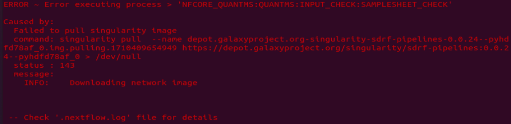
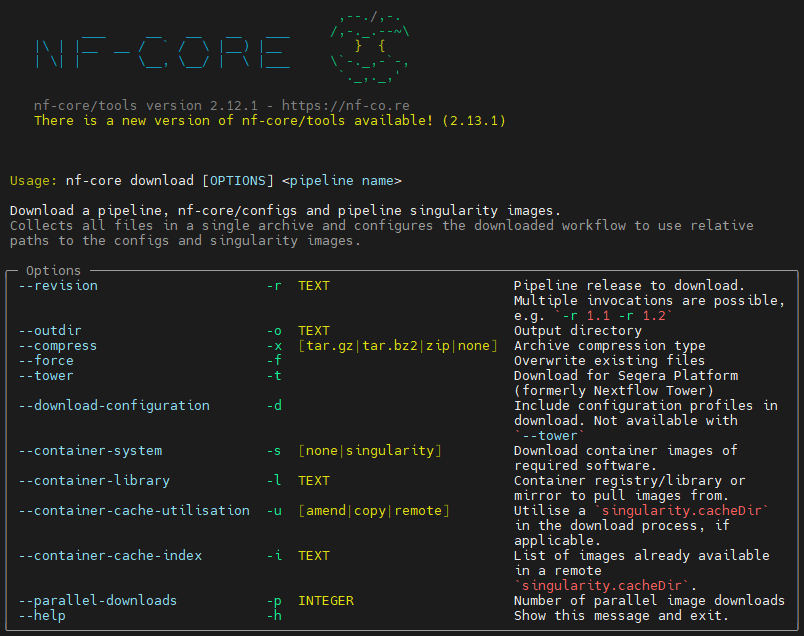
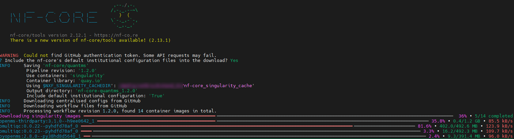

When running nf-core pipelines for the first time, I frequently encounter errors while pulling the Singularity image.



Therefore, I perform the process of downloading the images separately before executing the pipeline.

Link: [**nf-core download**](https://nf-co.re/tools#downloading-pipelines-for-offline-use)

```bash
# 1. Choose the folder where singularity images are saved.
path="nf-core_singularity_cache"
echo "export NXF_SINGULARITY_CACHEDIR='${path}'" > ~/.bashrc
source ~/.bashrc

# 2. Install nf-core in conda environment
conda install bioconda::nf-core

# 3. Check usage and options.
nf-core download --help
```



```bash
# 4. Download Singularity images of a pipeline
# Usage: nf-core download [OPTIONS] <pipeline name>
nf-core download quantms -r 1.2.0 -d -x none -s singularity -u amend
```

