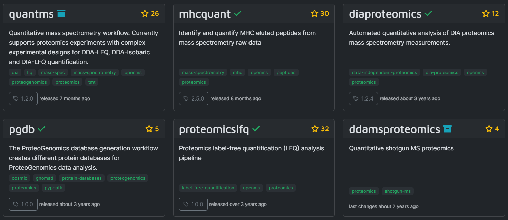

### Types of Proteomic Data:

1. **Mass Spectrometry Data**: The most common type of data in proteomics, which includes information about the mass-to-charge (m/z) ratio and intensity of detected ions that represent peptides or proteins.

2. **Peptide Sequencing Data**: Derived from MS/MS or tandem MS data, it provides sequences of peptides based on the fragmentation pattern observed in the mass spectrometer.

3. **Protein Identification Data**: Information about the proteins identified from the mass spectrometry data, often including a confidence score or probability.

4. **Quantitative Proteomics Data**: Data indicating the abundance of peptides/proteins across samples or conditions, which can be either label-free or label-based.

5. **Post-translational Modifications (PTMs) Data**: Information on chemical modifications that proteins may undergo after synthesis, like phosphorylation or glycosylation.

6. **Proteogenomics Data**: Combines proteomics data with genomic or transcriptomic data to provide a more comprehensive view of protein expression and regulation.

7. **Protein-Protein Interaction Data**: Information on the interactions between proteins, which can be obtained through techniques like co-immunoprecipitation followed by mass spectrometry.

8. **Protein Structure Data**: 3D structural data of proteins obtained through methods like X-ray crystallography or cryo-electron microscopy, but not typically through mass spectrometry.

#### Label-Free Quantification (LFQ):

LFQ is a method in mass spectrometry-based proteomics that enables the quantification of proteins without the need to label or modify them chemically. It's based on the intensity of the MS signals of peptides identified from the proteins in different samples.

#### DDA-LFQ:

DDA stands for **Data-Dependent Acquisition**. In this method, the mass spectrometer selects the most abundant precursor ions from a survey scan for fragmentation and further MS/MS analysis. DDA-LFQ uses this approach for protein identification and then quantifies the proteins based on the intensity of the precursor ions in a label-free manner.

#### DDA-Isobaric Labeling:

This method uses isobaric tags (like TMT or iTRAQ) to label peptides. In DDA, specific precursor ions are selected for MS/MS analysis. The fragmentation releases the isobaric tags, allowing for quantification of peptides/proteins across different samples in a multiplexed fashion.

### DIA-LFQ:

DIA stands for **Data-Independent Acquisition**. Unlike DDA, DIA doesn't select specific precursor ions. Instead, it systematically fragments ions within a given mass range. This approach generates a more comprehensive dataset as it is not limited to the most abundant species. DIA-LFQ quantifies proteins based on the intensity of all fragmented ions in the mass range.

### Pipelines in nf-core

1. [**quantms**](https://nf-co.re/quantms): This is a quantitative mass spectrometry workflow that supports proteomics experiments with complex experimental designs. It can be used for DDA-LFQ, DDA-Isobaric (e.g., TMT, iTRAQ), and DIA-LFQ quantification. It would be suitable for various types of mass spectrometry experiments.
   

2. **proteomicslfq**: A pipeline specifically for proteomics label-free quantification analysis. It's intended for researchers looking to perform LFQ without the use of isobaric tag labels. It can process and analyze data obtained from an Orbitrap mass spectrometer or any other high-resolution MS instrument.

3. **mhcquant**: Designed to identify and quantify MHC eluted peptides from mass spectrometry raw data. This pipeline would be particularly relevant to immunopeptidomics, which is the study of peptides presented by MHC molecules, useful in immunology and cancer research.

4. **diaproteomics**: Focused on the automated quantitative analysis of DIA proteomics mass spectrometry measurements. This pipeline is for DIA workflows, which systematically fragment ions within a certain mass range instead of selecting specific precursor ions for fragmentation.

5. **pgdb**: The ProteoGenomics database generation workflow creates different protein databases for ProteoGenomics data analysis. It is useful when integrating proteomics data with genomic data for a comprehensive analysis.

6. **ddamsproteomics**: This pipeline is for quantitative shotgun MS proteomics. Shotgun proteomics is an approach where proteins are digested into peptides and then analyzed via mass spectrometry to identify and quantify the proteins in a sample.

This article was written with help from ChatGPT v4.