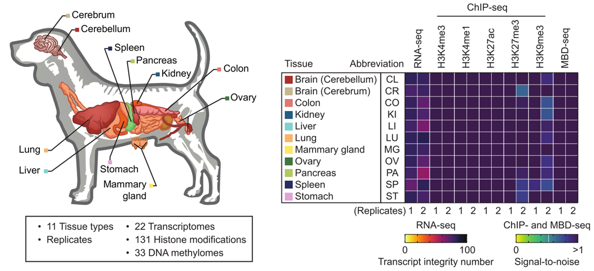

**Chromatin states** in the field of epigenomics refer to <u>the organization and modification of chromatin</u>, which is a complex of DNA and proteins found in cells. These states play a crucial role in regulating gene expression and can influence various cellular processes. Understanding chromatin states is essential in epigenomics, as they provide <u>insights into how genetic information is regulated and expressed in different cellular contexts.</u>

### List of representative paper

#### Human

[1502_N) Integrative analysis of 111 reference human epigenomes]()

**111 tissues/cell lines**

#### Mouse

[2007_N) An atlas of dynamic chromatin landscapes in mouse fetal development](https://www.nature.com/articles/s41586-020-2093-3)

**12 tissues, 8 developmental stages**

#### Dog

[2307_SciAdv) Integrative mapping of the dog epigenome: Reference annotation for comparative intertissue and cross-species studies](https://www.science.org/doi/full/10.1126/sciadv.ade3399?rfr_dat=cr_pub++0pubmed&url_ver=Z39.88-2003&rfr_id=ori%3Arid%3Acrossref.org)

**11 tissues from beagle breed**

#### Farm animals

[2102_Ncom) Pig genome functional annotation enhances the biological interpretation of complex traits and human disease](https://www.nature.com/articles/s41467-021-26153-7?proof=tExtended)

**14 tissues**

[2104_Ncom) A compendium and comparative epigenomics analysis of cis-regulatory elements in the pig genome](https://www.nature.com/articles/s41467-021-22448-x#Sec11)

**12 tissues from four pig breeds**

[2103_Ncom) Functional annotations of three domestic animal genomes provide vital resources for comparative and agricultural research](https://www.nature.com/articles/s41467-021-22100-8)

**8 tissues from Chicken, Pig & Cattle**

#### Rice

[2005_Ncom) Integrative analysis of reference epigenomes in 20 rice varieties](https://www.nature.com/articles/s41467-020-16457-5)

**20 varieties**

#### Wheat

[1907_GB) The bread wheat epigenomic map reveals distinct chromatin architectural and evolutionary features of functional genetic elements](https://genomebiology.biomedcentral.com/articles/10.1186/s13059-019-1746-8)

#### Comparative

[2105_Ncom) Epigenomic profiling of primate lymphoblastoid cell lines reveals the evolutionary patterns of epigenetic activities in gene regulatory architectures](https://www.nature.com/articles/s41467-021-23397-1)

**Lymphoblastoid cell lines from five primates**

[2111_SciAdv) Evolutionary epigenomic analyses in mammalian early embryos reveal species-specific innovations and conserved principles of imprinting](https://www.science.org/doi/10.1126/sciadv.abi6178)
**Embryos from five species**

#### Disease

[2103_Ncom) Integrative pan cancer analysis reveals epigenomic variation in cancer type and cell specific chromatin domains](https://www.nature.com/articles/s41467-021-21707-1)

**9 cancer cell lines, 4 histone marks**

[2104_Ncom) Epigenomic landscape of human colorectal cancer unveils an aberrant core of pan-cancer enhancers orchestrated by YAP/TAZ](https://www.nature.com/articles/s41467-021-22544-y)

**Colorectal cancer oragnoids**

[1901_CanC) Comprehensive Analysis of Chromatin States in Atypical Teratoid/Rhabdoid Tumor Identifies Diverging Roles for SWI/SNF and Polycomb in Gene Regulation](https://www.sciencedirect.com/science/article/pii/S153561081830535X)

**Atypical teratoid rhabdoid tumors (ATRT)**

This article was written with help from ChatGPT v4.