**Chromatin states** in the field of epigenomics refer to <u>the organization and modification of chromatin</u>, which is a complex of DNA and proteins found in cells. These states play a crucial role in regulating gene expression and can influence various cellular processes. Understanding chromatin states is essential in epigenomics, as they provide <u>insights into how genetic information is regulated and expressed in different cellular contexts.</u>

### List of representative paper

#### Human

**111 tissues/cell lines** - [1502_N) Integrative analysis of 111 reference human epigenomes](https://www.nature.com/articles/nature14248)

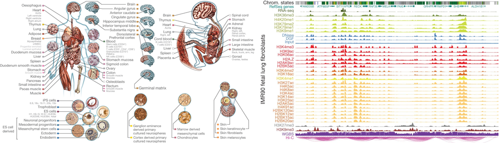

#### Mouse

**12 tissues, 8 developmental stages** - [2007_N) An atlas of dynamic chromatin landscapes in mouse fetal development](https://www.nature.com/articles/s41586-020-2093-3)

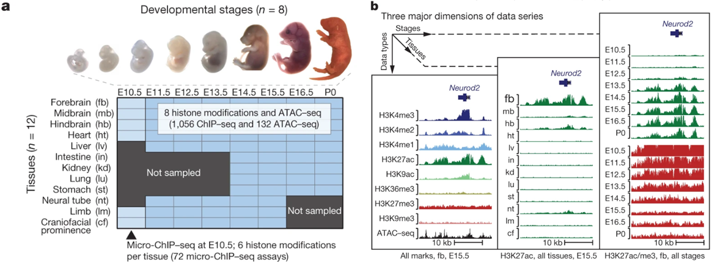

**123 cell types and primary tissues** - [1411_N) A comparative encyclopedia of DNA elements in the mouse genome](https://www.nature.com/articles/nature13992)

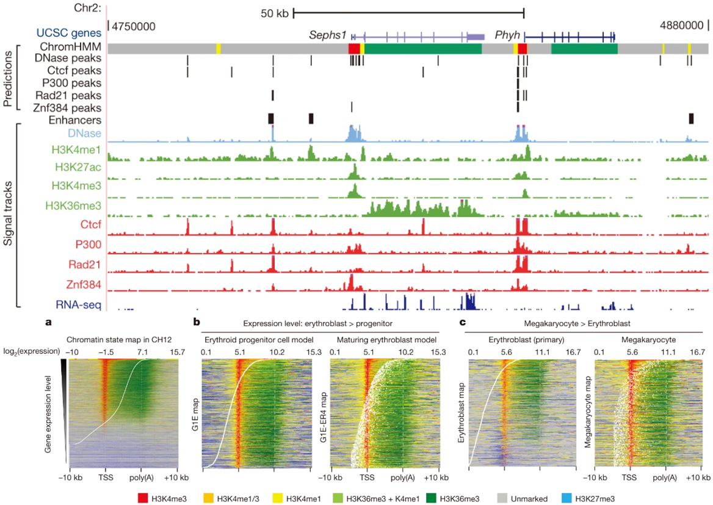

#### Dog

**11 tissues from beagle breed** - [2307_SciAdv) Integrative mapping of the dog epigenome: Reference annotation for comparative intertissue and cross-species studies](https://www.science.org/doi/full/10.1126/sciadv.ade3399?rfr_dat=cr_pub++0pubmed&url_ver=Z39.88-2003&rfr_id=ori%3Arid%3Acrossref.org)

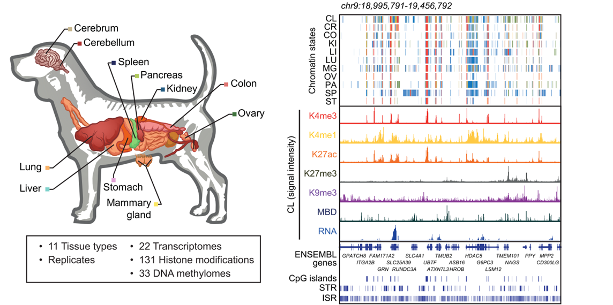

#### Farm animals - Pig, Cattle & Chicken

**14 tissues from a pig breed** - [2102_Ncom) Pig genome functional annotation enhances the biological interpretation of complex traits and human disease](https://www.nature.com/articles/s41467-021-26153-7?proof=tExtended)

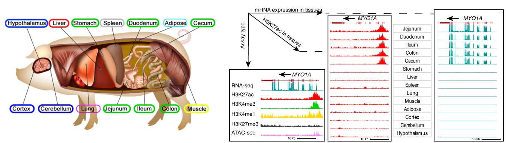

**12 tissues from four pig breeds** - [2104_Ncom) A compendium and comparative epigenomics analysis of cis-regulatory elements in the pig genome](https://www.nature.com/articles/s41467-021-22448-x#Sec11)

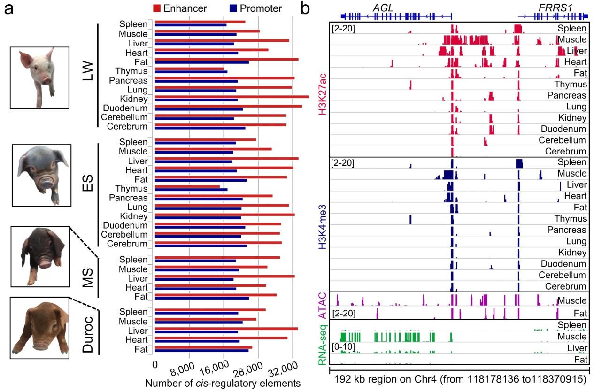

**23 tissues from Chicken** - [2305_SciAdv) An atlas of regulatory elements in chicken: A resource for chicken genetics and genomics](https://www.science.org/doi/10.1126/sciadv.ade1204)

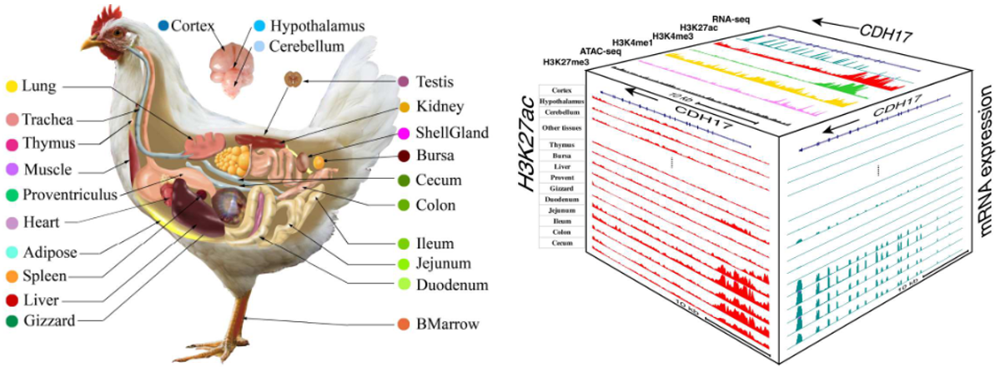

**Eight tissues from Pig, Cattle & Chicken** - [2103_Ncom) Functional annotations of three domestic animal genomes provide vital resources for comparative and agricultural research](https://www.nature.com/articles/s41467-021-22100-8)

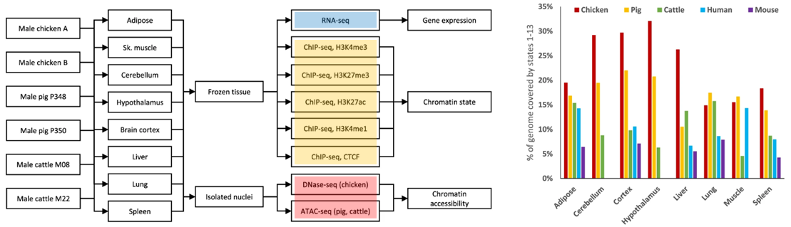

#### Grains - Rice & Wheat

**20 varieties of rice** - [2005_Ncom) Integrative analysis of reference epigenomes in 20 rice varieties](https://www.nature.com/articles/s41467-020-16457-5)

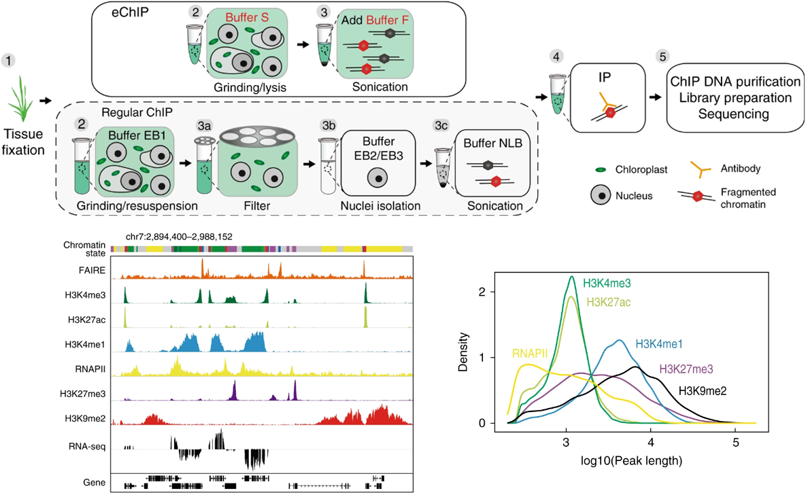

**Wheat** - [1907_GB) The bread wheat epigenomic map reveals distinct chromatin architectural and evolutionary features of functional genetic elements](https://genomebiology.biomedcentral.com/articles/10.1186/s13059-019-1746-8)

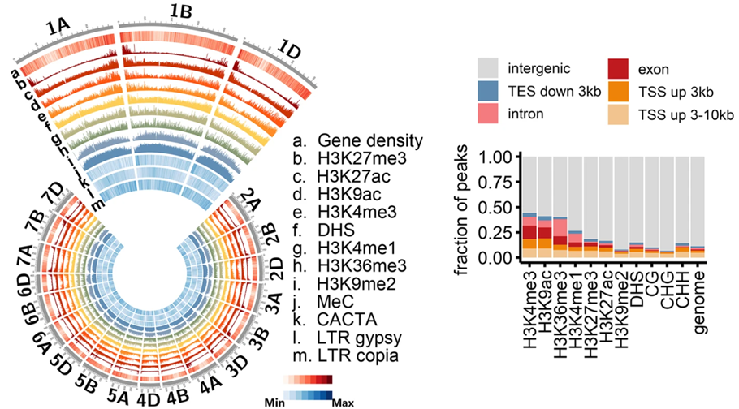

**Tomato** - [2407_PNAS) An atlas of the tomato epigenome reveals that KRYPTONITE shapes TAD-like boundaries through the control of H3K9ac distribution](https://www.pnas.org/doi/10.1073/pnas.2400737121)

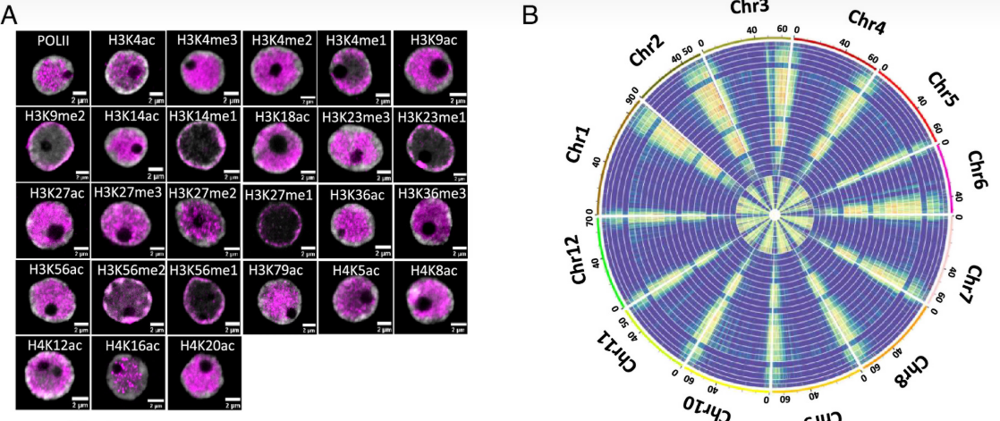

#### Comparative

**Lymphoblastoid cell lines from five primates** - [2105_Ncom) Epigenomic profiling of primate lymphoblastoid cell lines reveals the evolutionary patterns of epigenetic activities in gene regulatory architectures](https://www.nature.com/articles/s41467-021-23397-1)

**Embryos from five species** - [2111_SciAdv) Evolutionary epigenomic analyses in mammalian early embryos reveal species-specific innovations and conserved principles of imprinting](https://www.science.org/doi/10.1126/sciadv.abi6178)

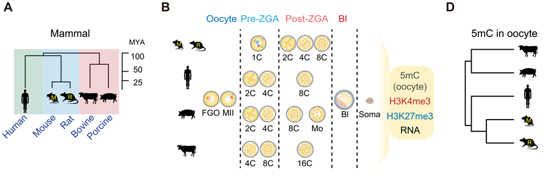

#### Disease

**Nine cancer cell lines, four histone marks** - [2103_Ncom) Integrative pan cancer analysis reveals epigenomic variation in cancer type and cell specific chromatin domains](https://www.nature.com/articles/s41467-021-21707-1)

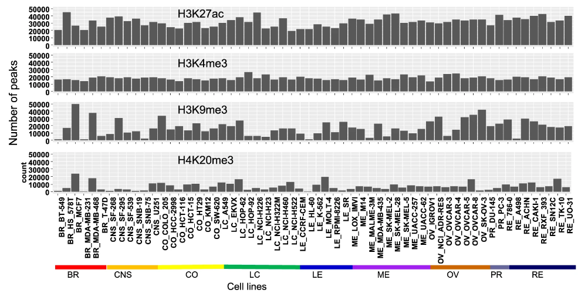

**Colorectal cancer oragnoids** - [2104_Ncom) Epigenomic landscape of human colorectal cancer unveils an aberrant core of pan-cancer enhancers orchestrated by YAP/TAZ](https://www.nature.com/articles/s41467-021-22544-y)

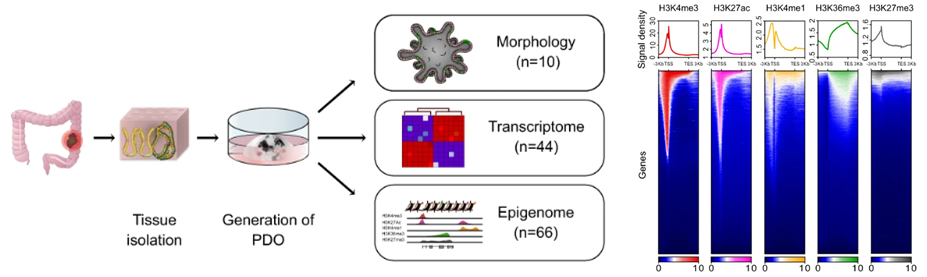

**Atypical teratoid rhabdoid tumors (ATRT)** - [1901_CanC) Comprehensive Analysis of Chromatin States in Atypical Teratoid/Rhabdoid Tumor Identifies Diverging Roles for SWI/SNF and Polycomb in Gene Regulation](https://www.sciencedirect.com/science/article/pii/S153561081830535X)

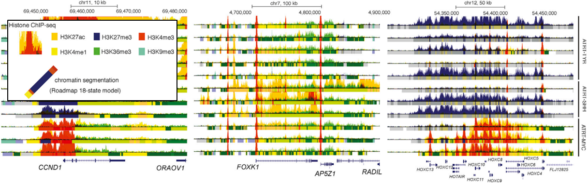