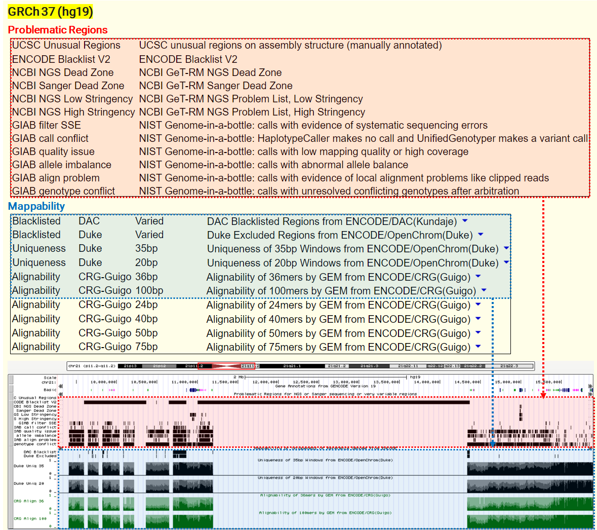
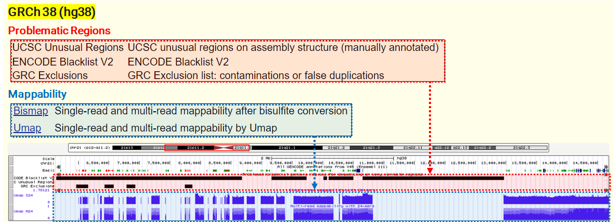

In my [previous post](https://keun-hong.github.io/bioinformatics/encode-blacklist/), we delved into the concept of Blacklist regions in genomes. Expanding on this, today's focus is on broader "Problematic Regions" and the crucial concept of "Mappability" in genomic analysis.

### Why problematic regions matter in genomic analysis

The reference genome, including repetitive sequences, structural anomalies, sequence homology and errors, presents unique challenges when mapping short-length reads. These challenges significantly impact critical analyses, such as variant calling and peak calling, influencing the reliability of genomic interpretations.

### Diverse approaches to annotate problematic regions

Various esteemed organizations have employed different methodologies to delineate "Problematic Regions" in genomes. This diversity in approach reflects the complexity and critical nature of accurately identifying these regions.

**Exploring the problematic regions track in UCSC genome browser**

Both GRCh38/hg38 & GRCh37/hg19

- **UCSC Unusual Regions**: Annotations collected over the years at UCSC, including well-known gene clusters (IGH, IGL, PAR1/2, TCRA, TCRB, etc) and other elements that often yield low-quality mapping scores and discordant read pairs, particularly in short-read sequencing data.
- [**ENCODE Blacklist**](https://github.com/Boyle-Lab/Blacklist/blob/master/lists/hg19-blacklist-README.pdf): A comprehensive set of regions problematic for NGS aligners, characterized by high multi-mapping ratios and mappability variance.

GRCh38/hg38

- **GRC Exclusions**: Regions flagged by the GRC (Genome Reference Consortium) for containing false duplications or contamination sequences, with a masking file.

GRCh37/hg19

- [**Genome-In-A-Bottle (GIAB)**](https://www.nist.gov/programs-projects/genome-bottle): Defined regions where making confident calls is difficult due to issues like low coverage and local alignment problems.
- **NCBI GeT-RM**: Contains gene- and exon-level regions challenging for standard sequencing methods, relevant for clinical testing.

### Mappability: A key measure in genomic sequencing

Mappability indicates the likelihood that a short DNA sequence read from sequencing experiments will align to a single, unique location on the reference genome. High mappability means a sequence can be mapped with high confidence to a specific location, while low mappability suggests ambiguity in aligning the sequence, often due to the presence of similar or repetitive sequences in the genome.

Mappability is a crucial metric in genomic sequencing, offering insights into <mark>how effectively short-read sequences can be mapped to the reference genome.</mark> It encompasses aspects like **alignability** and **uniqueness**, which are pivotal for accurate genomic interpretation.

- **Alignability**: This measure reflects how often a sequence at a particular location aligns within the whole genome when <mark>allowing for a small number of mismatches, typically up to two.</mark> This tolerance for mismatches is crucial as it accounts for minor sequencing errors or polymorphisms, providing a more realistic view of how sequencing data will map to the reference genome in practice. Alignability scores close to 1 suggest that a sequence is likely to align uniquely, while scores closer to 0 may indicate a problematic region where reads could align to multiple locations.

- **Uniqueness**: In contrast to alignability, uniqueness is a strict measure that assesses whether a sequence is found only once in the entire reference genome, without any mismatches. High uniqueness scores mean that reads are likely to map to only one location, facilitating accurate read placement and subsequent analyses like variant calling. Low uniqueness can lead to ambiguity in read mapping, which is particularly problematic in regions with high sequence similarity or repetitive DNA.

Understanding and incorporating mappability into genomic analysis helps prevent misinterpretation of sequencing data, particularly in regions where the reference genome may not perfectly represent the diversity of natural genetic variation.

### UCSC tracks for Problematic Regions and Mappability

under the GRCh37/hg19 assembly

under the GRCh38/hg38 assembly

Understanding problematic regions and mappability is crucial for accurate genomic analysis. These concepts help us navigate the complexities of genomic sequencing, ensuring more reliable and precise interpretations.

### Reference

[UCSC Problematic Regions tracks (GRCh38/hg38)](https://genome.ucsc.edu/cgi-bin/hgTrackUi?hgsid=2085777710_cG7fOciiX5UkBnNjpWwmGeAaLMw7&g=problematicSuper&hgTracksConfigPage=configure) [UCSC Problematic Regions tracks (GRCh37/hg19)](https://genome.ucsc.edu/cgi-bin/hgTrackUi?hgsid=2085772932_rUYMafXlv64Lk7kLe4ozMEQcJpNr&g=problematic&hgTracksConfigPage=configure) [UCSC Mappability tracks (GRCh38/hg38)](https://genome.ucsc.edu/cgi-bin/hgTrackUi?hgsid=2085964354_bgEjxal88GxBb7DP8Amw5PKsI1WH&db=hg38&c=chr21&g=mappability) [UCSC Mappability tracks (GRCh37/hg19)](https://genome.ucsc.edu/cgi-bin/hgTrackUi?hgsid=2085772932_rUYMafXlv64Lk7kLe4ozMEQcJpNr&db=hg19&c=chr21&g=wgEncodeMapability)

 

This article was written with help from ChatGPT v4.