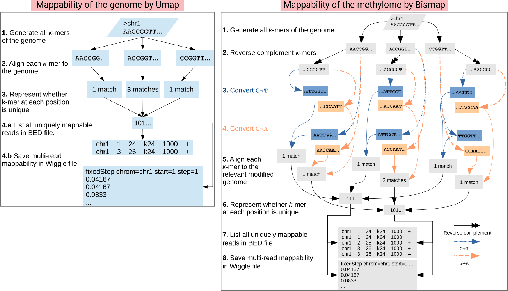
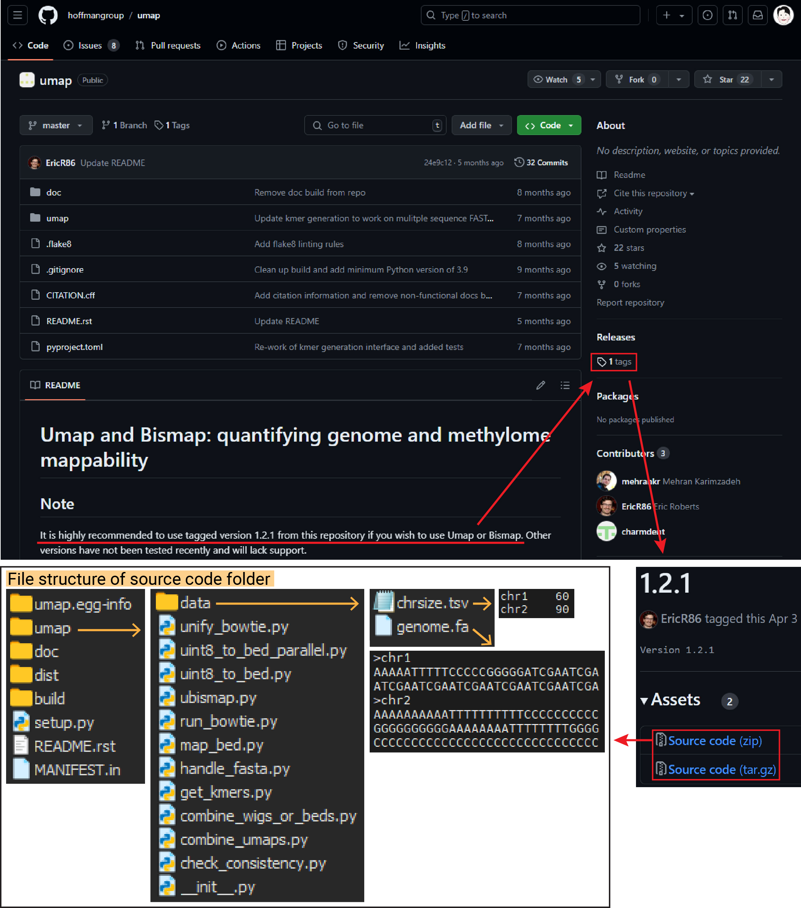
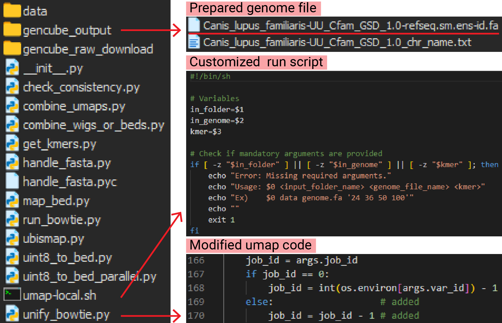
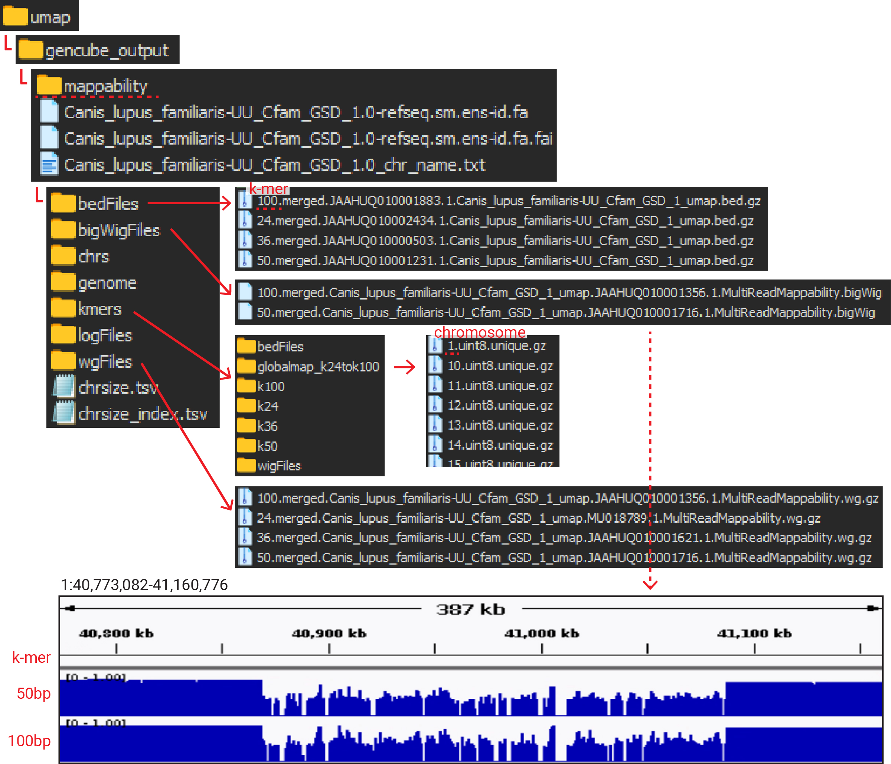

In my previous posts, we explored the concept of [problematic regions](https://keun-hong.github.io/bioinformatics/problematic-regions/) in genomes, such as [the blacklist](https://keun-hong.github.io/bioinformatics/encode-blacklist/), and how understanding mappability was important for creating these blacklists. Therefore, in this post, I have outlined the concept of genome mappability and the process of calculating it using the Umap tool. <mark>Mappability is a key metric in genomics, especially when working with data from short-read sequencing.</mark> While long-read sequencing is becoming increasingly popular, short-read sequencing remains the standard, and the majority of publicly available data is generated from this method.

## What is genome mappability?

To grasp the concept of mappability, let's refer to the abstract from [Karimzadeh M. et. al. (2018) Umap and Bismap: quantifying genome and methylome mappability. Nucleic Acids Research](https://academic.oup.com/nar/article/46/20/e120/5086676):

"Every region in a genome assembly has a property called ‘mappability,’ which <mark>measures the extent to which it can be uniquely mapped by sequence reads</mark>. <mark>In regions of lower mappability, estimates of genomic and epigenomic characteristics from sequencing assays are less reliable</mark>. These regions have increased susceptibility to spurious mapping from reads from other regions of the genome with sequencing errors or unexpected genetic variation.”

## **Why use Umap?**

While several tools are available for calculating mappability, this post will focus on Umap, a tool capable of calculating both genome and methylome mappability.



## How to use Umap?

### 1. Setup

**1) Download the source code**

Umap’s latest version is v1.2.1, and the source code can be downloaded from the [GitHub page (hoffmangroup/umap)](https://github.com/hoffmangroup/umap) through the tags. You can also understand the file structure from the image below. 



**2) Create separated conda environment**

Since Umap is compatible only with Python 2.7, create a separate environment in Conda as follows:

```bash
$ conda create --name py2_env python=2.7
$ conda activate py2_env
```

**3) Requirements (tools & python packages)**

To ensure Umap functions correctly, install the followings:

```bash
$ pip install argparse numpy pandas  # Python packages required for Umap
$ pip install gencube                # For downloading genome assembly files

$ sudo apt update                    # Install GNU parallel for multi-threading
$ sudo apt install parallel

$ conda install bioconda::samtools   # For genome indexing
$ conda install bioconda::bowtie     # For k-mer reads mapping
```

**4) Code modification for error resolution**

While working with Umap, I encountered an error that required a small code modification. The necessary changes are as follows:

```python
# Original Code
167 if job_id == 0:
168        job_id = int(os.environ[args.var_id]) - 1

# Modified/added Code
169    else:                   # added
170        job_id = job_id - 1 # added
```

**5) Download customized run script.**

The scripts generated by **ubismap.py** are designed with the assumption that you are using a `Sun Grid Engine cluster`, which is a type of computing cluster that manages job scheduling and resource allocation using the Sun Grid Engine workload manager. However, if you need to run it on a local workstation, you must modify the scripts.

The author provided guidance on how to modify the script for `SLURM`, another workload manager similar to Sun Grid Engine but also capable of running on local PCs. Since I preferred a simpler solution, I wrote a script to run using `parallel` instead. I’ve uploaded the customized script to GitHub ([keun-hong/umap-local](https://github.com/keun-hong/umap-local)). **Download the file and place it in the Umap folder.**

```bash
# Clone the repository and modify script permission
$ git clone https://github.com/keun-hong/umap-local.git
$ chmod +x umap-local/umap-local.sh

# Display usage instructions
$ ./umap-local/umap-local.sh
Error: Missing required arguments.
Usage: ./umap-local/umap-local.sh <input_folder_name> <genome_file_name> <kmer>
Ex)    ./umap-local/umap-local.sh data genome.fa '24 36 50 100'
```

### 2. Run the customized script

**1) Prepare genome assembly**

Using the [Gencube tool](https://github.com/snu-cdrc/gencube), you can easily download the desired genome with a single command. By running the command below to download the dog genome (canFam4), the necessary file for mappability calculation will be prepared, as shown in the below image.

```bash
# Download the genome assembly
gencube genome GCF_011100685.1 --download

# Decompress the downloaded genome file
gzip -d gencube_output/*.fa.gz
```



**2) Run the customized script**

```bash
input_folder_name="gencube_output"
genome_file_name="Canis_lupus_familiaris-UU_Cfam_GSD_1.0-refseq.sm.ens-id.fa"

$ ./umap-local.sh  $input_folder_name $genome_file_name '24 36 50 100'
```

### 3. Outputs

I used 22 threads, and the mappability calculation for the dog genome (approx. 2.5 Gb) took about 30 hours in total, resulting in the following output.

