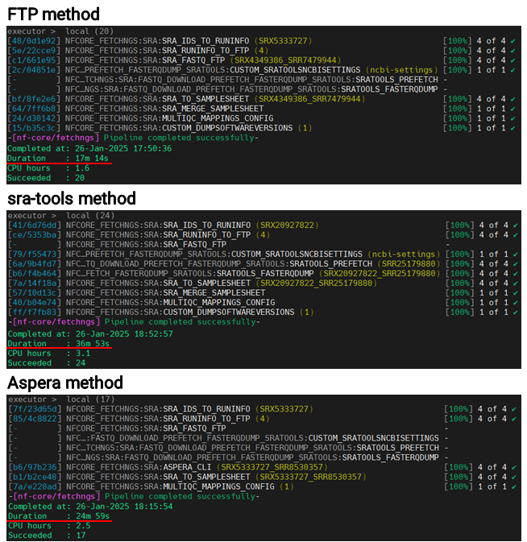
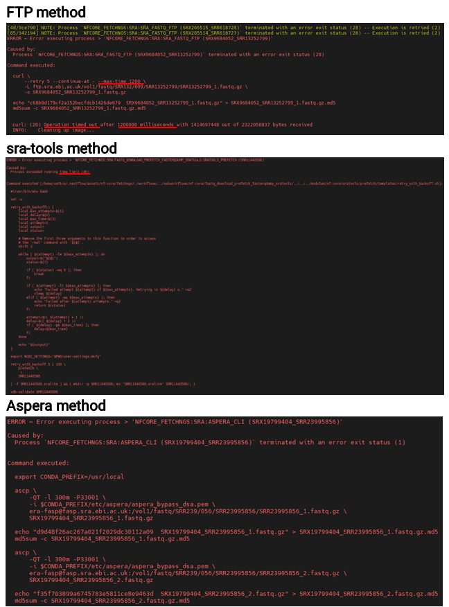
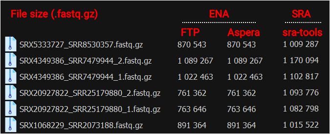
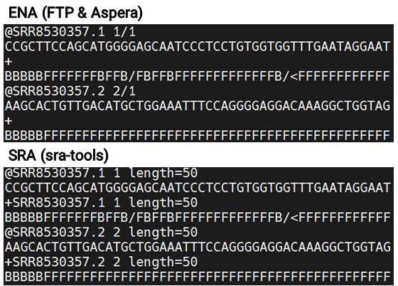

In my [previous post](https://keun-hong.github.io/bioinformatics/how-to-download-ngs-data/), I discussed several methods for downloading public NGS data, including the nf-core/fetchngs pipeline. This pipeline provides three retrieval options—FTP, Aspera, and sra-tools—and in today’s post, we’ll examine how each one differs in terms of performance and the types of errors you might encounter.

### Retrieval Methods in nf-core/fetchngs

1. **FTP (default)**
2. **Aspera** (`--download_method aspera`)
3. **sra-tools** (`--download_method sratools`)

When using FTP or Aspera, compressed FASTQ files (`fastq.gz`) are fetched from the ENA database. If you opt for the sra-tools method, `sra` files are downloaded from the SRA database and then converted into FASTQ format.

### Performance

I compared the three methods by measuring download speeds for four datasets—two single-end and two paired-end—each of similar size. Because the sra-tools approach involves first downloading `.sra` files and then converting them to `.fastq`, it ended up taking relatively more time. In scenarios with smaller datasets, FTP turned out to be somewhat quicker, but for large-scale downloads, the <mark>Aspera method consistently delivered faster performance</mark>.



### Errors

I tried all the methods, but I frequently ran into errors. The FTP and sra-tools methods produced time limit errors (20 minutes and 4 hours, respectively) due to the set time constraints. With fixed time limits like these, I concluded that downloading large files would be difficult. As for the Aspera method, I’m not entirely sure what caused the error, but I suspect unstable network connectivity might be to blame.



### What's the best method

I experienced the most errors with the Aspera method, but it also provided the fastest download speeds. By repeatedly running the pipeline with the `-resume` option, I was ultimately able to retrieve all the data. As shown in the example below, I ran the pipeline in a `for` loop to ensure every dataset was downloaded. For any items that still failed under Aspera, switching to FTP or sra-tools successfully completed the process.

```bash
for i in {1..50};do 
    echo "!! Iteration: "$i
    nextflow run nf-core/fetchngs \
        -profile singularity \
        --input ids.csv \
        --outdir 00_raw \
        -r 1.12.0 \
        --download_method aspera \
        -resume
done
```

### Additional Information

While comparing the methods, I noticed that file sizes differed between the ENA and SRA downloads. Curious whether this meant there were differences in the actual content, I checked the line counts, which turned out to be the same.



Upon further review, I confirmed that all key information matched, so there were no issues for analysis. Interestingly, the files from ENA were about 20% smaller on average, suggesting they could be more efficient for storage management.

