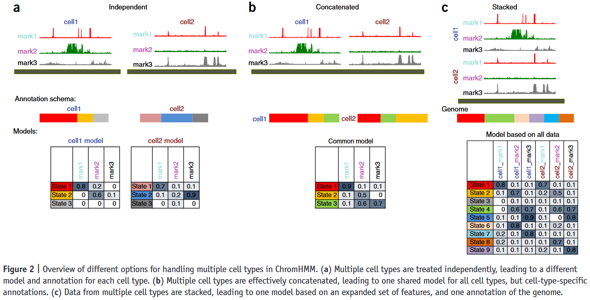

A variety of strategic tools for chromatin state segmentation have been developed over time. Among them, ChromHMM remains the most widely used and recognized. However, many other tools have been introduced to address its limitations, often offering superior performance under specific conditions.
Below is a comparative overview of these tools, highlighting their key features and reference citations.

### 🧠 Comparative Table of Epigenomic Segmentation Tools

| Tool           | Modeling Strategy                                     | Key Features                                                    | Strengths                                                                 | Limitations                                                     |
| -------------- | ----------------------------------------------------- | --------------------------------------------------------------- | ------------------------------------------------------------------------- | --------------------------------------------------------------- |
| **ChromHMM**   | Multivariate HMM + EM                                 | Learns chromatin states from binary histone mark data           | Fast, easy to use, interpretable, widely adopted                          | Assumes same state model across samples, no cross-cell modeling |
| **TreeHMM**    | Tree-structured HMM                                   | Models lineage relationships among cell types                   | Captures developmental hierarchy, improves accuracy for related cells     | Requires a known or assumed cell lineage tree                   |
| **GATE**       | Graph-aware HMM                                       | Integrates spatial proximity data (e.g., Hi-C)                  | Accounts for chromatin 3D structure                                       | Depends on high-quality Hi-C or interaction data                |
| **diHMM**      | Hierarchical HMM                                      | Models chromatin at both nucleosome and domain levels           | Multi-scale annotation of genome                                          | Computationally intensive, more complex training                |
| **CMINT**      | Bayesian mixture model                                | Jointly clusters cell types and learns chromatin states         | Handles cell type heterogeneity                                           | Model complexity, requires cluster number tuning                |
| **hiHMM**      | Hierarchical HMM                                      | Models shared and cell-specific states across cell types        | Captures both conserved and unique patterns                               | Assumes predefined hierarchical relationships                   |
| **IDEAS**      | 2D HMM (Bayesian, nonparametric)                      | Jointly models genome position × cell type dynamics explicitly  | Cross-cell comparison, flexible state sharing, state number auto-inferred | Complex model, higher computational cost                        |
| **Segway-GBR** | Dynamic Bayesian network + Graph-based regularization | Integrates genome annotation with 3D genome architecture (Hi-C) | Models long-range interactions                                            | Requires Hi-C and advanced setup                                |
| **STAN**       | Bayesian changepoint detection                        | Focuses on detecting domain boundaries                          | Effective for identifying sharp transitions                               | Not designed for general-purpose segmentation                   |
| **GenoSTAN**   | Poisson/Gaussian HMM                                  | Models read counts from ChIP-seq directly                       | Good for quantitative signal modeling                                     | Assumes statistical distributions; heavier computation          |
| **EpiCSeg**    | HMM + Count data                                      | Uses actual read counts instead of binarization                 | More accurate modeling of weak/moderate signals                           | Slower performance, harder to interpret                         |
| **Spectacle**  | Spectral learning-based HMM                           | Uses method-of-moments for fast parameter estimation            | Faster than EM, reduces overfitting to null states                        | Spectral method requires careful initialization                 |

### 📚 References for Each Tool

<mark>Tool name (citations; accessed July 1, 2025)</mark>

1. [**ChromHMM**](https://doi.org/10.1038/nmeth.1906) (n = 2702, 862)
   
   - Ernst J & Kellis M (2012) ChromHMM: automating chromatin-state discovery and characterization. *Nature Methods*
   
   - Ernst J & Kellis M (2017) Chromatin-state discovery and genome annotation with ChromHMM. *Nature Protocols*.

2. [**TreeHMM**](https://doi.org/10.1186/1471-2105-14-S5-S4) (n = 60)
   
   - Biesinger J et al. (2013) Discovering and mapping chromatin states using a tree hidden Markov model. *BMC Bioinformatics*.

3. [**GATE**](https://genome.cshlp.org/content/23/2/352) (n = 79)
   
   - Yu P et al. (2013) Spatiotemporal clustering of the epigenome reveals rules of dynamic gene regulation. *Genome Res*.

4. [**diHMM**](https://www.nature.com/articles/ncomms15011) (n = 52)
   
   - Marco E et al. (2017) Multi-scale chromatin state annotation using a hierarchical hidden Markov model. *Nat. Commun*.

5. [**CMINT**](https://genome.cshlp.org/content/27/7/1250.long) (n = 16)
   
   - Roy S & Sridharan R (2017) Chromatin module inference on cellular trajectories identifies key transition points and poised epigenetic states in diverse developmental processes. *Genome Res*.

6. [**hiHMM**](https://doi.org/10.1093/bioinformatics/btv117) (n = 53)
   
   - Sohn K-A et al. (2015) hiHMM: Bayesian non-parametric joint inference of chromatin state maps. *Bioinformatics*.

7. [**IDEAS**](https://doi.org/10.1093/nar/gkw278) (n = 103)
   
   - Zhang Y et al. (2016) Jointly characterizing epigenetic dynamics across multiple human cell types. *Nucleic Acids Res*.

8. [**Segway-GBR**](https://genome.cshlp.org/content/25/4/544.long) (n = 89)
   
   - Libbrecht MW et al. (2015) Joint annotation of chromatin state and chromatin conformation reveals relationships among domain types and identifies domains of cell-type-specific expression. *Genome Res*.

9. [**STAN**](https://doi.org/10.15252/msb.20145654) (n = 33)
   
   - Zacher B et al. (2014) Annotation of genomics data using bidirectional hidden Markov models unveils variations in Pol II transcription cycle. *Mol. Syst. Biol*.

10. [**GenoSTAN**](https://doi.org/10.1371/journal.pone.0169249) (n = 96)
    
    - Zacher B et al. (2017) Accurate promoter and enhancer identification in 127 ENCODE and roadmap epigenomics cell types and tissues by GenoSTAN. *PLoS ONE*.

11. [**EpiCSeg**](https://doi.org/10.1186/s13059-015-0708-z) (n = 103)
    - Mammana A & Chung H-R (2015) Chromatin segmentation based on a probabilistic model for read counts explains a large portion of the epigenome. *Genome Biol*.

12. [**Spectacle**](https://doi.org/10.1186/s13059-015-0598-0) (n = 55)
    - Song J & Chen KC (2015) Spectacle: fast chromatin state annotation using spectral learning. *Genome Biol*.