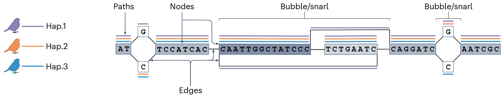

This post summarizes essential terms and techniques used in Telomere-to-Telomere (T2T) genome assembly and pangenome research, with concise definitions and reference illustrations

### What are the T2T assembly and Pangenome?

**T2T (Telomere-to-Telomere) assembly** refers to a complete, gapless genome assembly from one telomere to the other, including previously unresolved regions like centromeres and rDNA.

**Pangenome** is a comprehensive reference model that captures the full range of genomic diversity across individuals, populations, or species—going beyond a single linear reference.

### 🖥️ Sequencing & Assembly Techniques in T2T & Pangenomics

| **Technique**                                                      | **Definition**                                                                                                                          | **Purpose / Strengths**                                                                               |
| ------------------------------------------------------------------ | --------------------------------------------------------------------------------------------------------------------------------------- | ----------------------------------------------------------------------------------------------------- |
| **HiFi (PacBio High-Fidelity)**                                    | Long-read sequencing using circular consensus sequencing (CCS) to achieve high per-base accuracy (~Q30) with read lengths of ~15–25 kb. | Long reads with high accuracy; ideal for resolving repeats and phasing haplotypes.                    |
| **ONT (Oxford Nanopore)**                                          | Long-read sequencing using nanopores that measure changes in electrical current as DNA passes through.                                  | Ultra-long reads (100 kb~Mb); great for spanning entire repeats, centromeres, telomeres.              |
| **Bionano Optical Mapping**                                        | Maps ultra-long DNA molecules (100 kb–Mb) by fluorescently labeling specific motifs and imaging them in nanochannels.                   | Scaffolding assemblies, detecting large structural variants (SVs), validating contiguity.             |
| **Hi-C (Chromatin conformation capture)**                          | Captures 3D spatial proximity between DNA regions using proximity ligation and sequencing.                                              | Helps in chromosome-scale scaffolding; anchors contigs based on nuclear organization.                 |
| **[Strand-seq](https://youtu.be/wfsauCLU4lk?si=IIw_UmbRSD4pY1K_)** | Single-cell sequencing technique that sequences only one strand of DNA (template strand).                                               | Detects inversions, sister chromatid exchange; critical for resolving orientation and phasing in T2T. |
| **Phasing**                                                        | Determining which variants are inherited together on the same chromosome.                                                               | Enables haplotype-resolved genome assemblies; critical for understanding allele-specific variation.   |
| **Trio-binning**                                                   | Method for separating reads by parental origin using sequencing data from both parents.                                                 | Produces haplotype-resolved assemblies from diploid individuals.                                      |
| **k-mer**                                                          | Substrings of length k from a nucleotide sequence (used in assembly, mapping).                                                          | Fundamental unit for genome assembly, error correction, repeat detection, and sequence comparison.    |

**Comparison of Genomic Technologies**

| Technology              | Read Length                 | Accuracy     | Ideal for                  |
| ----------------------- | --------------------------- | ------------ | -------------------------- |
| HiFi                    | 15–25 kb                    | High (~Q30+) | Resolving repeats, phasing |
| ONT                     | 100 kb–1 Mb                 | Moderate     | Centromeres, telomeres     |
| Bionano Optical Mapping | 100 kb–Mb (molecule length) | N/A          | SV detection, scaffolding  |
| Hi-C                    | N/A (proximity-based)       | N/A          | Chromosome scaffolding     |

### 🧬 Key Genomic Regions and Concepts in T2T and Pangenome Research

| **Term**                                     | **Description**                                                                                                   | **Why It Was Difficult to Assemble**                                                                                                               |
| -------------------------------------------- | ----------------------------------------------------------------------------------------------------------------- | -------------------------------------------------------------------------------------------------------------------------------------------------- |
| **rDNA repeats**                             | Repeated ribosomal RNA gene clusters; essential for protein synthesis.                                            | Highly repetitive sequences made alignment and assembly ambiguous.                                                                                 |
| **Acrocentric DNA**                          | DNA on short arms of acrocentric chromosomes (13, 14, 15, 21, 22) containing rDNA and satellite DNA.              | Dense with similar repeats; often collapsed in assemblies.                                                                                         |
| **Segmental Duplications (SDs)**             | Large blocks (1–200 kb) of duplicated DNA with high sequence similarity.                                          | Difficult to distinguish between duplicated regions.                                                                                               |
| **Centromeres**                              | Central chromosome regions critical for proper segregation during cell division; rich in alpha-satellite repeats. | Extremely repetitive and megabase-sized; unreadable with short reads.                                                                              |
| **Telomeres**                                | Chromosome ends composed of repetitive TTAGGG sequences; protect against genomic instability.                     | Simple and extremely repetitive; hard to resolve start/end.                                                                                        |
| **VNTRs (Variable Number Tandem Repeats)**   | Short sequence motifs repeated in tandem with variable counts among individuals.                                  | Hard to accurately estimate repeat number using short reads.                                                                                       |
| **Heterochromatin**                          | Densely packed, gene-poor chromatin regions, often transcriptionally silent.                                      | Largely inaccessible and repetitive; often excluded from reference genomes.                                                                        |
| **Satellite DNA**                            | Tandemly repeated sequences found in centromeres and heterochromatic regions.                                     | Similar to alpha-satellite; hard to sequence and map due to size and uniformity.                                                                   |
| **Polymorphic Structural Variants (SVs)**    | Large-scale genome changes (insertions, deletions, inversions, duplications) that vary among individuals.         | Often missed or mischaracterized by short-read sequencing.                                                                                         |
| **Inversion toggling**                       | Regions that repeatedly flip orientation between species or populations.                                          | Hard to detect with short reads; can be misassembled.                                                                                              |
| **Haplotypes / Haplotype-resolved assembly** | Distinct sets of variants inherited together on a chromosome.                                                     | Phasing across long distances needs long reads and complex algorithms.                                                                             |
| **Haplotype false duplication**              | Error where heterozygous variants are misrepresented as duplicated regions in assembly.                           | Caused by failure to collapse allelic variation; often occurs in diploid genomes assembled without phasing.                                        |
| **Microchromosomes**                         | Tiny, gene-rich chromosomes seen in birds, reptiles, etc.                                                         | Numerous, small, GC-rich, and repeat-dense; often fragmented or misassembled due to their short length and limited long-range scaffolding signals. |

### 🐒 Structural & Evolutionary Genomics Concepts

| **Term**          | **Definition**                                                                     |
| ----------------- | ---------------------------------------------------------------------------------- |
| **Hybridization** | Breeding between genetically distinct lineages.                                    |
| **Introgression** | Gene flow between species/populations via hybrid backcrossing.                     |
| **Synteny**       | Conservation of blocks of genes across species, not necessarily in the same order. |
| **Collinearity**  | Preservation of gene order across species.                                         |

### 🧩 Pangenome Graph Concepts

| Term                 | Definition                                                                |
| -------------------- | ------------------------------------------------------------------------- |
| **Bidirected graph** | Graph representing both DNA strands (forward/reverse).                    |
| **Node**             | DNA sequence unit in the graph; may be shared across multiple haplotypes. |
| **Edge**             | Connectors between nodes, indicating how they form complete sequences.    |
| **Path**             | A concatenation of nodes representing a specific haplotype.               |
| **Bubble**           | Region where paths diverge and reconverge, reflecting sequence variation. |
| **Snarl**            | A generalized bubble with complex internal connections.                   |

### Reference

- Secomandi et al. (2024) [Pangenome graphs and their applications in biodiversity genomics. Nature Genetics](https://www.nature.com/articles/s41588-024-02029-6)

- Rhie et al. (2021) [Towards complete and error-free genome assemblies of all vertebrate species. Nature](https://www.nature.com/articles/s41586-021-03451-0)

- Rocha et al. (2024) [Structural variation in humans and our primate kin in the era of telomere-to-telomere genomes and pangenomics. Curr Opin Genet Dev](https://www.sciencedirect.com/science/article/pii/S0959437X24000820)