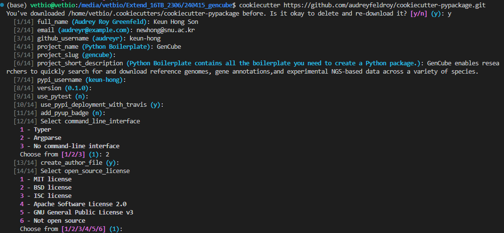
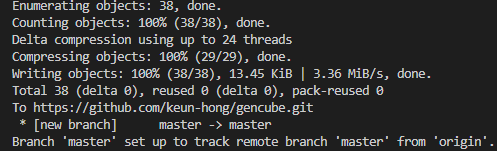
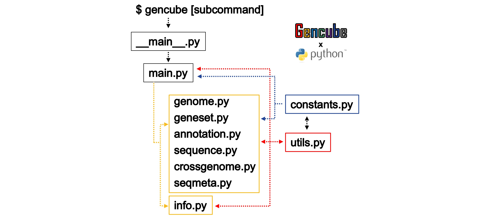
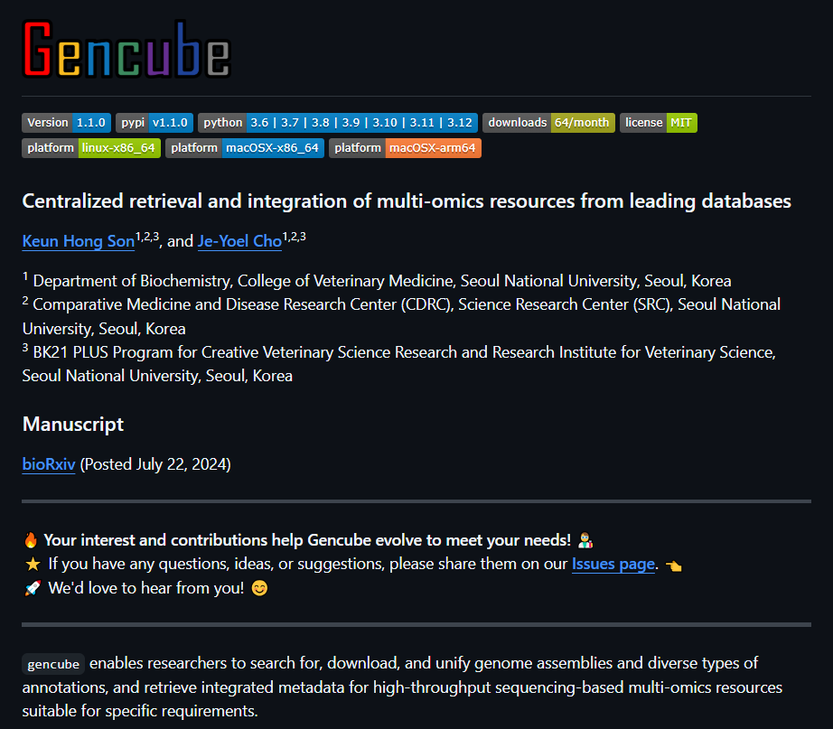
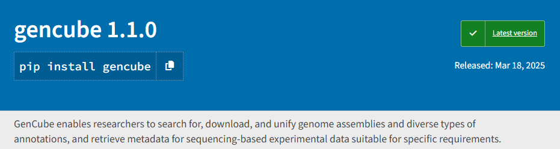
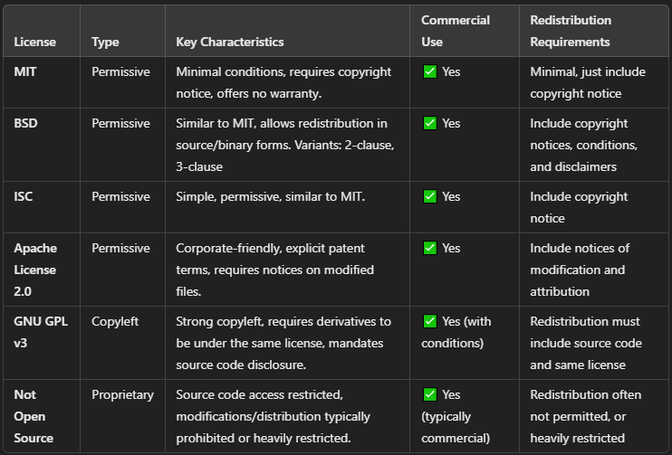

Recently, I developed a Python-based tool called [**Gencube**](https://github.com/snu-cdrc/gencube), designed to facilitate easy retrieval, downloading, and integration of multi-omics resources from leading databases. The accompanying manuscript describing this tool has been published in the journal ***Bioinformatics***. As this was my first experience with tool development, I'd like to share an overview of the development process in this post.

The process was structured as follows:

1. Download the template for tool development
2. Create a GitHub repository and upload the template
3. Install development requirements into a virtual environment
4. Complete the code development
5. Test the package
6. Prepare the `pyproject.toml` file
7. Prepare a comprehensive `README.md` file
8. Build the package
9. Register the package with PyPI
10. Additional information
    - License

## 1. Download the template for tool development

For efficient and structured Python package development, it's beneficial to start with a standardized template. **Cookiecutter** is a widely used Python tool designed to generate customizable project templates from predefined setups. 

Repo: [GitHub - audreyfeldroy/cookiecutter-pypackage](https://github.com/audreyfeldroy/cookiecutter-pypackage?tab=readme-ov-file)<br>Docs: [Cookiecutter PyPackage](https://cookiecutter-pypackage.readthedocs.io/en/latest/readme.html#cookiecutter-pypackage)

```bash
pip install -U cookiecutter
cookiecutter https://github.com/audreyfeldroy/cookiecutter-pypackage.git
```

Running the `cookiecutter` command initiates a series of prompts that ask you questions about your project's configuration, such as project name, author details, package version, and license type. By responding to these prompts according to your preferences, a customized project template is generated, matching your selections exactly, as illustrated in the image below.



```markdown
# Cookiecutter termplate
gencube
├── AUTHORS.rst
├── CODE_OF_CONDUCT.rst
├── CONTRIBUTING.rst
├── docs
│   ├── authors.rst
│   ├── conf.py
│   ├── contributing.rst
│   ├── history.rst
│   ├── index.rst
│   ├── installation.rst
│   ├── make.bat
│   ├── Makefile
│   ├── readme.rst
│   └── usage.rst
├── HISTORY.rst
├── LICENSE
├── Makefile
├── MANIFEST.in
├── pyproject.toml
├── README.rst
├── requirements_dev.txt
├── ruff.toml
├── src
│   └── gencube
│       ├── cli.py
│       ├── gencube.py
│       └── __init__.py
├── tests
│   ├── __init__.py
│   └── test_gencube.py
└── tox.ini
```

## 2. Create a GitHub repository and upload the template

After generating your project with Cookiecutter, you need to initialize a new Git repository in your project directory. Then, upload this repository to a version control service like GitHub.

```bash
git config user.email "thsrms9216@gmail.com" # your email address
git config --global user.name "keun-hong"    # your user name

cd gencube # your project forder
git init
git add .
git commit -m "Initial project skeleton"
git remote add origin "https://github.com/keun-hong/gencube.git"
git push -u origin main # (or master)
```



## 3. Install development requirements into a virtual environment

Ensures that your development environment has all the necessary packages required for development and testing.

```bash
# 1. Create a virtual environment
python -m venv venv
# 2. Activate the virtual environment
source venv/bin/activate  # On Windows use `venv\\Scripts\\activate`
# 3. Install required dependencies
pip install -r requirements_dev.txt
# When you want to deactivate
deactivate
```

It is highly recommended to conduct development within a virtual environment. Using a virtual environment has several significant benefits, particularly for Python development, where dependency management and project isolation are crucial. Here’s a detailed explanation of why you should use a virtual environment and the benefits it offers:

**Why Use a Virtual Environment?**

1. **Isolation**: A virtual environment keeps your project’s dependencies separate from those of other projects or from global Python packages on your system. This prevents version conflicts between packages required by different projects.
2. **Consistency**: It ensures that all developers working on the project have the same dependencies installed, which can help reduce "works on my machine" problems when multiple people are working on the same project.
3. **Control**: You have full control over the Python and package versions in your project, which makes it easier to manage dependencies and troubleshoot issues.
4. **Replicability**: It makes it easier to replicate your development environment. This is particularly important when you move from a development to a production setting, or when you are collaborating with others.
5. **Non-sudo Installations**: Since virtual environments are scoped to the user level, you do not need administrative privileges to install new packages. This is particularly useful on shared systems or systems where you do not have root access.

## 4. Complete the code development

The code structure of **Gencube** is as follows:

```markdown
gencube
├── gencube
│   ├── __init__.py
│   ├── __main__.py
│   ├── main.py                # 1. command
│   ├── gencube_genome.py      # 2. subcommands
│   ├── gencube_geneset.py
│   ├── gencube_annotation.py
│   ├── gencube_sequence.py
│   ├── gencube_seqmeta.py
│   ├── gencube_crossgenome.py
│   ├── gencube_info.py
│   ├── utils.py               # major functions
│   ├── constants.py           # constant variables
│   └── autosql                # required files for data format conversion
│       ├── bigRmskBed.as
│       ├── cpgIslandExt.as
│       ├── rmskBed6+10.as
│       └── simpleRepeat.as
├── figures
│   ├── data_type.jpg
│   ├── gencube_overview.jpg
│   ├── logo.png
│   └── seqmeta_scheme.jpg
├── HISTORY.md
├── LICENSE
├── pyproject.toml
└── README.md
```

When the command `$ gencube` is executed, the code operates sequentially as illustrated below. Upon accessing the `main.py` code, it either prints help information or activates specific subcommand-related code depending on the input provided. Various key functionalities are organized into functions within `utils.py`, which are utilized by `main.py` and the subcommand scripts as necessary. URLs and various fixed variables are stored in `constants.py` for convenient usage across different scripts.



Ensure all functionalities of the tool are implemented and working as intended.

## 5. Test the package

If you want to test the functionality of the package during development, you can run it using the module option (-m).

```bash
python -m gencube
python -m gencube genome
python -m gencube annotation
```

## 6. Prepare the `pyproject.toml` file

When developing a Python package, it is essential to define the project's build system, dependencies, metadata, and other configuration details clearly and consistently. Traditionally, this was done using separate files such as `setup.py`, `requirements.txt`, or `setup.cfg`. However, managing multiple configuration files can become cumbersome and error-prone.

The Python community introduced the standardized file `pyproject.toml` to unify these configurations into a single, clear, and easily maintainable format. Using `pyproject.toml`, developers can specify build tools, package metadata, dependency management, and even testing and linting configurations all in one place. This standardization simplifies the development process, improves reproducibility, and makes package distribution easier and more robust.

```toml
[build-system]
requires = ["setuptools>=61.0", "wheel"]
build-backend = "setuptools.build_meta"

[project]
name = "gencube"
version = "1.1.0"
description = "GenCube enables researchers to search for, download, and unify genome assemblies and diverse types of annotations, and retrieve metadata for sequencing-based experimental data suitable for specific requirements."
readme = "README.md"
authors = [
  {name = "Keun Hong Son", email = "newhong@snu.ac.kr"}
]
maintainers = [
  {name = "Keun Hong Son", email = "newhong@snu.ac.kr"}
]
classifiers = [
  # How mature is this project? Common values are
  #   3 - Alpha
  #   4 - Beta
  #   5 - Production/Stable
  "Development Status :: 5 - Production/Stable",

  # Indicate who your project is intended for
  "Intended Audience :: Science/Research",

  # Pick your license as you wish (see also "license" above)
  "License :: OSI Approved :: MIT License",
  "Topic :: Scientific/Engineering :: Bio-Informatics",
  "Topic :: Utilities",

  # Specify the Python versions you support here.
  "Programming Language :: Python :: 3",
  "Programming Language :: Python :: 3.6",
  "Programming Language :: Python :: 3.7",
  "Programming Language :: Python :: 3.8",
  "Programming Language :: Python :: 3.9",
  "Programming Language :: Python :: 3.10",
  "Programming Language :: Python :: 3.11",
  "Programming Language :: Python :: 3.12",
]
license = {file = "LICENSE"}
dependencies = [
  "biopython>=1.79",
  "pandas>=1.0.0",
  "numpy>=1.21.0,<2",
  "requests>=2.25.1",
  "urllib3>=1.26.5",
  "xmltodict>=0.12.0",
  "beautifulsoup4>=4.9.3",
  "tqdm>=4.61.2",
  "tabulate>=0.8.9",
]
keywords = [
  "Genome", "Genomic", "Geneset", "Annotation", "Comparative", "Sequencing", "Metadata"
]

[project.optional-dependencies]
dev = [
  "coverage",  # testing
  "mypy",  # linting
  "pytest",  # testing
  "ruff"  # linting
]

[project.urls]
Homepage = "<https://keun-hong.github.io/>"
Repository = "<https://github.com/snu-cdrc/gencube>"
Bugs = "<https://github.com/snu-cdrc/gencube/issues>"
Changelog = "<https://github.com/snu-cdrc/gencube/HISTORY.md>"

[project.scripts]
gencube = "gencube.__main__:main"

[tool.setuptools]
package-dir = {"gencube" = "gencube"}

[tool.setuptools.package-data]
"*" = ["*.*"]

# Mypy
[tool.mypy]
files = "."

# Use strict defaults
strict = true
warn_unreachable = true
warn_no_return = true

[[tool.mypy.overrides]]
module = "tests.*"
ignore_missing_imports = true
disable_error_code = "attr-defined"
```

## 7. Prepare a comprehensive `README.md` file

Clear and intuitive documentation is crucial for users to easily understand how to install and effectively use a software tool. Recognizing the importance of thorough documentation, I prepared a comprehensive [`README.md`](https://raw.githubusercontent.com/snu-cdrc/gencube/refs/heads/main/README.md) file that provides a detailed, step-by-step guide covering all essential aspects, including installation procedures, usage instructions, and practical examples. Well-structured documentation not only helps new users quickly get started but also significantly enhances the overall usability and accessibility of the tool.



## 8. Build the package

Once the code and documentation are finalized, the next step is building the package for distribution. This involves packaging the tool into a distributable format such as a wheel (`.whl`) file. Below is the step-by-step command sequence used to build, install, and manage the package:

```bash
# Build the package
python -m build

# Set up a virtual environment for testing
python -m venv venv
source venv/bin/activate

# Define package version and install the built wheel file
version="0.1.0"
pip install dist/gencube-${version}-py3-none-any.whl

# Manage version control with Git
git pull origin main          # Fetch the latest files from the GitHub repository
git add .                     # Stage updated files for commit
git commit -m 'Update'        # Commit with an informative message
git push -u origin main       # Push changes back to the GitHub repository
```

## 9. Register the package with PyPI

Registering your package with PyPI (Python Package Index) makes it publicly available, enabling users to easily install it using `pip`. The registration process typically involves creating an account on [PyPI](https://pypi.org/) and securely uploading your package files. Below is the way used to publish a package:

```bash
# Upload the package to PyPI using twine
twine upload dist/*
```



After successfully registering your package, users can install it directly from PyPI using the following commands:

```bash
python -m venv venv
source venv/bin/activate
# Install package from PyPI
pip install gencube
```

Once available on PyPI, your tool becomes widely accessible, significantly simplifying installation and adoption by the broader Python community.

## 10. Additional information

### License

Choosing an appropriate license is crucial, as it defines how users can use, modify, and distribute your software. Below are brief summaries of commonly used licenses:

1. **MIT License**
   
   Highly permissive; allows free use, modification, distribution, and sale with only minimal conditions (e.g., copyright notice). Offers no warranty.

2. **BSD License**
   
   Permissive license similar to MIT; allows redistribution of both source and binary forms. Requires inclusion of copyright notices. Variants include 2-clause and 3-clause BSD licenses.

3. **ISC License**
   
   Simple, permissive license comparable to MIT, allowing free use, modification, and redistribution. Requires inclusion of copyright notice.

4. **Apache Software License 2.0**
   
   Permissive, corporate-friendly license providing clear terms around patents. Requires notices for modified files but permits commercial use without many restrictions.

5. **GNU General Public License v3 (GPLv3)**
   
   Strong copyleft license, requiring derivatives to remain under the same license and disclose their source code. Ensures software freedom through continuous open source distribution.

6. **Not Open Source**
   
   Restrictive license, limiting source code access, modification, and redistribution. Typically used for commercial proprietary software.



Consider your project's goals, the desired openness, and legal protections when choosing the most suitable license.