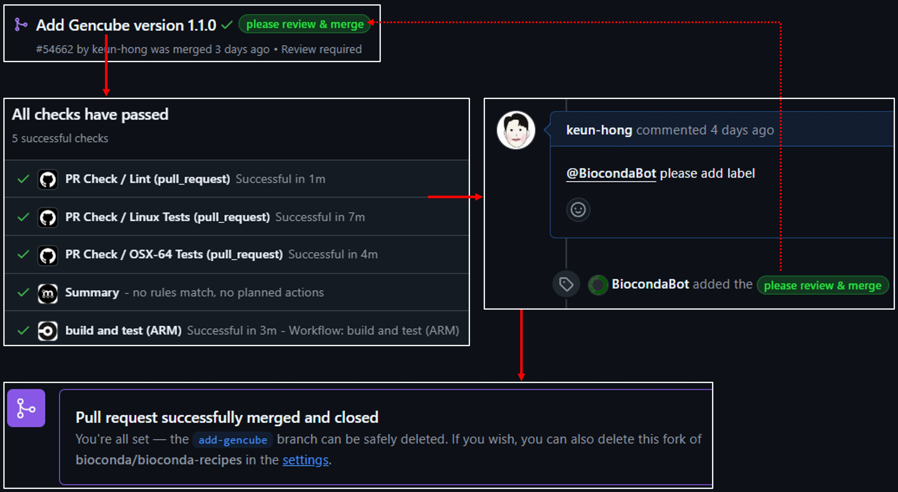
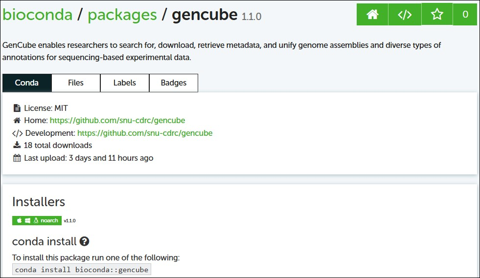

In this post, I’ll share my experience registering a Bioconda recipe for my Python-based tool. Bioconda is an excellent channel that allows researchers in the life sciences to easily install and manage software packages using conda. Follow along to learn how to prepare your package, create a recipe, and submit a pull request (PR) to Bioconda.

## 1. Prepare your package

Before registering your package with Bioconda, ensure that:

- Your tool is relevant to the biological sciences. If not, consider submitting to conda-forge instead.
- Your package is already available on PyPI or another public repository.
- Your package includes a proper `pyproject.toml` (or setup files) and documentation (README, license, etc.).

## 2. Preparations

Before you begin submitting your package to Bioconda, ensure that you have all the essential tools installed and configured:

**Miniconda/Anaconda:**

Install Miniconda or Anaconda to manage your conda environments. These tools form the backbone of your development and packaging process.

**conda-build:**

This tool is required for building conda packages. Install it by running:

```bash
conda install conda-build
```

**bioconda-utils:**

bioconda-utils is essential for validating and managing Bioconda recipes. Instead of installing it via conda channels, clone and install it directly from GitHub:

```bash
git clone https://github.com/bioconda/bioconda-utils.git
cd bioconda-utils
conda install --file bioconda_utils/bioconda_utils-requirements.txt -c conda-forge -c bioconda 
python setup.py install
```

**PyPI Registration Completed:**

Your package should already be registered on PyPI. This is important because the source file download URL from PyPI will be required in the `meta.yaml` file.

## 3. Fork and clone the bioconda-recipes repository

Bioconda’s recipes are maintained in the [bioconda-recipes](https://github.com/bioconda/bioconda-recipes) repository. To get started:

1. **Fork the repository:**
   
   Go to [bioconda/bioconda-recipes](https://github.com/bioconda/bioconda-recipes) and click “Fork” to create a copy under your GitHub account.

2. **Clone your fork:**
   
   Clone your forked repository locally.

```bash
git clone https://github.com/keun-hong/bioconda-recipes.git
cd bioconda-recipes
```

## 4. Create a new branch

```bash
git checkout -b add-gencube
```

## 5. Write the recipe (`meta.yaml`)

Inside the `recipes` directory, create a folder for your package (e.g., `recipes/gencube`) and write a `meta.yaml` file. This file should include:

- **Package metadata** (name, version, summary, home, license, etc.)
- **Source URL and checksum** (pointing to your PyPI tarball, for example)
- **Build instructions** using pip
- **Dependencies** for build and runtime
- **Test section** to verify the package after installation

An example `meta.yaml` might look like this:


```yaml
package:
  name: gencube
  version: "1.1.0"

source:
  url: <https://pypi.io/packages/source/g/gencube/gencube-1.1.0.tar.gz>
  sha256: 42871ce501775b423a652eba0deec8298380c00efd3b56b06bdbba5fe22ec36a

build:
  noarch: python
  number: 0
  script: "{{ PYTHON }} -m pip install . --no-deps -vv"
  run_exports:
    - {{ pin_subpackage("gencube", max_pin="x") }}

requirements:
  host:
    - python
    - pip
  run:
    - python
    - biopython >=1.79
    - pandas >=1.0.0
    - numpy >=1.21.0,<2
    - requests >=2.25.1
    - urllib3 >=1.26.5
    - xmltodict >=0.12.0
    - beautifulsoup4 >=4.9.3
    - tqdm >=4.61.2
    - tabulate >=0.8.9

test:
  imports:
    - gencube

about:
  home: "<https://github.com/snu-cdrc/gencube>"
  license: MIT
  summary: "GenCube enables researchers to search for, download, and unify genome assemblies and diverse types of annotations, and retrieve metadata for sequencing-based experimental data."

extra:
  recipe-maintainers:
    - keun-hong
```


**Note on version pinning:**

The `run_exports` section is crucial. It tells conda to pin your package’s version in downstream recipes to prevent API/ABI or CLI breakages. For example, if your package follows semantic versioning and you want to allow updates within the same major version, use:


```yaml
run_exports:
  - {{ pin_subpackage("gencube", max_pin="x") }}
```


If you expect potential changes even within minor releases, consider a tighter pin like `max_pin="x.x"`.

## 6. Lint your recipe

Before submitting a PR, run the Bioconda linting tool to catch common issues:

```bash
bioconda-utils lint recipes/gencube
```

Address any warnings (such as long summary lines) or errors (like missing run_exports) reported by the linter.

## 7. Commit your changes and push your branch

Once your recipe passes linting locally, add and commit your changes:

```bash
git add recipes/gencube
git commit -m "Add gencube version 1.1.0"
```

Then push your branch to your fork:

```bash
git push origin add-gencube
```

## 8. Create a Pull Request (PR)

1. **Open a PR:**
   
   On GitHub, navigate to your fork and click “Compare & pull request” to open a PR against the upstream bioconda-recipes repository.

2. **Follow the guidelines:**
   
   - Use an appropriate title starting with “Add” (e.g., “Add gencube version 1.1.0”).
   - Include a description summarizing your changes.
   - Ensure you have followed the Bioconda Recipe Guidelines.

3. **Request reviews:**
   
   Once your PR is passing all CI tests, issue the Bot command:

```sql
@BiocondaBot please add label
```

This helps the maintainers know your PR is ready for review.



## 9. Address CI feedback and merge

- **Monitor CI:**
  
  Your PR will trigger automated tests and lint checks. If there are any errors (e.g., missing run_exports, long summary warnings), address them by updating your recipe and pushing new commits.

- **Merge:**
  
  Once all checks pass and the maintainers have reviewed your PR, you can merge it. Note that Bioconda now prefers squash & merge, so make sure to combine your commits appropriately.

## 10. Post-merge actions

After your PR is merged:

- Your package will be built and uploaded automatically to the Bioconda channel.
- Users can install your package using:

```bash
conda config --add channels conda-forge
conda config --add channels bioconda
conda install gencube
```

 

## 11. Additional Tips

- **Stay Updated:**
  
  Follow the Bioconda guidelines and updates, as the policy on run_exports and version pinning may evolve.

- **Engage with the Community:**
  
  If you have questions, use the Bioconda Gitter channel or mention `@bioconda/core` in your PR comments.

By following these steps, you can efficiently register your Python tool on Bioconda and help make it accessible to the broader bioinformatics community. Happy coding and contributing!