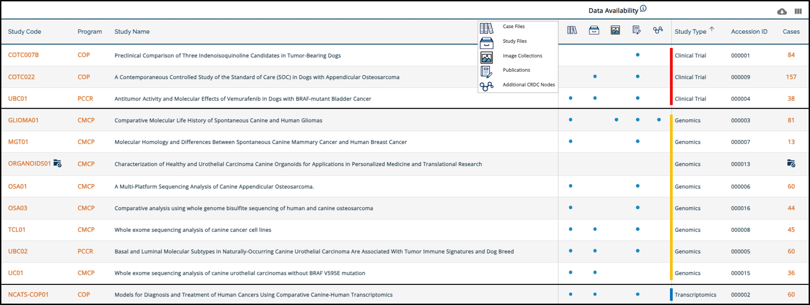
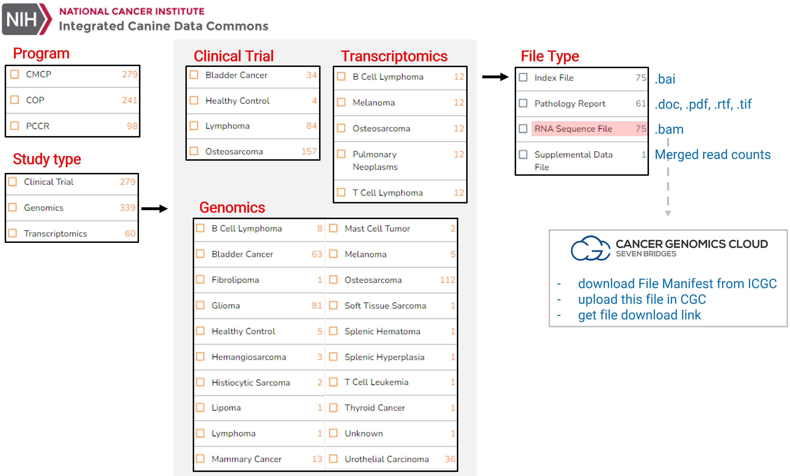
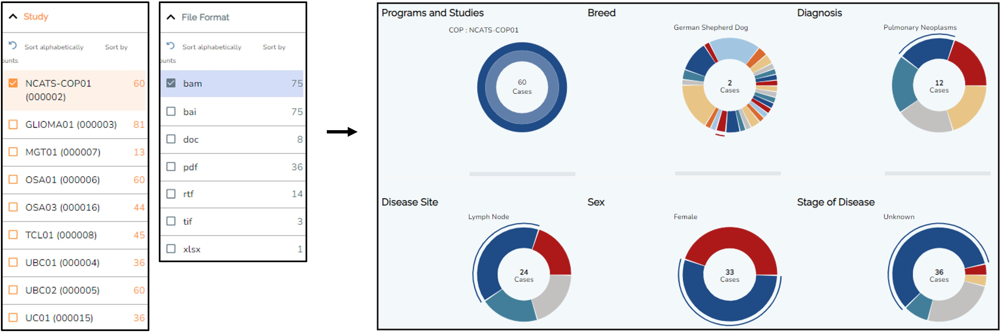
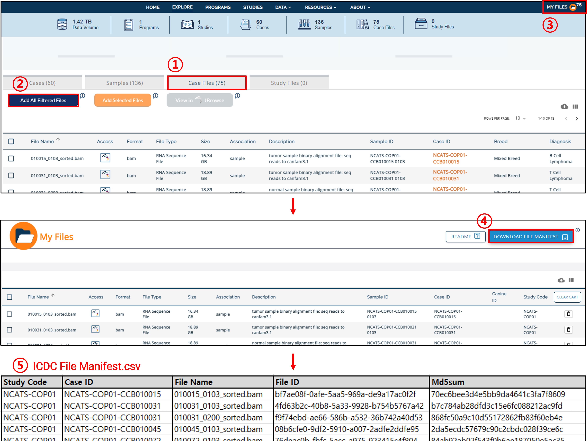
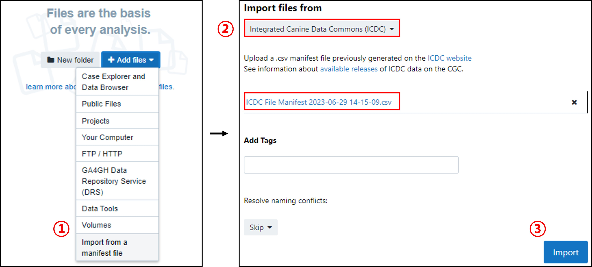
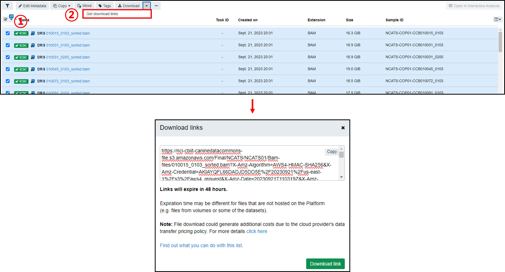

### Integrative Canine Data Commons (ICDC)

To study canine tumor biology, researchers often turn to public databases for genomic and transcriptomic data. Although repositories like International Nucleotide Sequence Database Collaboration (INSDC), which coordinates with SRA, ENA, and DDBJ, are rich with data, datasets from various labs and institutions might differ in terms of experimental or sequencing methods. This heterogeneity can complicate integration. In light of this challenge, the Integrated Canine Data Commons (ICDC) stands out, offering consolidated pan-tumor data for comprehensive analysis.

### Overview

- [Introduction](https://datacommons.cancer.gov/repository/integrated-canine-data-commons)

- [Main page](https://caninecommons.cancer.gov/#/explore)

**Data Types**: Clinical and Biospecimen, RNA-seq, WGS, WES, genotyping array, and DNA methylation analysis

**Anatomical sites**: Bladder, Bone, Femur, Humerus, Mandible, Radius, Tibia, Bone marrow, Brain, Kidney, Lung, Lymph nodes, Skin

**Datasets**: total 11 studies (3 Clinical Trial, 7 Genomics, 1 Transcriptomics)

To fully utilize the ICDC's datasets, one needs to acquire the manifest file detailing selected samples, followed by downloading the relevant data files from the [Seven Bridges Cancer Genomics Cloud](https://www.cancergenomicscloud.org/) (SB-CGC).

### Procedure to Download the Raw Data

Let's walk through a sample workflow, assuming we're obtaining transcriptomic raw data in BAM format. According to ICDC's resources, data for five tumor types — osteosarcoma, melanoma, B & T cell lymphoma, and lung tumor — is available.

Start by selecting the dataset of interest and follow the on-screen steps to obtain the ICDC manifest file. This file encapsulates details of your chosen 75 samples, with columns for study code, case ID, file name, file ID, and MD5 checksum.

**Caution**: Please note that while the file downloaded on 2023-06-29 adhered to the format described above, a subsequent download on 2023-09-21 yielded a different format. This latter file contained more information but lacked the md5sum, making it unrecognizable by SB-CGC. It remains uncertain whether this discrepancy arises from an issue with the ICDC page or a change in the system. I will update this post with any solutions or explanations found in the future.

With your manifest file in hand, proceed to [SB-CGC](https://www.cancergenomicscloud.org/) to obtain the download links:

1. Register and sign in on <a href="https://www.cancergenomicscloud.org/">SB-CGC</a> 
2. Initiate a new project. 
3. Navigate to "Files" from the dashboard and select “Import from a manifest file”. 
4. Choose “Integrated Canine Data Commons (ICDC)” and upload the prepared ICDC manifest file. 
5. Initiate the import process.

6. Post-import, DRS (Data Repository Service) identifiers for each file will be displayed within your project. 
7. To acquire the actual file download links, click on "Get download links".

8. Utilize these links to download your data. If you're on a Linux system, the wget command is a convenient way to fetch these files.

 

With this workflow, the ICDC's comprehensive datasets are at your fingertips, ready for analysis.
