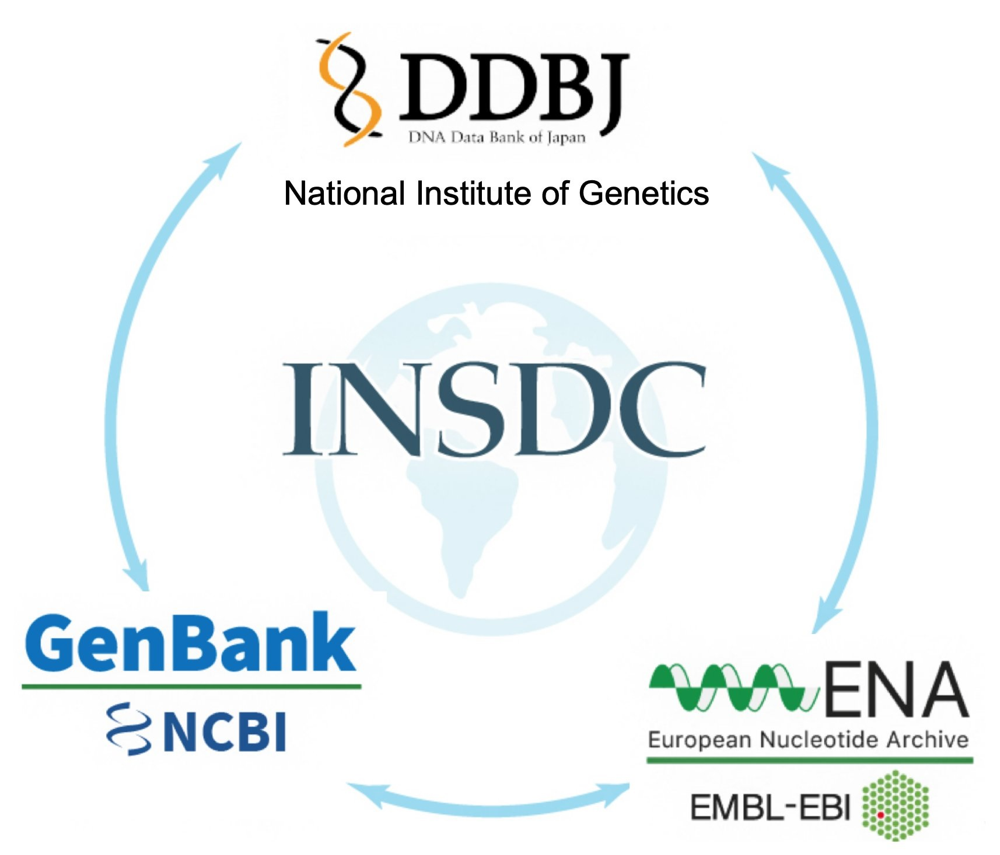
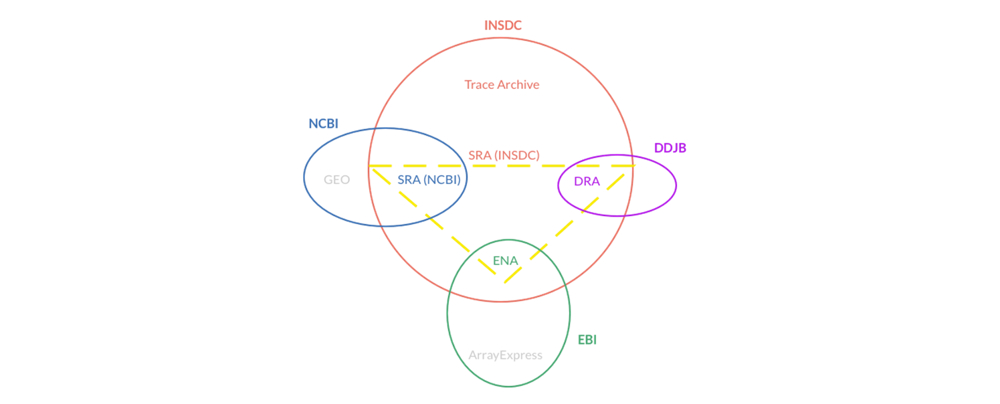
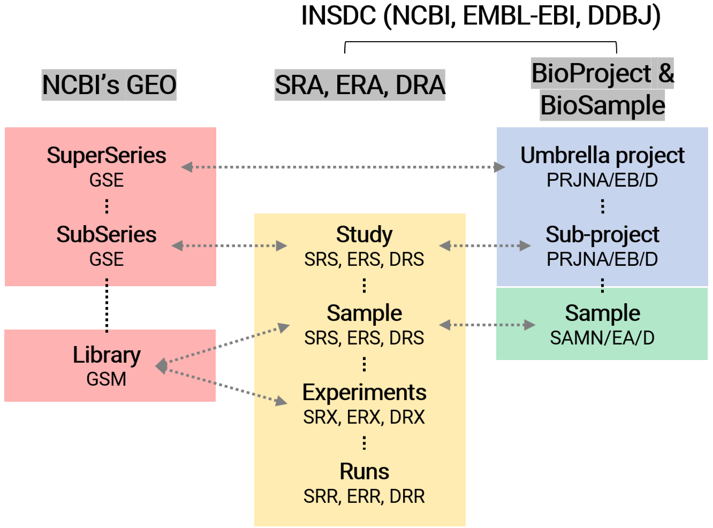
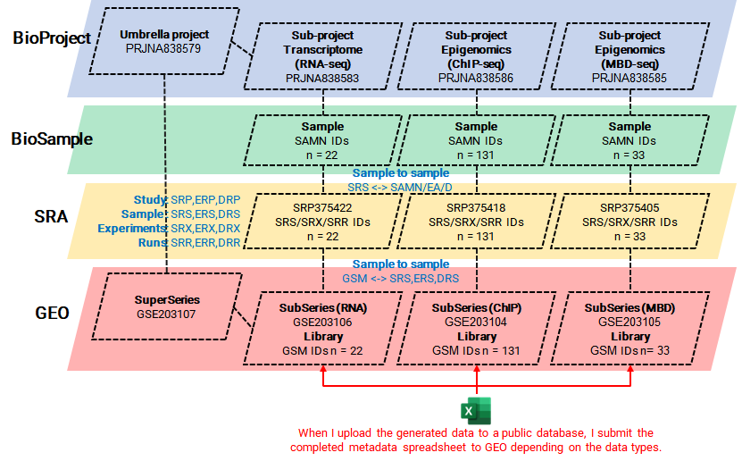
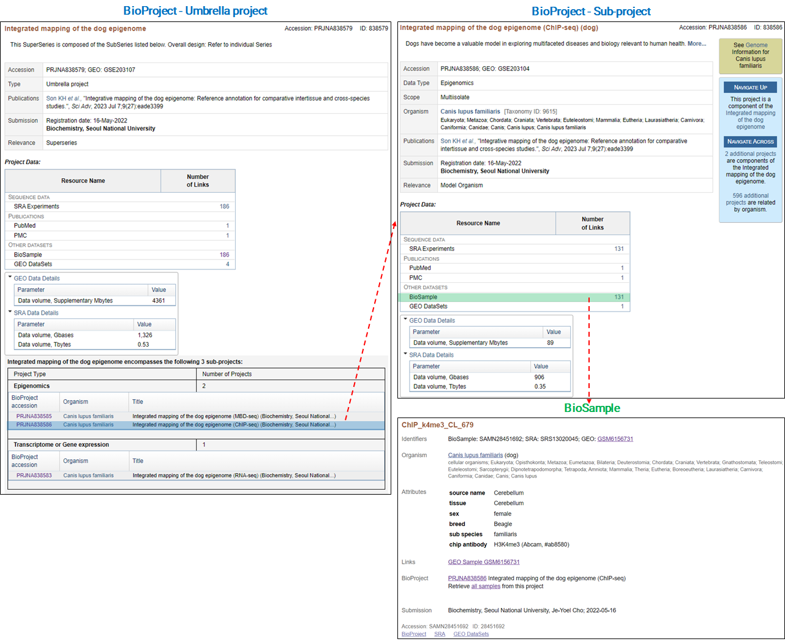
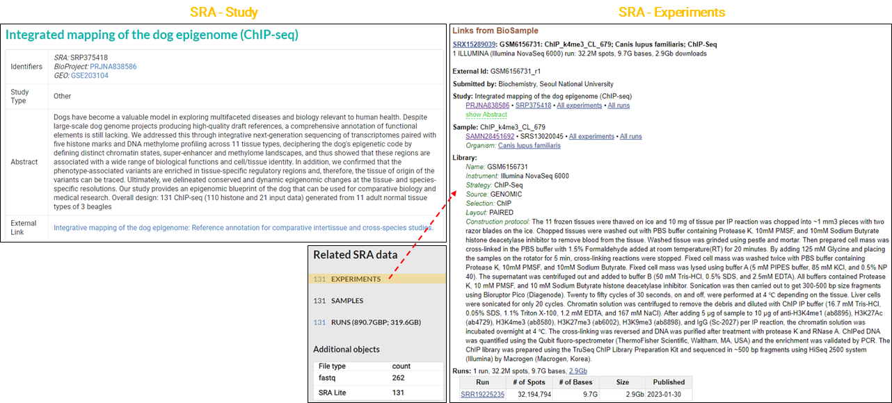
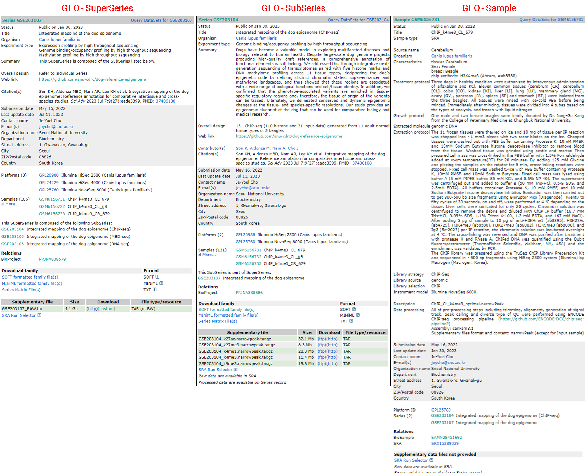
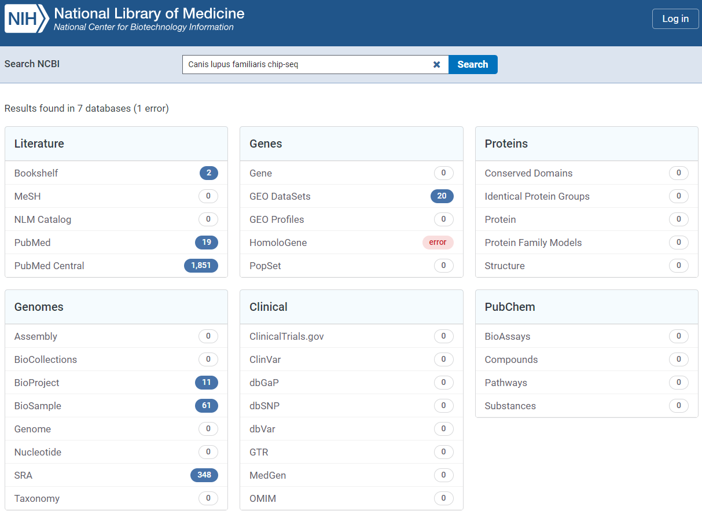

Public databases are filled with a tremendous amount of NGS-based data that can be used for research brainstorming, storyboarding, target selection, and validation. **However, finding, identifying, and downloading adequate raw data can be a difficult task.** In this post, I will introduce you to the process of effectively using public NGS-based data.

### 1. Major DBs where NGS data are stored



**International Nucleotide Sequence Database Collaboration ([INSDC](https://www.insdc.org/); [M Arita et al., NAR, 2021](https://academic.oup.com/nar/article/49/D1/D121/5964076?login=false))** is a long-standing global collaboration among three primary databases that archive and distribute data from nucleotide sequencing:

1. [NCBI's Genebank]([GenBank Overview](https://www.ncbi.nlm.nih.gov/genbank/))
   BioProject & BioSample ([T Barrett et al., NAR, 2011](https://academic.oup.com/nar/article/40/D1/D57/2903284?login=false)), SRA & GEO

2. [ENA]([ENA Browser](https://www.ebi.ac.uk/ena/browser**/)): European Nucleotide Archive

3. [DDBJ](%5BDDBJ%5D(https://www.ddbj.nig.ac.**jp/index-e**.html)): DNA Data Bank of Japan

These three organizations exchange data on a daily basis to ensure that they all hold the same comprehensive collection of sequence data. They follow the same conventions for data content and format to ensure consistent and high-quality data. The INSDC covers the full spectrum of data raw reads, alignment, assembly, and functional annotation.




[Ref. Gene Expression Repositories Explained](https://www.ccdatalab.org/blog/gene-expression-repositories-explained)

### 2. Structure of DBs (BioProject, BioSample, SRA & GEO)

To effectively use public data within databases, one must first comprehend the structure of the databases such as BioProject, BioSample, SRA, and GEO, and then choose the appropriate database to collect information tailored to specific needs. These databases are interconnected, with each having the following descriptions:

- **BioProject** is a DB for information on the biological project's scope and purpose and can link to various datasets across different NCBI databases.

- **BioSample** contains descriptions of biological source materials (or samples) used in experimental assays.

- **SRA (Sequence Read Archive)** stores <u>raw sequencing data</u> and alignment information.

- **GEO (Gene Expression Omnibus)** archives <u>processed datasets</u> such as high-throughput gene expression data, functional genomics data sets, and both array-based and sequence-based data..

These DBs indeed share a relationship where data from one can be linked to another. For example, raw data in the **SRA** may be part of a larger project detailed in **BioProject**, and samples used for generating such data may be described in **BioSample**. The processed results from these data could then be stored in **GEO**.



In the process of making my multi-omics data public ([Son KH et al., SciAdv, 2023](https://www.science.org/doi/full/10.1126/sciadv.ade3399?rfr_dat=cr_pub++0pubmed&url_ver=Z39.88-2003&rfr_id=ori%3Arid%3Acrossref.org)), including RNA-seq, ChIP-seq, and MBD-seq, I prepared and submitted the required metadata spreadsheet to the **GEO**. A few days later, I was able to verify that IDs for the project and sample data had been issued in the structure illustrated in the image below.



The information verified in each DB was as follows.







[Another example](https://www.ccgproject.org/data-ncbi) of handling a variety of data types is as follows.


### 3. Strategies for gathering information of public data

1. Manual Search:
- [NCBI's Entrez Global Query Cross-Database Search System](https://www.ncbi.nlm.nih.gov/sites/gquery)

- [BioProject](https://www.ncbi.nlm.nih.gov/bioproject/) / [BioSample](https://www.ncbi.nlm.nih.gov/biosample/) / [SRA](https://www.ncbi.nlm.nih.gov/sra) / [GEO](https://www.ncbi.nlm.nih.gov/geo/)
2. Programmatic Access:
   
   - **E-utilities** are a set of server-side scripts provided by NCBI for programmatically accessing their databases. These tools allow users to perform automated searches, downloads, and analysis of data from NCBI's various databases, including <u>GenBank, PubMed, GEO, and SRA</u>. E-utilities are particularly useful for researchers who need to handle large datasets or automate repetitive tasks. They use a standard web protocol (HTTP) for queries, making them accessible from any programming environment that can send HTTP requests.
   
   - **SRA Toolkit** is developed by NCBI specifically for <u>working with data from the Sequence Read Archive (SRA)</u>. This toolkit provides utilities for downloading, converting, and analyzing the vast amount of sequencing data stored in SRA. It's a crucial tool for researchers dealing with high-throughput sequencing data, as it simplifies the process of accessing and manipulating large-scale genomic datasets. The toolkit supports various formats and allows for efficient data management, especially in large-scale genomic projects.

3. APIs: Some third-party bioinformatics tools and platforms (ex. **BioPython-Entrez**)

4. Research Publications

### 3-1 Manual Search

If you search for several keywords in the [NCBI's Entrez Global Query Cross-Database Search System](https://www.ncbi.nlm.nih.gov/sites/gquery), you can view the comprehensive number of results.



[BioProject](https://www.ncbi.nlm.nih.gov/bioproject/) / [BioSample](https://www.ncbi.nlm.nih.gov/biosample/) / [SRA](https://www.ncbi.nlm.nih.gov/sra) / [GEO](https://www.ncbi.nlm.nih.gov/geo/)


Typically, when we submit NGS-based generated data, there are two options: `GEO or SRA`. If both raw and processed data are submitted to `GEO`, IDs for other three DBs are automatically issued. But, If only raw data is submitted to `SRA`, a `GEO` ID is not issued. For this reason, `SRA` and `BioProject (BioSample)` are initially investigated to collect as much data as possible.

By applying the search rules likes `boolean operator (AND, OR, NOT)` or `fields (ex. Organoism, Source, etc)` found in [Search in SRA Entrez](https://www.ncbi.nlm.nih.gov/sra/docs/srasearch/), you can search for the data you need more efficiently and accurately.

```tex
# Example
((canis lupus familiaris[Organism]) AND genomic[Source]) AND ChIP-seq[Strategy]
```

 In the SRA DB, there are 20 fields we can use: `Access, Accession, Aligned, Author, BioProject, BioSample, Filter, Layout, Mbases, Modification Date, Organism, Platform, Properties, Publication Date, ReadLength, Selection, Source, Strategy, Text Word, Title`.  Indexes that can be used in each field are found in [Advanced search](https://www.ncbi.nlm.nih.gov/sra/advanced); click the **"show index list"** button. Useful fields are described below.
`Organism`: homo sapiens, mus musculus, canis lupus familiaris, etc.
`Strategy`: wgs, wxs, rna seq, chip seq, ata seq, etc.
`Source`: genomic, transcriptomic, other, etc.
`Selection`: cdna, chip, mnase, cage, other, etc.
`Layout`: paired or single.

### 3-2. Data gathering with BioPython-Entrez

Link: [**biopython/Bio.Entrez**](https://biopython.org/docs/latest/api/Bio.Entrez.html#)

#### Modules

BioPython's Bio.Entrez module provides an interface to the NCBI's Entrez service, which allows you to search, retrieve, and download data from NCBI's databases. The major functions of Bio.Entrez are:

1. **`Entrez.esearch()`** is used to search an NCBI database. You provide it with a database to search and a search term, and it returns a list of IDs of records that match the search.

2. **`Entrez.efetch()`** is used to download full records from a list of IDs. You provide it with a database and the IDs of the records you want to download, and it returns those records in a format that you specify.

3. **`Entrez.epost()`** is used to upload a list of IDs to the NCBI server. You provide it with a database and a list of IDs, and it returns a query key and web environment string that you can use in subsequent calls to `efetch()` or `elink()`.

4. **`Entrez.esummary()`** retrieves summaries from a list of IDs. You provide it with a database and the IDs of the records you want summaries of, and it returns those summaries.

5. **`Entrez.elink()`** is used to find related records in the database. You provide it with a database and a list of IDs, and it returns a list of IDs of related records.

6. **`Entrez.egquery()`** is used to search for your term in all databases and return the number of results in each one.

7. **`Entrez.eread()`** is used to parse the XML output from any of the other functions. It is often used in conjunction with `efetch()`.

8. **`Entrez.read()`** is used to parse an XML file returned by any of the other Entrez functions. It's typically used to parse the output of `esearch()` and `esummary()`.

9. **`Entrez.efilter()`** is used to use the Entrez filtering system with your search. This is a more advanced feature.

Each function has different options that you can use to refine your searches, specify the format of your results, and more.

#### Entrez.esearch()

First, import necessary libraries.

```python
from Bio import Entrez
```

Next, always tell NCBI who you are by providing an email address.

```python
Entrez.email = "your.email@example.com"  # Always tell NCBI who you are
```

Then, use Entrez.esearch() function to search a database of interest. For instance, if you are interested in BioProject, you would do:

```python
def search(query):
    handle = Entrez.esearch(db="bioproject",  # Database to search
                            term=query,  # Search term
                            retmax=1000  # Number of results to return
                            )
    record = Entrez.read(handle)
    return record
```

Here, `query` is a string of keywords you're interested in. It might look like "homo sapiens[Organism] AND RNA-Seq[Strategy]". For the db parameter, use "bioproject" for BioProject, "gds" for GEO, and "sra" for SRA.

Next, to call this function:

```python
results = search("your_keywords_here")
```

The IDs returned by this search are in `results['IdList']`.

```python
print(results['IdList'])
```

This gives you a list of IDs related to your keywords.

Make sure to replace "[your.email@example.com](mailto:your.email@example.com)" and "your_keywords_here" with your actual email and keywords, respectively.

Also, please note that due to restrictions on the number of queries that can be sent to NCBI servers, if you are going to use this script for heavy usage, consider using NCBI API keys and include it in your queries like `Entrez.api_key = "YourAPIKey"`.

Finally, when writing and running these scripts, make sure you are abiding by the terms and conditions of the databases from which you are retrieving data.

#### 'db' parameter

here's a full list of databases you can use in NCBI with the 'db' parameter in `Entrez.esearch()`

```python
handle = Entrez.einfo()
record = Entrez.read(handle)
record["DbList"]
```

['pubmed', 'protein', 'nuccore', 'ipg', 'nucleotide', 'structure', 'genome', 'annotinfo', 'assembly', '**bioproject**', '**biosample**', 'blastdbinfo', 'books', 'cdd', 'clinvar', 'gap', 'gapplus', 'grasp', 'dbvar', 'gene', '**gds**', 'geoprofiles', 'medgen', 'mesh', 'nlmcatalog', 'omim', 'orgtrack', 'pmc', 'popset', 'proteinclusters', 'pcassay', 'protfam', 'pccompound', 'pcsubstance', 'seqannot', 'snp', '**sra**', 'taxonomy', 'biocollections', 'gtr']

#### Variables in output

The `results` variable in this context is a dictionary that contains the response from the NCBI server for your search query. The dictionary contains several fields. The key fields are:

1. **Count**: The total number of results that match your search query in the database.

2. **RetMax**: The maximum number of results returned from your query. This is set by you in the `retmax` argument of the `esearch()` function. If `RetMax` is less than `Count`, it means there are more results available than you have retrieved in this request.you

3. **RetStart**: This represents the starting index of returned results. It is useful when you want to paginate through results.

4. **<mark>IdList</mark>**: This is a list of the unique identifiers for each of the returned records. These are the IDs you will likely be most interested in, as you can use them to fetch detailed records.

5. **TranslationSet**: This contains a set of translations for your q

6. uery. For instance, if you search for a common name of an organism, the TranslationSet might contain the scientific name.

7. **TranslationStack**: This is a history stack of the search, which contains the search terms and their translations.

8. **QueryTranslation**: This is the final, fully translated version of your search query.

The `IdList` is usually the most relevant piece of information if you're looking to gather specific IDs. Other fields are more relevant for understanding the context of the search or for more advanced usage.

---

### Reference

[biopython/Bio.Entrez](https://biopython.org/docs/latest/api/Bio.Entrez.html#)

[incodom.kr/E-utility](http://www.incodom.kr/E-utility)

[Biopython/Bio.Entrez](https://incodom.kr/Biopython/Bio.Entrez)

<br>This article was written with help from ChatGPTv4