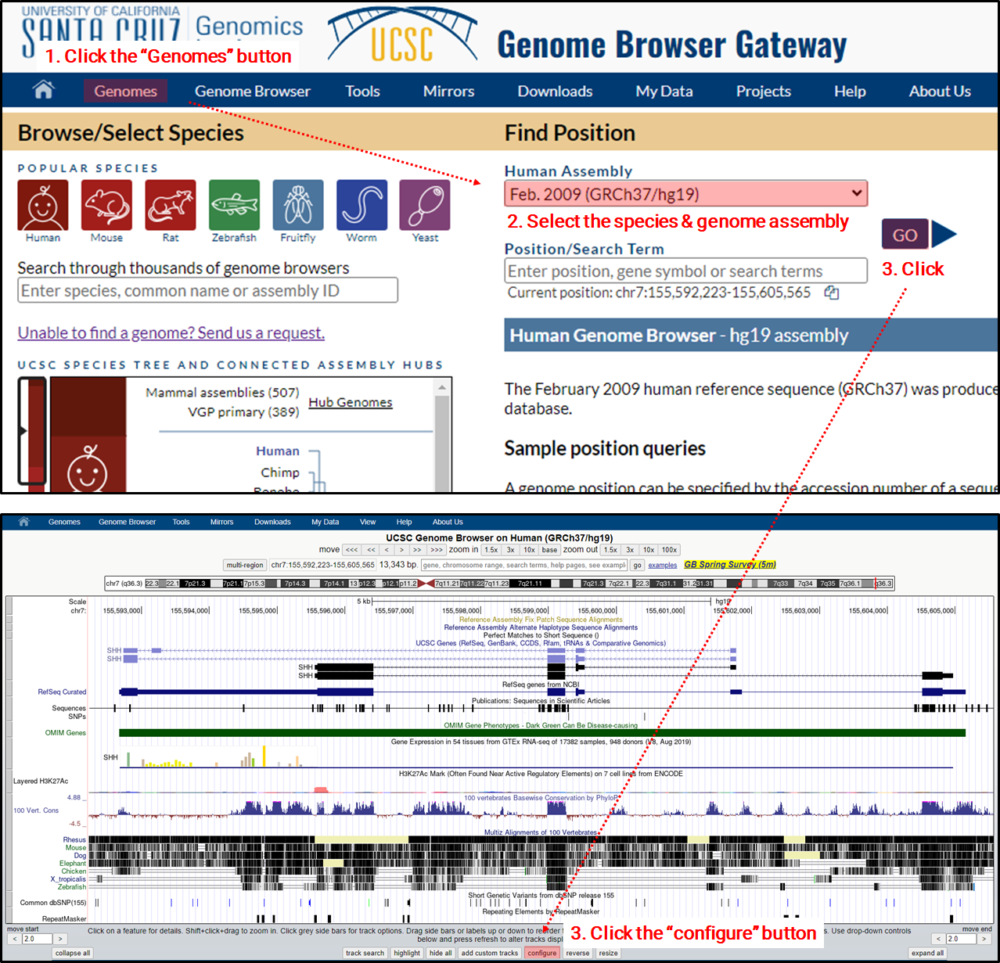
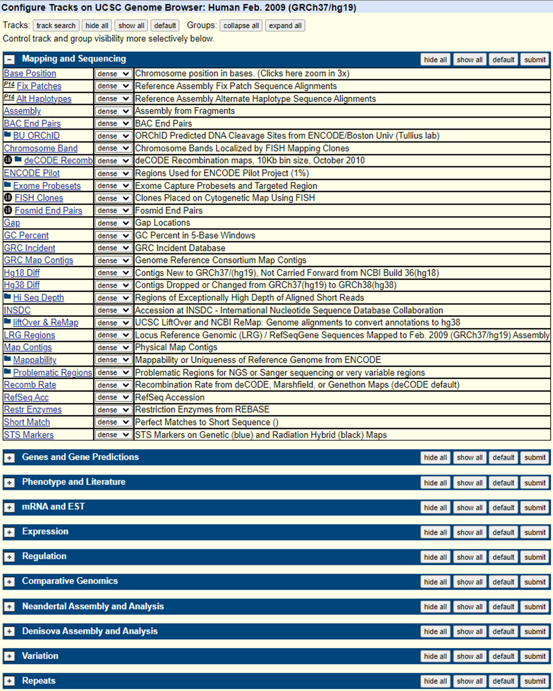

In the quest to understand how genomes are regulated and function, and their implications in disease, researchers worldwide undertake diverse studies to annotate genomes of various species with different objectives and methodologies. The UCSC Genome Browser serves as a centralized hub where the culmination of these key research findings is readily accessible. Here's how you can access this invaluable information.

### How to access?

Link: [UCSC genome browser](https://genome.ucsc.edu/)

**Lists of annotations with brief information for selected species & genome assembly**

### Links of major species annotations stored in UCSC

Human: [T2T CHM13v2.0/hs1](https://genome-asia.ucsc.edu/cgi-bin/hgTracks?hgtgroup_map_close=0&hgtgroup_genes_close=0&hgtgroup_phenDis_close=0&hgtgroup_rna_close=0&hgtgroup_regulation_close=0&hgtgroup_compGeno_close=0&hgtgroup_varRep_close=0&hgsid=833029818_stDSeUvCLLIX0zYmhFLE66EOAOqO&position=chr9%3A145458455-145495201&hgt.positionInput=chromosome+range%2C+search+terms%2C+help+pages%2C+see+examples&db=hub_170992_hs1&c=chr9&l=145458454&r=145495201&pix=1502&dinkL=2.0&dinkR=2.0&hgTracksConfigPage=configure), [GRCh38/hg38](https://genome-asia.ucsc.edu/cgi-bin/hgTracks?hgtgroup_map_close=0&hgtgroup_genes_close=0&hgtgroup_phenDis_close=0&hgtgroup_hprc_close=0&hgtgroup_singleCell_close=0&hgtgroup_rna_close=0&hgtgroup_expression_close=0&hgtgroup_regulation_close=0&hgtgroup_compGeno_close=0&hgtgroup_varRep_close=0&hgtgroup_rep_close=0&hgsid=833029818_stDSeUvCLLIX0zYmhFLE66EOAOqO&position=chr7%3A155799529-155812871&hgt.positionInput=gene%2C+chromosome+range%2C+search+terms%2C+help+pages%2C+see+examples&hgt.suggestTrack=knownGene&db=hg38&c=chr7&l=155799528&r=155812871&pix=1883&dinkL=2.0&dinkR=2.0&hgTracksConfigPage=configure), [GRCh37/hg19](https://genome-asia.ucsc.edu/cgi-bin/hgTracks?hgtgroup_map_close=0&hgtgroup_genes_close=0&hgtgroup_phenDis_close=0&hgtgroup_rna_close=0&hgtgroup_expression_close=0&hgtgroup_regulation_close=0&hgtgroup_compGeno_close=0&hgtgroup_neandertal_close=1&hgtgroup_denisova_close=1&hgtgroup_varRep_close=0&hgtgroup_rep_close=0&hgsid=833029818_stDSeUvCLLIX0zYmhFLE66EOAOqO&position=chr7%3A155592223-155605565&hgt.positionInput=gene%2C+chromosome+range%2C+search+terms%2C+help+pages%2C+see+examples&hgt.suggestTrack=knownGene&db=hg19&c=chr7&l=155592222&r=155605565&pix=1883&dinkL=2.0&dinkR=2.0&hgTracksConfigPage=configure) 

**Experimental models**

Mouse: [GRCm39/mm39](https://genome-asia.ucsc.edu/cgi-bin/hgTracks?hgtgroup_map_close=0&hgtgroup_genes_close=0&hgtgroup_rna_close=0&hgtgroup_regulation_close=0&hgtgroup_compGeno_close=0&hgtgroup_varRep_close=0&hgsid=833029818_stDSeUvCLLIX0zYmhFLE66EOAOqO&position=chr12%3A56741761-56761390&hgt.positionInput=gene%2C+chromosome+range%2C+search+terms%2C+help+pages%2C+see+examples&hgt.suggestTrack=knownGene&db=mm39&c=chr12&l=56741760&r=56761390&pix=1883&dinkL=2.0&dinkR=2.0&hgTracksConfigPage=configure), [GRCm38/mm10](https://genome-asia.ucsc.edu/cgi-bin/hgTracks?hgtgroup_map_close=0&hgtgroup_genes_close=0&hgtgroup_pub_close=0&hgtgroup_rna_close=0&hgtgroup_regulation_close=0&hgtgroup_compGeno_close=0&hgtgroup_varRep_close=0&hgsid=833029818_stDSeUvCLLIX0zYmhFLE66EOAOqO&position=chr12%3A56694976-56714605&hgt.positionInput=gene%2C+chromosome+range%2C+search+terms%2C+help+pages%2C+see+examples&hgt.suggestTrack=knownGene&db=mm10&c=chr12&l=56694975&r=56714605&pix=1883&dinkL=2.0&dinkR=2.0&hgTracksConfigPage=configure), [NCBI37/mm9](https://genome-asia.ucsc.edu/cgi-bin/hgTracks?hgtgroup_map_close=0&hgtgroup_genes_close=0&hgtgroup_pub_close=0&hgtgroup_rna_close=0&hgtgroup_phenoAllele_close=0&hgtgroup_regulation_close=0&hgtgroup_compGeno_close=0&hgtgroup_varRep_close=0&hgsid=833029818_stDSeUvCLLIX0zYmhFLE66EOAOqO&position=chr12%3A57795963-57815592&hgt.positionInput=gene%2C+chromosome+range%2C+search+terms%2C+help+pages%2C+see+examples&hgt.suggestTrack=knownGene&db=mm9&c=chr12&l=57795962&r=57815592&pix=1883&dinkL=2.0&dinkR=2.0&hgTracksConfigPage=configure) Rat: [rn7](https://genome-asia.ucsc.edu/cgi-bin/hgTracks?hgtgroup_map_close=0&hgtgroup_genes_close=0&hgtgroup_rna_close=0&hgtgroup_regulation_close=0&hgtgroup_compGeno_close=0&hgtgroup_varRep_close=0&hgsid=833029818_stDSeUvCLLIX0zYmhFLE66EOAOqO&position=chr1%3A79348972-79379997&hgt.positionInput=gene%2C+chromosome+range%2C+search+terms%2C+help+pages%2C+see+examples&hgt.suggestTrack=refGene&db=rn7&c=chr1&l=79348971&r=79379997&pix=1883&dinkL=2.0&dinkR=2.0&hgTracksConfigPage=configure), [rn6](https://genome-asia.ucsc.edu/cgi-bin/hgTracks?hgtgroup_map_close=0&hgtgroup_genes_close=0&hgtgroup_rna_close=0&hgtgroup_regulation_close=0&hgtgroup_compGeno_close=0&hgtgroup_varRep_close=0&hgsid=833029818_stDSeUvCLLIX0zYmhFLE66EOAOqO&position=chr1%3A80608553-80639261&hgt.positionInput=gene%2C+chromosome+range%2C+search+terms%2C+help+pages%2C+see+examples&hgt.suggestTrack=refGene&db=rn6&c=chr1&l=80608552&r=80639261&pix=1883&dinkL=2.0&dinkR=2.0&hgTracksConfigPage=configure) Zebrafish: [danRer11](https://genome-asia.ucsc.edu/cgi-bin/hgTracks?hgtgroup_map_close=0&hgtgroup_genes_close=0&hgtgroup_rna_close=0&hgtgroup_regulation_close=0&hgtgroup_compGeno_close=0&hgtgroup_varRep_close=0&hgsid=833029818_stDSeUvCLLIX0zYmhFLE66EOAOqO&position=chr6%3A43426669-43433274&hgt.positionInput=gene%2C+chromosome+range%2C+search+terms%2C+help+pages%2C+see+examples&hgt.suggestTrack=refGene&db=danRer11&c=chr6&l=43426668&r=43433274&pix=1883&dinkL=2.0&dinkR=2.0&hgTracksConfigPage=configure), [danRer10](https://genome-asia.ucsc.edu/cgi-bin/hgTracks?hgtgroup_map_close=0&hgtgroup_genes_close=0&hgtgroup_rna_close=0&hgtgroup_regulation_close=0&hgtgroup_compGeno_close=0&hgtgroup_varRep_close=0&hgsid=833029818_stDSeUvCLLIX0zYmhFLE66EOAOqO&position=chr10%3A33840892-34129251&hgt.positionInput=gene%2C+chromosome+range%2C+search+terms%2C+help+pages%2C+see+examples&hgt.suggestTrack=refGene&db=danRer10&c=chr10&l=33840891&r=34129251&pix=1883&dinkL=2.0&dinkR=2.0&hgTracksConfigPage=configure) Fruitfly (D. melanogaster): [dm6](https://genome-asia.ucsc.edu/cgi-bin/hgTracks?hgtgroup_map_close=0&hgtgroup_genes_close=0&hgtgroup_rna_close=0&hgtgroup_regulation_close=0&hgtgroup_compGeno_close=0&hgtgroup_varRep_close=0&hgsid=833029818_stDSeUvCLLIX0zYmhFLE66EOAOqO&position=chr2L%3A826001-851000&hgt.positionInput=gene%2C+chromosome+range%2C+search+terms%2C+help+pages%2C+see+examples&hgt.suggestTrack=refGene&db=dm6&c=chr2L&l=826000&r=851000&pix=1883&dinkL=2.0&dinkR=2.0&hgTracksConfigPage=configure) Worm (C. elegans): [ce11](https://genome-asia.ucsc.edu/cgi-bin/hgTracks?hgtgroup_map_close=0&hgtgroup_genes_close=0&hgtgroup_rna_close=0&hgtgroup_regulation_close=0&hgtgroup_compGeno_close=0&hgtgroup_varRep_close=0&hgsid=833029818_stDSeUvCLLIX0zYmhFLE66EOAOqO&position=chrII%3A14646376-14667875&hgt.positionInput=gene%2C+chromosome+range%2C+search+terms%2C+help+pages%2C+see+examples&hgt.suggestTrack=refGene&db=ce11&c=chrII&l=14646375&r=14667875&pix=1883&dinkL=2.0&dinkR=2.0&hgTracksConfigPage=configure) Yeast (S. cerevisiae): [sacCer3](https://genome-asia.ucsc.edu/cgi-bin/hgTracks?hgtgroup_map_close=0&hgtgroup_genes_close=0&hgtgroup_rna_close=0&hgtgroup_regulation_close=0&hgtgroup_compGeno_close=0&hgtgroup_varRep_close=0&hgsid=833029818_stDSeUvCLLIX0zYmhFLE66EOAOqO&position=chrIV%3A765966-775965&hgt.positionInput=chromosome+range%2C+search+terms%2C+help+pages%2C+see+examples&db=sacCer3&c=chrIV&l=765965&r=775965&pix=1883&dinkL=2.0&dinkR=2.0&hgTracksConfigPage=configure)

**Pet animals**
Dog: [Dog10K_Boxer_Tasha/canFam6](https://genome-asia.ucsc.edu/cgi-bin/hgTracks?hgtgroup_map_close=0&hgtgroup_genes_close=0&hgtgroup_rna_close=0&hgtgroup_regulation_close=0&hgtgroup_compGeno_close=0&hgtgroup_varRep_close=0&hgsid=833029818_stDSeUvCLLIX0zYmhFLE66EOAOqO&position=chr14%3A7802540-7807848&hgt.positionInput=gene%2C+chromosome+range%2C+search+terms%2C+help+pages%2C+see+examples&hgt.suggestTrack=refGene&db=canFam6&c=chr14&l=7802539&r=7807848&pix=1883&dinkL=2.0&dinkR=2.0&hgTracksConfigPage=configure), [UMICH_Zoey_3.1/canFam5](https://genome-asia.ucsc.edu/cgi-bin/hgTracks?hgtgroup_map_close=0&hgtgroup_genes_close=0&hgtgroup_rna_close=0&hgtgroup_regulation_close=0&hgtgroup_compGeno_close=0&hgtgroup_varRep_close=0&hgsid=833029818_stDSeUvCLLIX0zYmhFLE66EOAOqO&position=chr14%3A8085731-8092195&hgt.positionInput=gene%2C+chromosome+range%2C+search+terms%2C+help+pages%2C+see+examples&hgt.suggestTrack=refGene&db=canFam5&c=chr14&l=8085730&r=8092195&pix=1883&dinkL=2.0&dinkR=2.0&hgTracksConfigPage=configure), [UU_Cfam_GSD_1.0/canFam4](https://genome-asia.ucsc.edu/cgi-bin/hgTracks?hgtgroup_map_close=0&hgtgroup_genes_close=0&hgtgroup_rna_close=0&hgtgroup_regulation_close=0&hgtgroup_compGeno_close=0&hgtgroup_varRep_close=0&hgsid=833029818_stDSeUvCLLIX0zYmhFLE66EOAOqO&position=chr14%3A7973274-7979747&hgt.positionInput=gene%2C+chromosome+range%2C+search+terms%2C+help+pages%2C+see+examples&hgt.suggestTrack=refGene&db=canFam4&c=chr14&l=7973273&r=7979747&pix=1883&dinkL=2.0&dinkR=2.0&hgTracksConfigPage=configure), [Broad CanFam3.1/canFam3](https://genome-asia.ucsc.edu/cgi-bin/hgTracks?hgtgroup_map_close=0&hgtgroup_genes_close=0&hgtgroup_rna_close=0&hgtgroup_regulation_close=0&hgtgroup_compGeno_close=0&hgtgroup_varRep_close=0&hgsid=833029818_stDSeUvCLLIX0zYmhFLE66EOAOqO&position=chr14%3A8114295-8120760&hgt.positionInput=gene%2C+chromosome+range%2C+search+terms%2C+help+pages%2C+see+examples&hgt.suggestTrack=refGene&db=canFam3&c=chr14&l=8114294&r=8120760&pix=1883&dinkL=2.0&dinkR=2.0&hgTracksConfigPage=configure) Cat: [felCat9](https://genome-asia.ucsc.edu/cgi-bin/hgTracks?hgtgroup_map_close=0&hgtgroup_genes_close=0&hgtgroup_rna_close=0&hgtgroup_regulation_close=0&hgtgroup_compGeno_close=0&hgtgroup_varRep_close=0&hgsid=833029818_stDSeUvCLLIX0zYmhFLE66EOAOqO&position=chrA2%3A53333898-53447862&hgt.positionInput=gene%2C+chromosome+range%2C+search+terms%2C+help+pages%2C+see+examples&hgt.suggestTrack=refGene&db=felCat9&c=chrA2&l=53333897&r=53447862&pix=1883&dinkL=2.0&dinkR=2.0&hgTracksConfigPage=configure), [felCat8](https://genome-asia.ucsc.edu/cgi-bin/hgTracks?hgtgroup_map_close=0&hgtgroup_genes_close=0&hgtgroup_rna_close=0&hgtgroup_regulation_close=0&hgtgroup_compGeno_close=0&hgtgroup_varRep_close=0&hgsid=833029818_stDSeUvCLLIX0zYmhFLE66EOAOqO&position=chrA2%3A53484451-53597660&hgt.positionInput=gene%2C+chromosome+range%2C+search+terms%2C+help+pages%2C+see+examples&hgt.suggestTrack=refGene&db=felCat8&c=chrA2&l=53484450&r=53597660&pix=1883&dinkL=2.0&dinkR=2.0&hgTracksConfigPage=configure)

**Farm animals**

Pig: [susScr11](https://genome-asia.ucsc.edu/cgi-bin/hgTracks?hgtgroup_map_close=0&hgtgroup_genes_close=0&hgtgroup_rna_close=0&hgtgroup_regulation_close=0&hgtgroup_compGeno_close=0&hgtgroup_varRep_close=0&hgsid=833029818_stDSeUvCLLIX0zYmhFLE66EOAOqO&position=chr18%3A19836295-19840119&hgt.positionInput=gene%2C+chromosome+range%2C+search+terms%2C+help+pages%2C+see+examples&hgt.suggestTrack=refGene&db=susScr11&c=chr18&l=19836294&r=19840119&pix=1883&dinkL=2.0&dinkR=2.0&hgTracksConfigPage=configure), [susScr3](https://genome-asia.ucsc.edu/cgi-bin/hgTracks?hgtgroup_map_close=0&hgtgroup_genes_close=0&hgtgroup_pub_close=0&hgtgroup_rna_close=0&hgtgroup_regulation_close=0&hgtgroup_compGeno_close=0&hgtgroup_varRep_close=0&hgsid=833029818_stDSeUvCLLIX0zYmhFLE66EOAOqO&position=chr18%3A20905375-20909537&hgt.positionInput=gene%2C+chromosome+range%2C+search+terms%2C+help+pages%2C+see+examples&hgt.suggestTrack=refGene&db=susScr3&c=chr18&l=20905374&r=20909537&pix=1883&dinkL=2.0&dinkR=2.0&hgTracksConfigPage=configure) Cattle (cow): [bosTau9](https://genome-asia.ucsc.edu/cgi-bin/hgTracks?hgtgroup_map_close=0&hgtgroup_genes_close=0&hgtgroup_rna_close=0&hgtgroup_regulation_close=0&hgtgroup_compGeno_close=0&hgtgroup_varRep_close=0&hgsid=833029818_stDSeUvCLLIX0zYmhFLE66EOAOqO&position=chr6%3A85405597-85664387&hgt.positionInput=gene%2C+chromosome+range%2C+search+terms%2C+help+pages%2C+see+examples&hgt.suggestTrack=refGene&db=bosTau9&c=chr6&l=85405596&r=85664387&pix=1883&dinkL=2.0&dinkR=2.0&hgTracksConfigPage=configure), [bosTau8](https://genome-asia.ucsc.edu/cgi-bin/hgTracks?hgtgroup_map_close=0&hgtgroup_genes_close=0&hgtgroup_rna_close=0&hgtgroup_regulation_close=0&hgtgroup_compGeno_close=0&hgtgroup_varRep_close=0&hgsid=833029818_stDSeUvCLLIX0zYmhFLE66EOAOqO&position=chr1%3A2772575-2921534&hgt.positionInput=gene%2C+chromosome+range%2C+search+terms%2C+help+pages%2C+see+examples&hgt.suggestTrack=refGene&db=bosTau8&c=chr1&l=2772574&r=2921534&pix=1883&dinkL=2.0&dinkR=2.0&hgTracksConfigPage=configure) Chicken: [galGal6](https://genome-asia.ucsc.edu/cgi-bin/hgTracks?hgtgroup_map_close=0&hgtgroup_genes_close=0&hgtgroup_rna_close=0&hgtgroup_regulation_close=0&hgtgroup_compGeno_close=0&hgtgroup_varRep_close=0&hgsid=833029818_stDSeUvCLLIX0zYmhFLE66EOAOqO&position=chr4%3A45667317-45670831&hgt.positionInput=gene%2C+chromosome+range%2C+search+terms%2C+help+pages%2C+see+examples&hgt.suggestTrack=refGene&db=galGal6&c=chr4&l=45667316&r=45670831&pix=1883&dinkL=2.0&dinkR=2.0&hgTracksConfigPage=configure), [galGal5](https://genome-asia.ucsc.edu/cgi-bin/hgTracks?hgtgroup_map_close=0&hgtgroup_genes_close=0&hgtgroup_rna_close=0&hgtgroup_regulation_close=0&hgtgroup_compGeno_close=0&hgtgroup_varRep_close=0&hgsid=833029818_stDSeUvCLLIX0zYmhFLE66EOAOqO&position=chr4%3A45985744-45991655&hgt.positionInput=gene%2C+chromosome+range%2C+search+terms%2C+help+pages%2C+see+examples&hgt.suggestTrack=refGene&db=galGal5&c=chr4&l=45985743&r=45991655&pix=1883&dinkL=2.0&dinkR=2.0&hgTracksConfigPage=configure) Horse: [equCab3](https://genome-asia.ucsc.edu/cgi-bin/hgTracks?hgtgroup_map_close=0&hgtgroup_genes_close=0&hgtgroup_rna_close=0&hgtgroup_regulation_close=0&hgtgroup_compGeno_close=0&hgtgroup_varRep_close=0&hgsid=833029818_stDSeUvCLLIX0zYmhFLE66EOAOqO&position=chr11%3A53320263-53382039&hgt.positionInput=gene%2C+chromosome+range%2C+search+terms%2C+help+pages%2C+see+examples&hgt.suggestTrack=refGene&db=equCab3&c=chr11&l=53320262&r=53382039&pix=1883&dinkL=2.0&dinkR=2.0&hgTracksConfigPage=configure)

**Primates**

Chimpanzee: [panTro6](https://genome-asia.ucsc.edu/cgi-bin/hgTracks?hgtgroup_map_close=0&hgtgroup_genes_close=0&hgtgroup_rna_close=0&hgtgroup_regulation_close=0&hgtgroup_compGeno_close=0&hgtgroup_varRep_close=0&hgsid=833029818_stDSeUvCLLIX0zYmhFLE66EOAOqO&position=chr7%3A111311998-111585728&hgt.positionInput=gene%2C+chromosome+range%2C+search+terms%2C+help+pages%2C+see+examples&hgt.suggestTrack=refGene&db=panTro6&c=chr7&l=111311997&r=111585728&pix=1883&dinkL=2.0&dinkR=2.0&hgTracksConfigPage=configure), [panTro5](https://genome-asia.ucsc.edu/cgi-bin/hgTracks?hgtgroup_map_close=0&hgtgroup_genes_close=0&hgtgroup_rna_close=0&hgtgroup_regulation_close=0&hgtgroup_compGeno_close=0&hgtgroup_varRep_close=0&hgsid=833029818_stDSeUvCLLIX0zYmhFLE66EOAOqO&position=chr7%3A118772635-119046356&hgt.positionInput=gene%2C+chromosome+range%2C+search+terms%2C+help+pages%2C+see+examples&hgt.suggestTrack=refGene&db=panTro5&c=chr7&l=118772634&r=119046356&pix=1883&dinkL=2.0&dinkR=2.0&hgTracksConfigPage=configure) Bonobo: [panPan3](https://genome-asia.ucsc.edu/cgi-bin/hgTracks?hgtgroup_map_close=0&hgtgroup_genes_close=0&hgtgroup_rna_close=0&hgtgroup_regulation_close=0&hgtgroup_compGeno_close=0&hgtgroup_varRep_close=0&hgsid=833029818_stDSeUvCLLIX0zYmhFLE66EOAOqO&position=chr7%3A106336524-106733879&hgt.positionInput=gene%2C+chromosome+range%2C+search+terms%2C+help+pages%2C+see+examples&hgt.suggestTrack=refGene&db=panPan3&c=chr7&l=106336523&r=106733879&pix=1883&dinkL=2.0&dinkR=2.0&hgTracksConfigPage=configure), [panPan2](https://genome-asia.ucsc.edu/cgi-bin/hgTracks?hgtgroup_map_close=0&hgtgroup_genes_close=0&hgtgroup_rna_close=0&hgtgroup_regulation_close=0&hgtgroup_compGeno_close=0&hgtgroup_varRep_close=0&hgsid=833029818_stDSeUvCLLIX0zYmhFLE66EOAOqO&position=chr7%3A119267067-119359255&hgt.positionInput=gene%2C+chromosome+range%2C+search+terms%2C+help+pages%2C+see+examples&hgt.suggestTrack=refGene&db=panPan2&c=chr7&l=119267066&r=119359255&pix=1883&dinkL=2.0&dinkR=2.0&hgTracksConfigPage=configure) Gorilla: [gorGor6](https://genome-asia.ucsc.edu/cgi-bin/hgTracks?hgtgroup_map_close=0&hgtgroup_genes_close=0&hgtgroup_rna_close=0&hgtgroup_regulation_close=0&hgtgroup_compGeno_close=0&hgtgroup_varRep_close=0&hgsid=833029818_stDSeUvCLLIX0zYmhFLE66EOAOqO&position=chr8%3A98674056-98712420&hgt.positionInput=gene%2C+chromosome+range%2C+search+terms%2C+help+pages%2C+see+examples&hgt.suggestTrack=refGene&db=gorGor6&c=chr8&l=98674055&r=98712420&pix=1883&dinkL=2.0&dinkR=2.0&hgTracksConfigPage=configure), [gorGor5](https://genome-asia.ucsc.edu/cgi-bin/hgTracks?hgtgroup_map_close=0&hgtgroup_genes_close=0&hgtgroup_rna_close=0&hgtgroup_regulation_close=0&hgtgroup_compGeno_close=0&hgtgroup_varRep_close=0&hgsid=833029818_stDSeUvCLLIX0zYmhFLE66EOAOqO&position=CYUI01014949v1%3A16861488-16905480&hgt.positionInput=gene%2C+chromosome+range%2C+search+terms%2C+help+pages%2C+see+examples&hgt.suggestTrack=refGene&db=gorGor5&c=CYUI01014949v1&l=16861487&r=16905480&pix=1883&dinkL=2.0&dinkR=2.0&hgTracksConfigPage=configure) Orangutan: [ponAbe3](https://genome-asia.ucsc.edu/cgi-bin/hgTracks?hgtgroup_map_close=0&hgtgroup_genes_close=0&hgtgroup_rna_close=0&hgtgroup_regulation_close=0&hgtgroup_compGeno_close=0&hgtgroup_varRep_close=0&hgtgroup_x_close=0&hgsid=833029818_stDSeUvCLLIX0zYmhFLE66EOAOqO&position=chrX%3A43955314-44095683&hgt.positionInput=gene%2C+chromosome+range%2C+search+terms%2C+help+pages%2C+see+examples&hgt.suggestTrack=refGene&db=ponAbe3&c=chrX&l=43955313&r=44095683&pix=1883&dinkL=2.0&dinkR=2.0&hgTracksConfigPage=configure) Rhesus: [rheMac10](https://genome-asia.ucsc.edu/cgi-bin/hgTracks?hgtgroup_map_close=0&hgtgroup_genes_close=0&hgtgroup_rna_close=0&hgtgroup_regulation_close=0&hgtgroup_compGeno_close=0&hgtgroup_varRep_close=0&hgsid=833029818_stDSeUvCLLIX0zYmhFLE66EOAOqO&position=chr3%3A70672926-70708108&hgt.positionInput=gene%2C+chromosome+range%2C+search+terms%2C+help+pages%2C+see+examples&hgt.suggestTrack=refGene&db=rheMac10&c=chr3&l=70672925&r=70708108&pix=1883&dinkL=2.0&dinkR=2.0&hgTracksConfigPage=configure), [rheMac8](https://genome-asia.ucsc.edu/cgi-bin/hgTracks?hgtgroup_map_close=0&hgtgroup_genes_close=0&hgtgroup_rna_close=0&hgtgroup_regulation_close=0&hgtgroup_compGeno_close=0&hgtgroup_varRep_close=0&hgsid=833029818_stDSeUvCLLIX0zYmhFLE66EOAOqO&position=chr3%3A64242280-64278013&hgt.positionInput=gene%2C+chromosome+range%2C+search+terms%2C+help+pages%2C+see+examples&hgt.suggestTrack=refGene&db=rheMac8&c=chr3&l=64242279&r=64278013&pix=1883&dinkL=2.0&dinkR=2.0&hgTracksConfigPage=configure) Babbon: [papAnu4](https://genome-asia.ucsc.edu/cgi-bin/hgTracks?hgtgroup_map_close=0&hgtgroup_genes_close=0&hgtgroup_rna_close=0&hgtgroup_regulation_close=0&hgtgroup_compGeno_close=0&hgtgroup_varRep_close=0&hgsid=833029818_stDSeUvCLLIX0zYmhFLE66EOAOqO&position=chr1%3A106647222-106657040&hgt.positionInput=gene%2C+chromosome+range%2C+search+terms%2C+help+pages%2C+see+examples&hgt.suggestTrack=refGene&db=papAnu4&c=chr1&l=106647221&r=106657040&pix=1883&dinkL=2.0&dinkR=2.0&hgTracksConfigPage=configure) Macaque: [macFas5](https://genome-asia.ucsc.edu/cgi-bin/hgTracks?hgtgroup_map_close=0&hgtgroup_genes_close=0&hgtgroup_rna_close=0&hgtgroup_regulation_close=0&hgtgroup_compGeno_close=0&hgtgroup_varRep_close=0&hgsid=833029818_stDSeUvCLLIX0zYmhFLE66EOAOqO&position=chr3%3A43196222-43472778&hgt.positionInput=gene%2C+chromosome+range%2C+search+terms%2C+help+pages%2C+see+examples&hgt.suggestTrack=refGene&db=macFas5&c=chr3&l=43196221&r=43472778&pix=1883&dinkL=2.0&dinkR=2.0&hgTracksConfigPage=configure) Squirrel Monkey: [saiBol1](https://genome-asia.ucsc.edu/cgi-bin/hgTracks?hgtgroup_map_close=0&hgtgroup_genes_close=0&hgtgroup_rna_close=0&hgtgroup_regulation_close=0&hgtgroup_compGeno_close=0&hgtgroup_varRep_close=0&hgsid=833029818_stDSeUvCLLIX0zYmhFLE66EOAOqO&position=JH378122%3A1872708-1880068&hgt.positionInput=chromosome+range%2C+search+terms%2C+help+pages%2C+see+examples&db=saiBol1&c=JH378122&l=1872707&r=1880068&pix=1883&dinkL=2.0&dinkR=2.0&hgTracksConfigPage=configure) Marmoset: [calJac4](https://genome-asia.ucsc.edu/cgi-bin/hgTracks?hgtgroup_map_close=0&hgtgroup_genes_close=0&hgtgroup_rna_close=0&hgtgroup_regulation_close=0&hgtgroup_compGeno_close=0&hgtgroup_varRep_close=0&hgsid=833029818_stDSeUvCLLIX0zYmhFLE66EOAOqO&position=chr2%3A73906565-73911532&hgt.positionInput=gene%2C+chromosome+range%2C+search+terms%2C+help+pages%2C+see+examples&hgt.suggestTrack=refGene&db=calJac4&c=chr2&l=73906564&r=73911532&pix=1883&dinkL=2.0&dinkR=2.0&hgTracksConfigPage=configure)

**Peto's paradox (Long-lived & cancer-free)**

Elephant: [loxAfr3](https://genome-asia.ucsc.edu/cgi-bin/hgTracks?hgtgroup_map_close=0&hgtgroup_genes_close=0&hgtgroup_rna_close=0&hgtgroup_compGeno_close=0&hgtgroup_varRep_close=0&hgsid=833029818_stDSeUvCLLIX0zYmhFLE66EOAOqO&position=scaffold_0%3A64882726-64892725&hgt.positionInput=gene%2C+chromosome+range%2C+search+terms%2C+help+pages%2C+see+examples&hgt.suggestTrack=refGene&db=loxAfr3&c=scaffold_0&l=64882725&r=64892725&pix=1883&dinkL=2.0&dinkR=2.0&hgTracksConfigPage=configure) Naked mole-rat: [hetGla2](https://genome-asia.ucsc.edu/cgi-bin/hgTracks?hgtgroup_map_close=0&hgtgroup_genes_close=0&hgtgroup_rna_close=0&hgtgroup_regulation_close=0&hgtgroup_compGeno_close=0&hgtgroup_varRep_close=0&hgsid=833029818_stDSeUvCLLIX0zYmhFLE66EOAOqO&position=JH602185%3A522994-528500&hgt.positionInput=chromosome+range%2C+search+terms%2C+help+pages%2C+see+examples&db=hetGla2&c=JH602185&l=522993&r=528500&pix=1883&dinkL=2.0&dinkR=2.0&hgTracksConfigPage=configure)