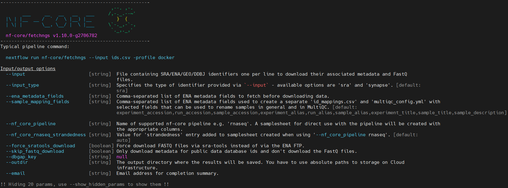

In my previous post, I described how to specifically search public data and fetch metadata. Today I hope to talk with you about how to download the selected public raw data.

To download the data, several tools as listed below can be used.

- 

- fasterq-dump

- [nf-core/fetchngs](https://nf-co.re/fetchngs/1.12.0/docs/usage)

In this option, I choose the nf-core/fetchngs pipeline due to several reasons.

1. 

### Required inputs

### How to use?

