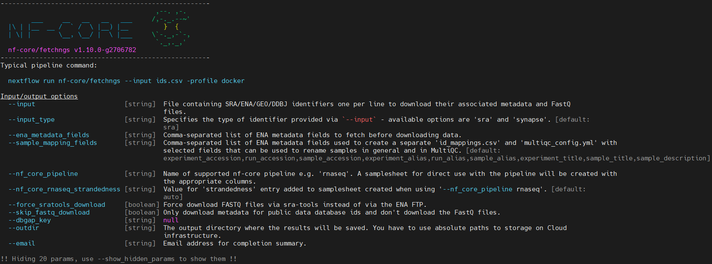
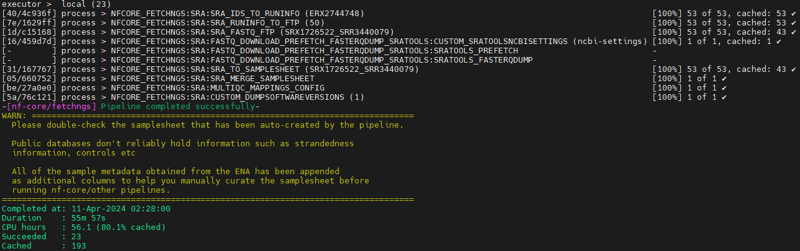
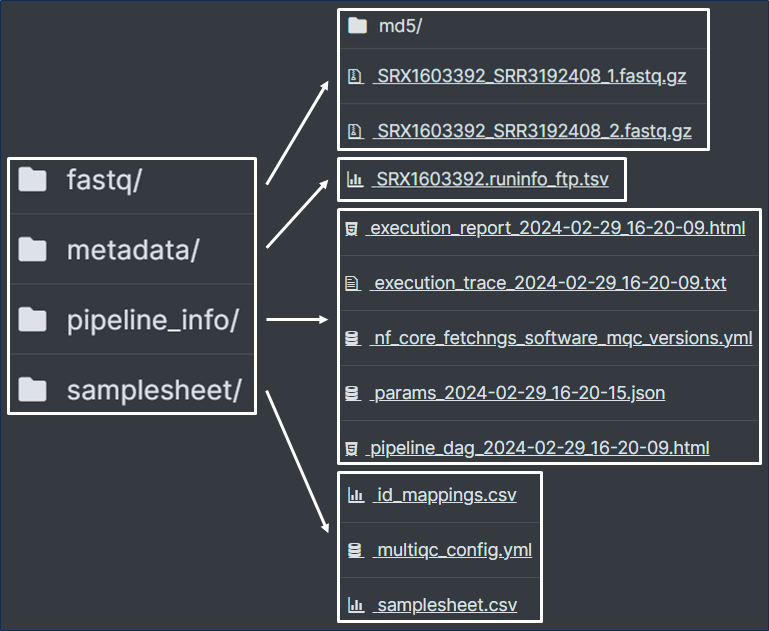
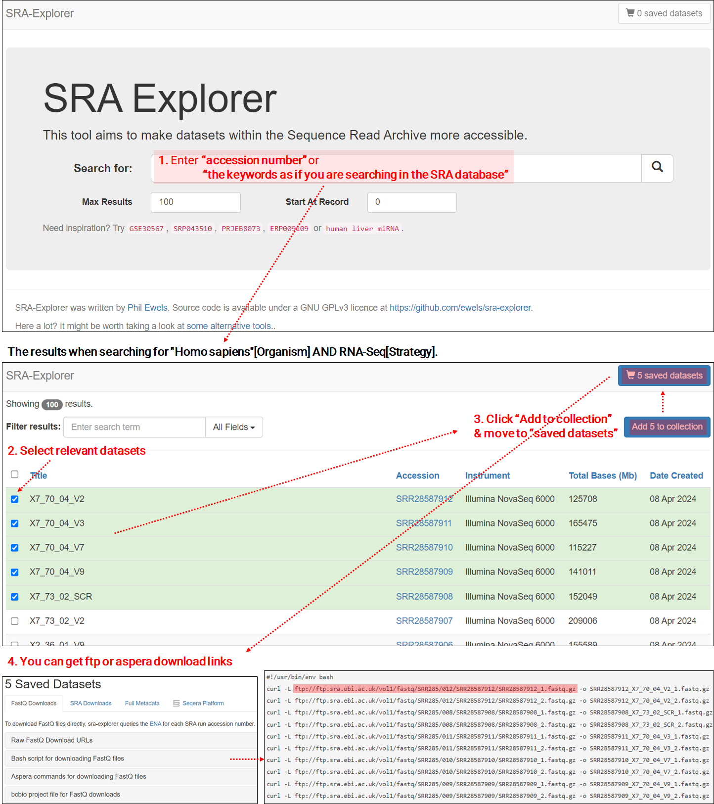

In my [previous post](https://keun-hong.github.io/database/public-ngs-data-db/), I described how to specifically search for public NGS-based data and fetch metadata from INSDC database. Today I hope to talk with you about how to download the selected raw data.

To download the data, several method or tools as listed below can be used. In this options, I choose the nf-core/fetchngs pipeline due to several reasons.

- File links searched from [SRA Explorer](https://sra-explorer.info/) ([GitHub](https://github.com/ewels/sra-explorer?tab=readme-ov-file))

- [fasterq-dump](https://github.com/ncbi/sra-tools/wiki/HowTo:-fasterq-dump) ([SRA-Toolkit](https://github.com/ncbi/sra-tools))

- [nf-core/fetchngs](https://nf-co.re/fetchngs/1.12.0/docs/usage)

- others (ex. [GEOfetch](https://pep.databio.org/geofetch/), [pysradb](https://github.com/saketkc/pysradb))

### Why I use nf-core/fetchngs pipeline?

- **Portability & Reproducibility:**<br>nf-core pipelines, like fetchngs, enable consistent and reproducible analyses across various environments, streamlined by containerization (ex. Singularity).

- **Scalability:**<br>Fetchngs efficiently manages simultaneous downloads of multiple files, enhancing throughput and expediting data acquisition in large-scale studies.

- **Re-entrancy:**<br>Fetchngs supports restarting downloads from failure points, conserving time and computational resources with `-resume` option.

- **Connectivity:**<br>Designed for direct interoperability, fetchngs seamlessly connects with nf-core's data processing pipelines (rnaseq, atacseq, viralrecon & taxprofiler) for integrated analyses.

### How to use?

#### Required input file

To run the pipeline, an input file containing accession numbers per line is required.

```bash
vim ids.csv
```

```tex
ERX2744752
ERX2744753
SRX15288999
SRX15289000
```

#### How to set-up and run?

```bash
# Download Singularity images of fetchngs pipeline
nf-core download fetchngs \
    -r 1.2.0 -d -x none -s singularity -u amend

# Confirm the usage
nextflow run nf-core/fetchngs --help
```



```bash
# Run the pipeline
nextflow run nf-core/fetchngs \
    -profile singularity \
    --input ids.csv \
    --outdir 00_raw \
    -resume # if error is occured.
```



#### Results

Link: [fetchngs: Results](https://nf-co.re/fetchngs/1.12.0/results/fetchngs/results-8ec2d934f9301c818d961b1e4fdf7fc79610bdc5)



### Other - File link searched from [SRA Explorer](https://sra-explorer.info/)



### Reference

[2109_Nmeth) Reproducible, scalable, and shareable analysis pipelines with bioinformatics workflow managers](https://www.nature.com/articles/s41592-021-01254-9)<br>[2002_Nbiotech) The nf-core framework for community-curated bioinformatics pipelines](https://www.nature.com/articles/s41587-020-0439-x)