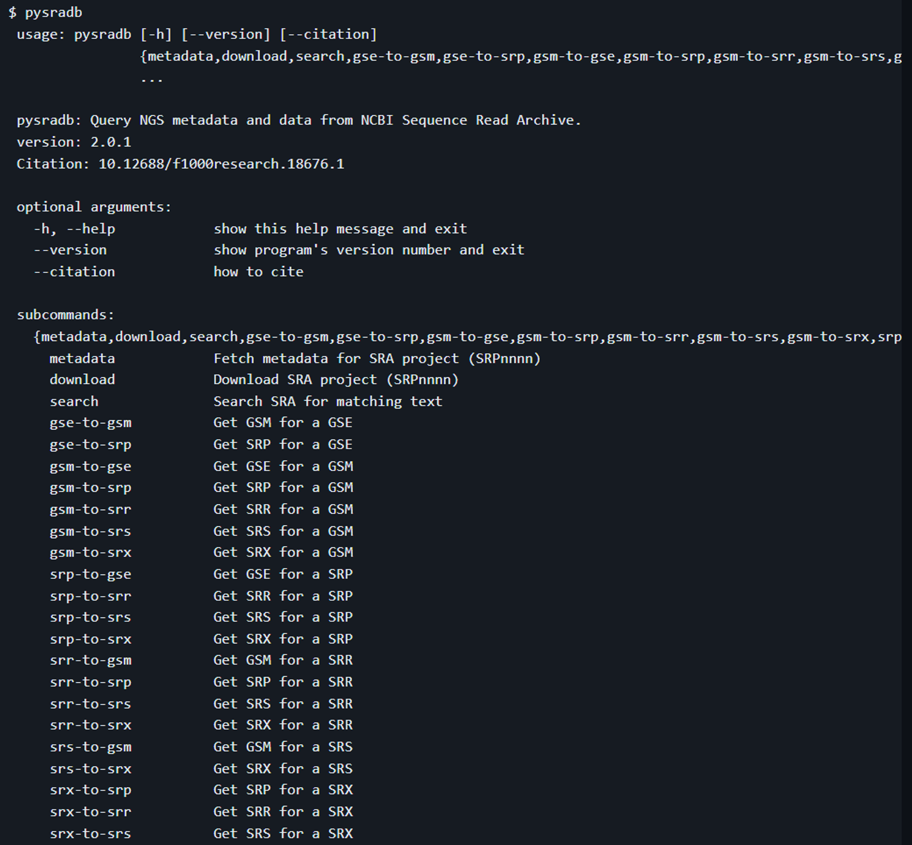

### ffq

[2301_Bioinfo) Metadata retrieval from sequence databases with *ffq*](https://academic.oup.com/bioinformatics/article/39/1/btac667/6971839)
[GitHub - pachterlab/ffq](https://github.com/pachterlab/ffq)

### GEOfetch

[2303_Bioinfo) GEOfetch: a command-line tool for downloading data and standardized metadata from GEO and SRA](https://academic.oup.com/bioinformatics/article/39/3/btad069/7066913?login=false)
[GEOfetch - PEPkit: the bio data management toolkit](https://pep.databio.org/geofetch/)

### nf-core/ngsfetch

[nf-core/fetchngs](https://nf-co.re/fetchngs/1.12.0/docs/usage)
[GitHub - nf-core/fetchngs](https://github.com/nf-core/fetchngs?tab=readme-ov-file)

### pysradb

[1904_F1000) pysradb: A Python package to query next-generation sequencing metadata and data from NCBI Sequence Read Archive](https://f1000research.com/articles/8-532/v1)
[GitHub - saketkc/pysradb](https://github.com/saketkc/pysradb)

https://www.biorxiv.org/content/10.1101/2021.09.23.461561v1.full

