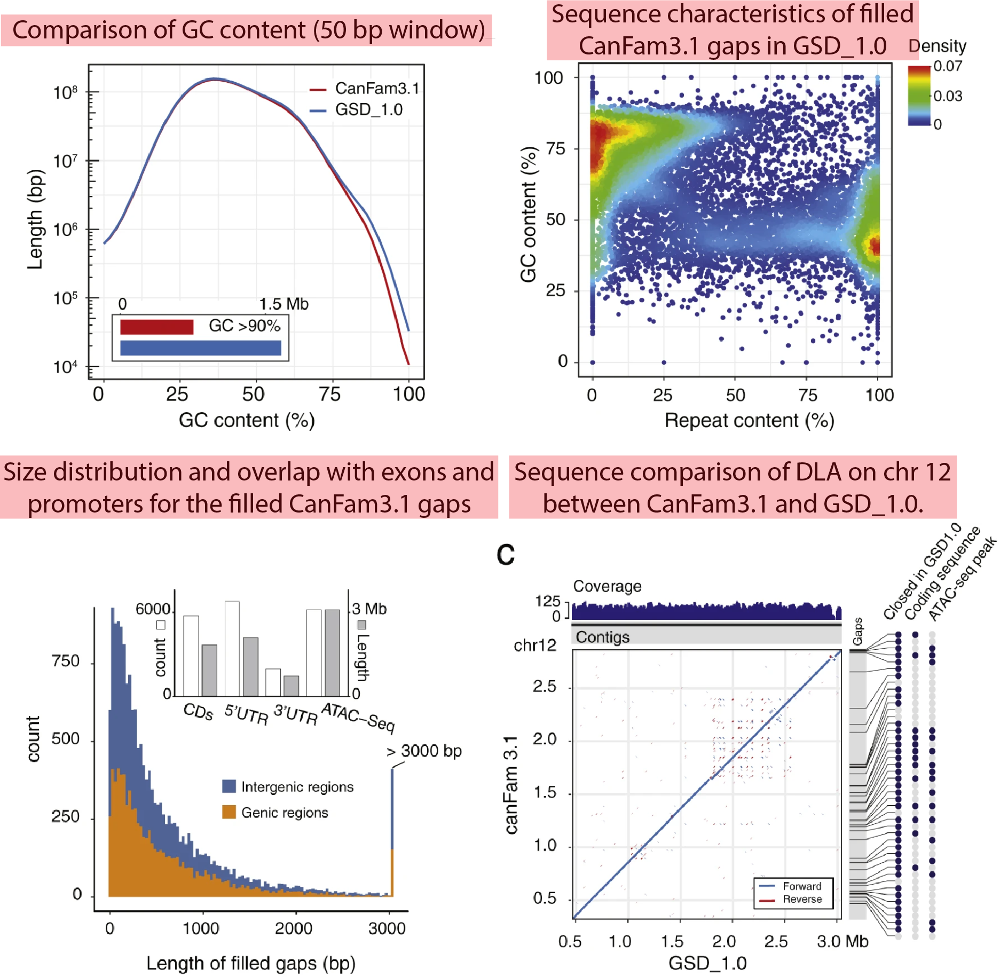

[Wang C. et al. (2021) A novel canine reference genome resolves genomic architecture and uncovers transcript complexity. Communications Biology](https://www.nature.com/articles/s42003-021-01698-x)

### Flow

- De novo assembly
- Reference benchmarking
- Repeat structure
- Functional annotation
- Implications for research
- Comparison to canine assemblies
- Genome variation
- Genome “dark” regions unmasked
- Chromosome mis-assembly resolved
- CYP1A2 locus variation

### Reflextions

As I delve deeper into research involving dogs, I find myself increasingly fascinated by the unique features and value of the dog model. This makes my research not only enjoyable but also truly important. (I’ll elaborate on this point in a future post.)

Over the past five years, the field of canine genomics has seen remarkable progress. For example, after the release of the first high-quality draft genome (CanFam v1 and v2) in 2005, and CanFam v3 in 2011, we have recently seen the publication of CanFam v4, v5, and v6 by different institutions within the span of 8-9 years. Additionally, there has been the publication of results from large-scale projects, such as the Dog 10K, which involved the sequencing of genomes from hundreds of different dog breeds. Many other significant projects are also ongoing in this field.

### Key Insights

The paper I’m discussing here reports on the newly improved CanFam4 genome, led by Professor Kerstin Lindblad-Toh, who was the first author on the original draft genome paper published in *Nature*. Though I am not directly involved in genome assembly research, I found the experimental and analytical methods used in this study to be particularly intriguing. The authors employed three sequencing technologies—PacBio long-read sequencing, 10x Genomics linked-read sequencing, and Hi-C sequencing—using innovative analytical techniques and validation methods that caught my attention.

CanFam v4 has addressed many gaps that existed in v3, which concealed hidden functionality, and it has revealed dark and camouflaged regions, among other significant improvements.

### About PI

Professor Lindblad-Toh is a faculty member at Uppsala University, where she focuses on comparative genomics with a particular emphasis on dogs. She also serves as a director at both the Broad Institute and Science for Life Laboratory in Uppsala.

In her research, she has led the dog disease mapping group at the Broad Institute, developing various SNP chips. She was also involved in the 29 Mammals Project, where she served as the first author of a 2011 paper published in *Nature*. This paper had two prominent senior authors: Eric S. Lander, leader of the Genome Project, and Manolis Kellis, leader of the ENCODE and Roadmap Epigenome projects. Upon further investigation, I discovered that Professor Lindblad-Toh was a postdoctoral fellow in Eric Lander's lab and contributed as a co-author to several important studies, including the initial mouse draft genome paper, which was a pleasant surprise.

I plan to read more of her papers in the near future!