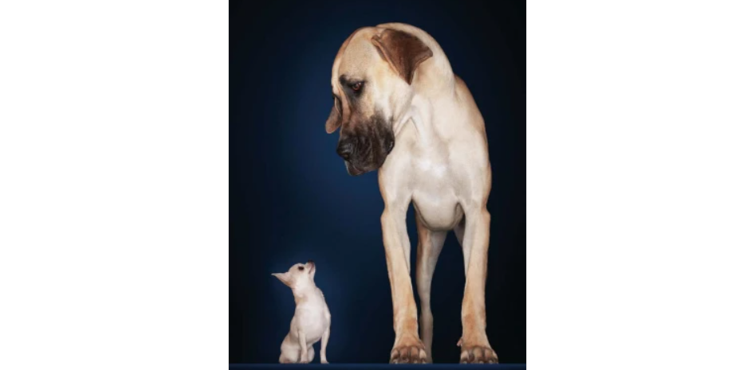

[Neff E.P. (2019) Whole genome sequencing has gone to the dogs. labanimal](https://www.nature.com/articles/s41684-019-0315-9)

As a researcher deeply involved in canine studies, I find dogs to be incredibly fascinating and unique. Their distinct characteristics, unmatched by any other animal model, not only make my research enjoyable but also instill a sense of pride in the work I do. I’d like to briefly discuss some of these remarkable traits.

### A brief history of canine evolution

Humans (homo sapiens) have evolved over hundreds of thousands of years, while dogs, in contrast, were <mark>domesticated from the grey wolf over 11,000 years ago</mark>—a relatively short time in evolutionary terms. During this brief period, <mark>dogs underwent rapid evolution through intense artificial selection by humans</mark>, resulting in <mark>approximately 450 distinct breeds</mark> worldwide. Notably, <mark>most of these breeds were established within the last 200 years</mark>.

Despite this rapid evolution, dogs of the <mark>same breed exhibit a high level of uniformity</mark>, while there is <mark>extraordinary variation between different breeds</mark> in terms of size, color, skull shape, behavior, and personality. This level of variation is unparalleled among mammals.

### What this means for research

The key implication here is that while human diversity, which has evolved over a long period, is influenced by many genes, the diversity observed in dogs—evolving under selective pressure in a much shorter time—can often be traced back to a few strong-impact genes. A striking example of this is seen in recent findings from the Dog 10K project. 

Despite years of research, <mark>hundreds of genes are thought to influence human height</mark>. <mark>However, the size difference between a tiny Chihuahua and a giant Great Dane can be explained by just 15-20 genes</mark>. Isn’t that astonishing? This makes dogs an excellent model for identifying the genetic causes of various morphological, behavioral, and personality traits.

### Dogs as models for disease research

Dogs also serve as valuable models for studying various diseases. Unlike artificially created mouse models, dogs naturally develop diseases similar to humans, such as cancer, due to their long history of sharing similar environments with humans. Additionally, due to the <mark>high levels of inbreeding within specific breeds, dogs often exhibit breed-specific disorders.</mark>

For example:

- Mountain dogs are prone to histiocytic sarcoma.
- Scottish Terriers frequently develop bladder cancer.
- Golden Retrievers have a high incidence of lymphoma.
- Irish Wolfhounds are prone to osteosarcoma.
- Bull Terriers often exhibit obsessive-compulsive disorders (OCD).
- Doberman Pinschers are known for blanket-sucking behavior.

These breed-specific tendencies make dogs a more suitable animal model for uncovering the causes of certain diseases, even more so than humans in some cases.