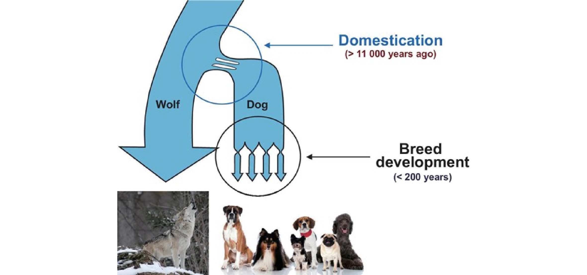
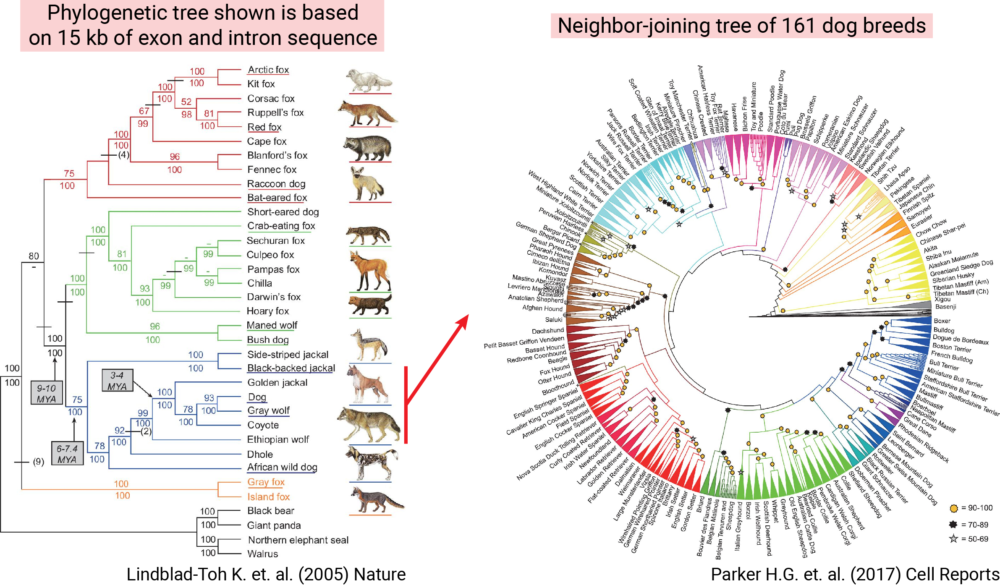

[Ostrander E.A. et al. (2019) Dog10K: an international sequencing effort to advance studies of canine domestication, phenotypes and health. National Science Review](https://academic.oup.com/nsr/article/6/4/810/5437695)

[In my previous post](https://keun-hong.github.io/exploration/canine-ref-canfam4-highlight/), I discussed the unique characteristics of dogs that have evolved over the past 11,000 years due to their close relationship with humans. These traits, unmatched by any other mammals, make dogs an incredibly fascinating and suitable animal model for studying a wide range of morphological, behavioral, personality phenotypes, and diseases.

### About PI

One of the leading researchers in the field of canine genomics is Elaine A. Ostrander from the NIH-National Human Genome Research Institute (NHGRI). Ostrander has dedicated many years to advancing dog genomics research and has recently expanded her work into transcriptomics and epigenomics. Some of her notable recent studies include a 2017 paper published in [*Cell Reports*](https://www.cell.com/cell-reports/fulltext/S2211-1247(17)30456-4?_returnURL=https%3A%2F%2Flinkinghub.elsevier.com%2Fretrieve%2Fpii%2FS2211124717304564%3Fshowall%3Dtrue&fbclid=IwAR2paobuwCsL0E2CvYrL_pgYlQmvss-EIhzmOMecg9X1dp2OmTeUVezV9us), where she used SNP-chip technology to analyze 1,356 dogs and 9 wild canids, revealing the relationships among 161 breeds. Another significant study, published in [*Nature Comm.*](https://www.nature.com/articles/s41467-019-09373-w) in 2019, utilized whole-genome sequencing (WGS) to investigate 669 domestic dogs and 54 wild canids at the genomic level.

### Dog 10K project

Building on her extensive research background, Dr. Ostrander has spearheaded the ambitious Dog 10K project. The goal of this large-scale initiative is to perform <mark>WGS (with a depth > 20x) on 10,000 dogs from various breeds over five years</mark>. This project aims to pave the way for future genomics research on a multitude of traits and diseases. The details of this endeavor are thoroughly discussed in a recent review paper.

The three primary objectives of the Dog 10K project are as follows:

**Aim 1:** Investigate the <mark>history of dogs, focusing on domestication, admixture, and selection</mark>, to uncover aspects of canine evolution that remain unclear.

**Aim 2:** Study the <mark>structure of modern dog breeds and their morphological diversity</mark>, particularly considering that most breeds have been developed in the last 200 years.

**Aim 3:** Focus on <mark>disease research that links dogs and humans</mark>, leveraging the similarities in disease manifestation between the two species.

The review paper also details the sampling scheme and sequencing efforts (phases 1-4) necessary to achieve these goals, based on previous SNP-chip and WGS studies. 

### Reflextions

As I read through these plans, I was struck by the sheer magnitude of influence and resources required to undertake such research. The collaboration, dedication, and hard work of the many teams involved—past, present, and future—are awe-inspiring and almost overwhelming. The paper mentions that sequencing for over 5,000 samples is already underway, with the data being shared in a public database.

Through this paper, I gained a deeper understanding of the current trajectory of canine research. At a time when studies are progressing rapidly, it made me reflect on the mindset and dedication required to contribute meaningfully to this field.