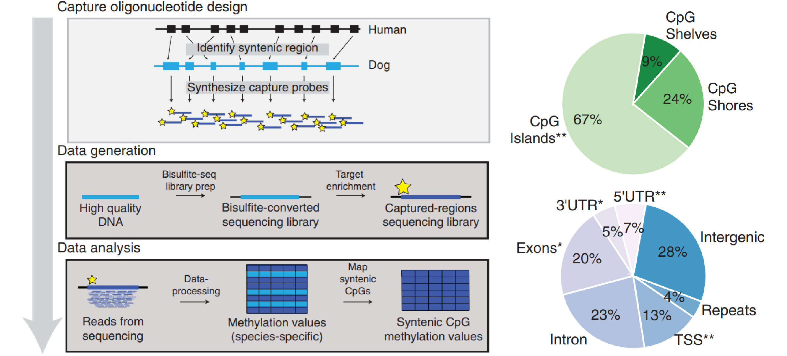

[Wang T. et. al. (2020) Quantitative translation of dog-to-human aging by conserved remodeling of the DNA methylome. Cell Systems](https://www.cell.com/fulltext/S2405-4712(20)30203-9)

[In a previous post](https://keun-hong.github.io/exploration/dog10k-nsr/), I mentioned Professor Elaine A. Ostrander, a leading figure in the field of dog genomics, who has spearheaded numerous large-scale projects. Recently, she has expanded her research into the epigenome field, and this study is one example of her work.

### Highlights (in paper)

- Oligo-capture sequencing of methylomes from 104 Labradors, 0–16 years old
- Methylome similarity translates dog years to human years logarithmically
- Conserved age-related changes predominately impact developmental gene networks
- Formulation of a conserved epigenetic clock transferable across mammals

### **Flow** (in paper)

- Characterization of dog methylomes with syntenic bisulfite sequencing (SyBS)
- A concordant but nonlinear relationship between dog and human age
- Identification of genes exhibiting conserved methylation dynamics with age
- Translating age and aging effects using a conserved epigenetic clock

### Main Point:

The primary focus of this study is the development of epigenetic clocks that can predict the age of not only dogs but also other mammals. This was achieved by integrating the blood DNA methylome data of 104 Labrador Retrievers (ranging from 0 to 16 years old) with publicly available methylome data from humans and mice.

### Introduction:

It has long been established through previous research that all mammals undergo similar stages of development (embryogenesis, birth, infancy, youth, adolescence, maturity, and senescence). However, much of the research has focused on embryogenesis, leaving our understanding of aging relatively underdeveloped. Despite this, the significant changes in the methylome that accompany aging are well-known. Over the years, researchers have attempted to create epigenetic clocks using the methylome of humans or mice. These clocks showed high accuracy within a species but faced limitations when applied across different species.

### Approach:

<mark>The authors aimed to develop epigenetic clocks that could be broadly applicable across mammals.</mark> To achieve this, they developed a novel experimental method called <mark>Syntenic Bisulfite Sequencing (SyBS)</mark>.

1. The team first identified <mark>approximately 232,000 CpG sites conserved in the dog genome that corresponded to target regions on the human genome.</mark> These regions had been extensively studied using Illumina human methylome arrays.
2. They then <mark>designed probes to capture DNA fragments from around 90,000 CpG sites.</mark> This allowed them to perform targeted sequencing with high depth, <mark>overcoming the limitations</mark> of Whole Genome Bisulfite Sequencing (WGBS) and Reduced Representation Bisulfite Sequencing (RRBS).

### Results:

1. Despite the limitations of using blood samples, such as the inability to account for changes in cell populations with aging, the study found a remarkably high positive correlation between methylation and aging.
2. The study identified a nonlinear epigenetic clock between the two species. For example, they observed that aging in dogs is significantly faster during juvenile and adolescent stages but slows considerably during the senior stage.
3. <mark>By analyzing 394 genes from conserved time-dependent methylation regions</mark>, they discovered highly interconnected network modules. Aging-related methylation generally <mark>increased in four modules (Anatomical Developments 1 & 2, Neuroepithelial Cell Differentiation, Synapse Assembly and Regulation)</mark> and <mark>decreased in one module (Leukocyte Differentiation and Metabolic Pathways)</mark>. Many of the genes within these modules were related to development, highlighting the ongoing influence of developmental processes during aging.
4. Finally, they validated the applicability of this epigenetic clock in mice, confirming that CpG methylation in these 394 genes could serve as a conserved epigenetic clock across mammals.

