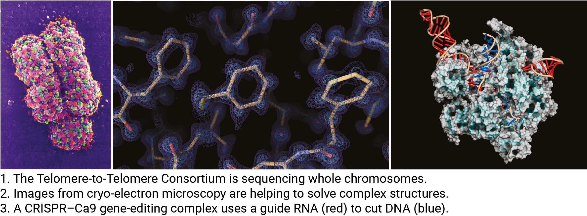

[Eisenstein M. (2022) Seven technologies to watch in 2022. Nature](https://www.nature.com/articles/d41586-022-00163-x)

The pace of change in the scientific world is accelerating rapidly, making it increasingly important to quickly adapt to and apply new developments. In a recent article by Nature Portfolio, titled "Seven Technologies to Watch in 2022," several emerging technologies were highlighted. Below is a summary of these key technologies.

### 1. Fully Finished Genomes

- Second-generation sequencing technologies, such as Illumina short-read sequencing, revolutionized molecular biology by enabling whole-genome research across numerous species. However, due to the short read lengths (<150 bp), these technologies struggled to sequence repetitive elements (e.g., retroelements, telomeres, centromeres), leaving approximately 10% of genomes unresolved.
- <mark>Third-generation sequencing technologies, like PacBio and Nanopore long-read sequencing</mark>, offer <mark>lower accuracy but can read sequences up to hundreds of thousands of bases long</mark>, making them game-changers in genomics.
- With these advancements, initiatives like the Telomere-to-Telomere (T2T) Consortium and the Human Pangenome Reference Consortium are collaborating to complete the final chapters of the Human Genome Project by providing fully finished genome sequences across diverse populations.

### 2. Protein Structure Solutions

- Protein structure is critical to function, and while structural research has been ongoing for many years, it has faced numerous challenges. Recent advancements in experimental and analytical methods, however, have enabled unprecedented levels of resolution and speed in structural studies.
- <mark>Notable computational tools like AlphaFold2 (by DeepMind) and RoseTTAFold (by UC’s Baker Lab)</mark> have emerged, offering remarkably accurate predictions that researchers now trust.
- On the experimental front, <mark>cryogenic-electron microscopy (cryo-EM) and cryo-electron tomography (cryo-ET)</mark> are allowing near-atomic resolution visualization of protein structures and even observing protein behavior within cells.

### 3. Quantum Simulation

- Under certain conditions, atoms can enter a highly excited, ultra-large state with diameters exceeding 1 micrometer. Physicists have shown that if these atoms are precisely arranged and controlled, they could potentially overcome the limitations of current computers.
- <mark>Quantum computers, which handle data in qubits rather than bits</mark>, offer dramatically enhanced performance. However, controlling qubits has proven difficult.
- Researchers have made significant progress in developing <mark>stable Rydberg atom array-based systems</mark>, suggesting that quantum simulators could be commercially available within a year or two. Yet, the journey to fully functional quantum computers remains challenging. As one scientist put it, "That first airplane didn’t have any transportation advantages, but it eventually changed the world."

### 4. Precise Genome Manipulation

- CRISPR-Cas9 creates DNA breaks that are typically repaired by non-homologous end joining (NHEJ), a process that often results in small insertions or deletions. While useful for gene inactivation, this method lacks the precision needed for therapeutic applications requiring exact DNA modifications.
- The newly developed <mark>Prime Editing technique</mark> is much safer, <mark>as it only cuts one strand of DNA at a time, allowing for base-level modifications and precise gene therapy.</mark> Researchers are currently working to improve the efficiency of this technology. As David Liu noted, “In some cases, it’s known that if you can replace a gene at a 10% or even a 1% level, you can rescue the disease.”

### 5. Targeted Genetic Therapies

- Traditional therapies for specific cells or tissues often require localized administration or ex vivo manipulation, where cells are modified outside the body and then reintroduced. Delivering therapies directly to specific tissues without these steps has been challenging.
- <mark>Modified adeno-associated viruses (AAVs) can achieve organ-restricted delivery (ORD).</mark> However, manufacturing at scale is difficult, and immune responses can reduce efficacy or cause side effects.
- <mark>Lipid nanoparticle technology offers a non-viral alternative for ORD</mark>, showing promise as a replacement for current methods.

### 6. Spatial Multi-Omics

- Single-cell omics technologies have opened new avenues for biological research. However, after the introduction of Slide-seq in 2016, which allowed for the collection of spatial information alongside single-cell data, the focus on developing spatial multi-omics techniques has intensified.
- In addition to commercially available platforms like Visium, various new methods are being developed to simultaneously capture spatial and multiple omics data (genome, transcriptome, epigenome).

### 7. CRISPR-Based Diagnostics

- CRISPR technology, derived from bacterial immune systems, primarily uses the Cas9 protein to recognize and cut specific DNA sequences. However, other Cas proteins exist.
- <mark>Cas13 and Cas12 recognize RNA and DNA, respectively, without cutting.</mark> <mark>By adding fluorescence techniques, systems have been developed that emit a signal when a target sequence is detected.</mark>
- Current viral diagnostics rely on antigen-antibody reactions or PCR amplification. The former is fast but can be difficult to develop and less accurate, while the latter is accurate but time-consuming. <mark>CRISPR-Cas13 offers a rapid, accurate, and low-cost alternative</mark> that can detect multiple viruses simultaneously, with methods <mark>now capable of detecting up to 169 viruses at once.</mark> The technology's versatility makes it a powerful tool for diagnosing any DNA or RNA-related conditions.

### Key Researchers to Watch in Each Area:

1. Karen Miga / Adam Phillippy / Erich Jarvis
2. Janet Thornton / Bridget Carragher
3. Antoine Browaeys / Mikhail Lukin
4. David Liu / Hyongbum Henry Kim
5. Daniel Anderson / Daniel Siegwart / Roy van der Meel
6. Joakim Lundeberg / Rong Fan
7. Pardis Sabeti / Feng Zhang / Jennifer Doudna / Melanie Ott