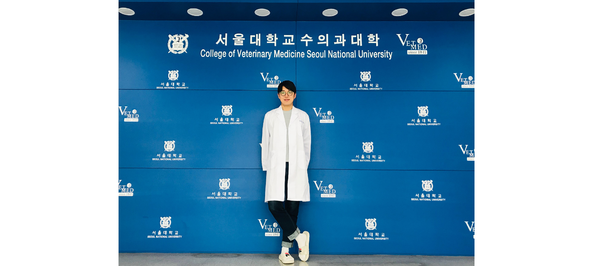

[Wang Y. (2022) Owning, not doing: my transition from master’s to PhD student. Nature](https://www.nature.com/articles/d41586-022-00135-1)

Today, I want to share a brief reflection on becoming a true researcher, rather than focusing on scientific details. This piece contains valuable insights that I believe are essential for many researchers, so I highly recommend reading it! :)

### Summary

In the opening line, the author says, <mark>"One of the most important lessons I learned during my seven years of graduate research was understanding the difference between merely 'doing' a research project and 'owning' it, and how to transition from being a doer to becoming a researcher."</mark>

During her master’s program, the author was a diligent doer. She contributed ideas, sometimes planned experiments, and relied heavily on her advisor for guidance. When reading papers, she focused more on the experimental methods needed to solve immediate problems rather than gaining deep knowledge or understanding the broader context.

While this approach allowed her to contribute enough to earn a spot as a co-author on papers, it wasn’t the path to becoming a successful scientist.

When she began her PhD, her advisor did not provide step-by-step answers. Instead, discussions often ended with many unresolved uncertainties that she had to figure out independently, which left her feeling confused.

However, her advisor consistently encouraged her to find the answers on her own, saying, "You need to 'own' your project, not just 'do' it. When you graduate, your goal should be to become the most knowledgeable person in the world in your field." (Inspiring... 😢)

Initially, the responsibility of making decisions was daunting, but the effort to read and think more deeply nurtured her curiosity, which in turn sparked greater interest and helped her overcome her anxiety. By the time she completed her PhD, she had gained confidence as a true researcher.

The author offers several tips for owning your research:

1. Think beyond the routine benchwork. Spend more time pondering why you’re conducting experiments rather than just performing them.
2. Even if you’re influenced by your advisor, develop your own daily, weekly, and monthly plans to learn how to manage your time effectively.
3. Science isn’t a solitary endeavor. Seek advice and communicate with your advisor, colleagues, people in other labs, and researchers online if it helps you.
4. Don’t hesitate to share your research. Whether in seminars, conferences, or with various people, discussing your work requires a thorough understanding, which helps you identify gaps in your knowledge and potentially find new collaborators.

### My Experience

I’ve had a similar experience to the author. During my master’s program, I focused on solving the problems laid out by various professors and postdocs I collaborated with. As a result, I earned (co-)first authorship on two papers and was listed as a co-author on four others. However, when I started my PhD and received my own project, I faced many challenges. No one could show me the way—I had to carve my own path. It was initially frightening, difficult, and painful. But gradually, I learned the process: how to ask questions, find answers, and make decisions on my own.

I still have much to learn, but I am committed to growing continuously and becoming a researcher who can support my colleagues and juniors while providing new insights.