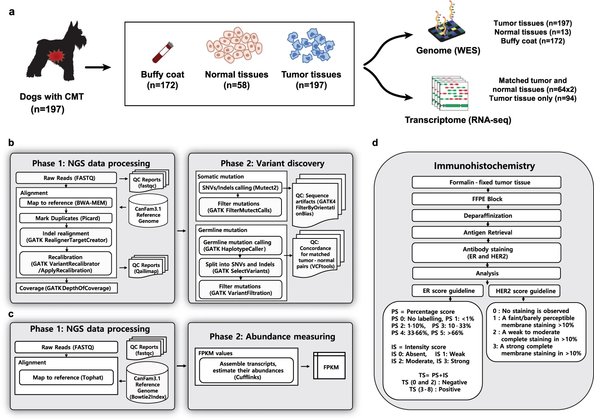
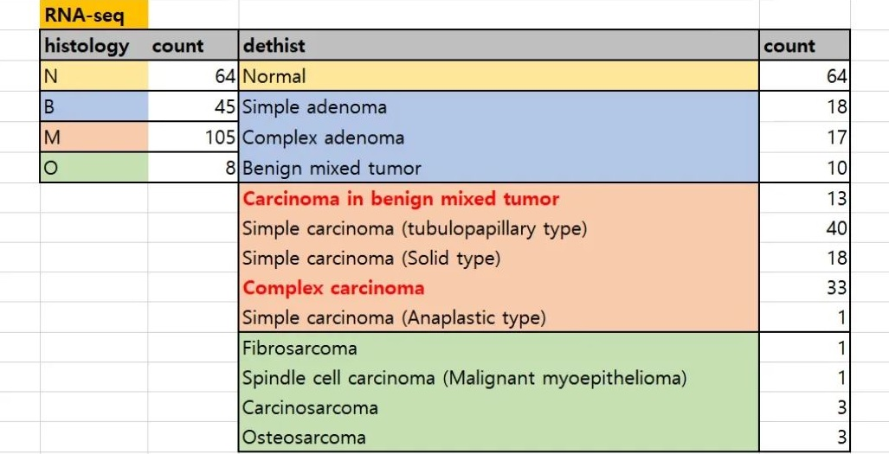

[Kim K. et al. (2019) Whole-exome and whole-transcriptome sequencing of canine mammary gland tumors. Scientific Data](https://www.nature.com/articles/s41597-019-0149-8)

As a researcher focused on pan-cancer studies, my current projects are primarily centered on breast cancer, with a particular emphasis on using canine models. Rigorous and well-constructed datasets are invaluable to my work, providing critical insights and support for ongoing research.

### Learning the importance of research rigor

Over the past five years, a team of our lab has been deeply involved in a comparative oncology project, with a focus on Peripheral Blood Mononuclear Cells (PBMCs) rather than the tumor tissues themselves in canine mammary tumor (CMT) patients. Team leader (Research Associate Professor) generated a significant amount of data, including bulk RNA-seq, MBD-seq, and ATAC-seq. However, the lack of rigor in the sampling process led to disastrous outcomes. Differences in sampling techniques across hospitals resulted in varying immune cell compositions, ultimately rendering many samples unusable. This not only led to a financial loss of around 200 million KRW (150,000 USD) but also wasted an immense amount of researchers' time. Witnessing this, I learned the hard way how crucial rigorous sampling is, engraving this lesson deep into my heart and mind.

### Dog tumor tissue dataset

Simultaneously, another team from Yonsei and Konkuk University Colleges of Veterinary Medicine was working on a similar project, focusing specifically on tumor tissue sampling. Their efforts have resulted in a robust dataset, which has been meticulously documented in their recent publication. The paper demonstrates the rigor with which they approached their work, providing WES and RNA-seq data from numerous patients, along with detailed matching clinical information.

This dataset will be instrumental to our team’s ongoing projects, offering new insights and advancing our understanding of breast cancer in canine models. I am deeply grateful to the Yonsei-Konkuk team for their hard work and dedication in producing such a valuable resource.

### Histology types of data

