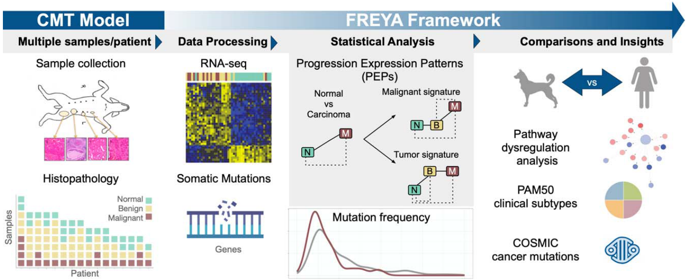
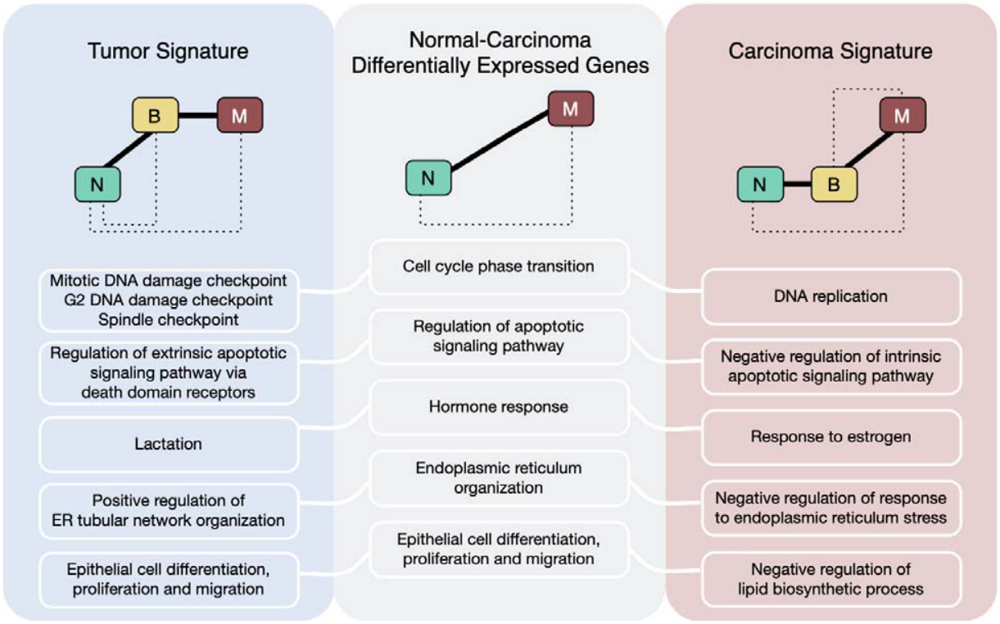
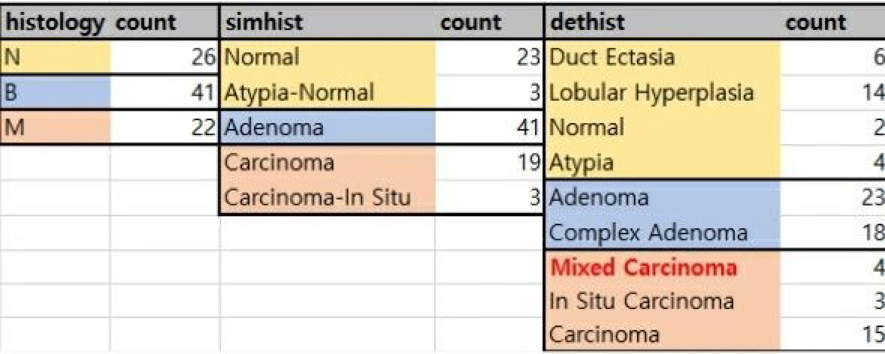
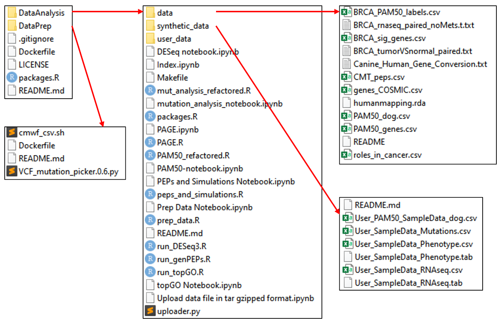

[Graim K. (2020) Modeling molecular development of breast cancer in canine mammary tumors. Genome Research](https://genome.cshlp.org/content/31/2/337.long)

### **Flow**

- Molecular and cancer subtype similarities between canine and human tumors
- Canine mammary tumors harbor human cancer-implicated mutations
- Capture and Characterization of Progression Expression Patterns (PEPs)
- Resolving carcinoma-specific processes versus those altered at the benign transition
- Carcinoma PEP signature is predictive of survival in human breast cancer

### **Key Insights**

In human studies, it is rare to obtain sequential samples from a single patient that capture the different stages of cancer progression, which limits our ability to study the development of the disease. Additionally, the high genetic diversity among individuals can obscure precise molecular signals related to cancer. While research using cell lines can address some of these issues by reducing genetic variability, it fails to replicate the tumor microenvironment and immune system. Similarly, mouse models, though useful, may alter tumor dynamics due to genetic modifications and the process of tumor transplantation.

In contrast, dogs offer several advantages as a model for studying cancer. First, like humans, dogs develop cancer spontaneously, and previous research has shown that canine cancers share many histopathological similarities with human cancers, including incidence rates, correlations with age or body mass index, and hormonal influences. Second, the high genetic homogeneity within specific dog breeds makes it easier to identify key factors in disease development (see the EP Neff paper referenced in a previous post). Third, unlike humans, dogs have five pairs of mammary glands, and the higher incidence of mammary tumors, combined with the lower rate of early diagnosis, often allows researchers to collect samples of different cancer stages from multiple sites in a single patient. This makes it possible to study cancer progression in greater detail using canine models.

In this study, researchers utilized a strategy that involved collecting multiple normal and tumor samples at different stages from the same canine patient. Specifically, they obtained 89 samples (26 normal, 41 benign, 22 malignant) from 16 dogs. All of these samples were subjected to RNA-seq analysis, allowing for a detailed comparison of the genomic and transcriptomic landscapes with those of human breast cancer. The study presents both the methodology and the findings related to cancer development, offering valuable insights into the molecular pathways involved.

### Histology types of data

### Stucture of supplementary data

