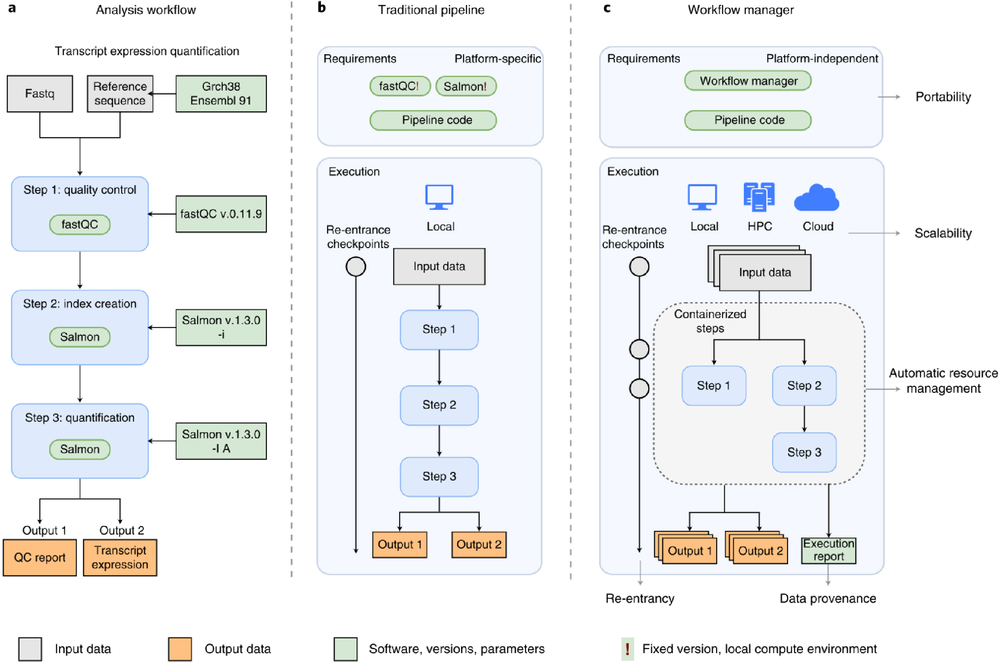
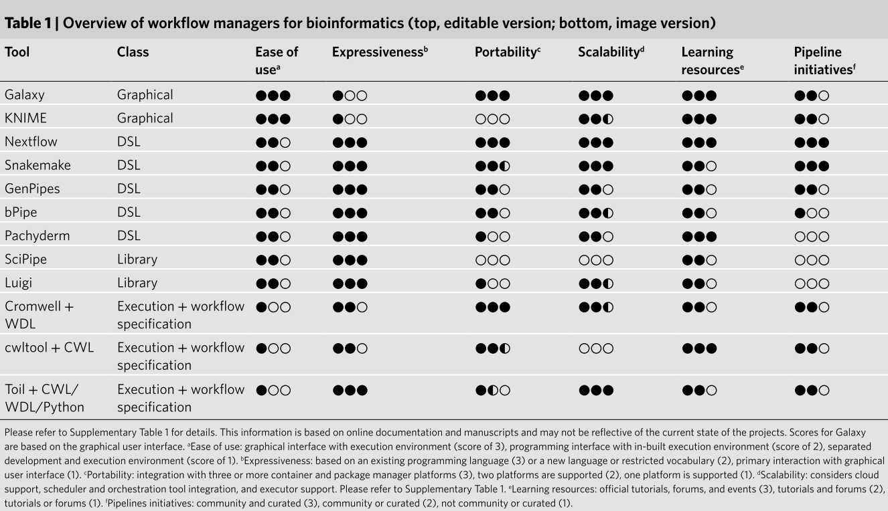
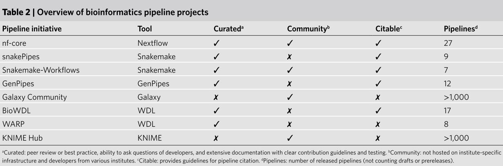

[Wratten L. et. al. (2021) Reproducible, scalable, and shareable analysis pipelines with bioinformatics workflow managers. Nature Methods](https://www.nature.com/articles/s41592-021-01254-9)

The rapid growth of high-throughput technologies has significantly transformed the landscape of biomedical research. With a single experiment now generating vast amounts of data, the complexity and volume of data have increased exponentially. This surge in data complexity, coupled with the continuous evolution of tools, parameters, and other elements required for data processing, has made it increasingly challenging to manage and maintain reproducibility in analysis.

To address these challenges, Workflow Managers (WMs) have been developed. The primary roles of WMs include: <mark>1)</mark> simplifying the development of analysis pipelines; <mark>2)</mark> optimizing the use of computing resources; <mark>3)</mark> simplifying software installation and version management; and <mark>4)</mark> enhancing the portability of workflows, ensuring reproducibility across different computing environments, including cloud-based platforms.

### 1. Data provenance

One of the most critical aspects of research is reproducibility. WMs are designed to track and record extensive details about the analysis process and data transformations, ensuring that the analysis can be reproduced accurately, even in future reanalyses.

### 2. Scalability

Traditional pipeline methods (which I previously implemented using Python or shell scripts) would process one sample at a time, regardless of CPU usage, leading to inefficient use of computing resources and significant time loss. WMs, however, monitor resource usage and automatically adjust to run multiple sample analyses concurrently, optimizing efficiency and reducing overall analysis time.

### 3. Re-entrancy

If an error occurs during the analysis process, WMs allow for reanalysis starting from the point of failure, rather than restarting from the beginning. This feature conserves both time and resources by avoiding unnecessary reprocessing.

### 4. Portability

Using containerization tools like Docker or Singularity, or virtual environments like Conda, WMs manage packages and maintain software dependencies efficiently. This ensures that the workflow can be easily transferred and executed in different environments, including local machines, high-performance computing (HPC) systems, or cloud platforms.

### Which workflow manager should you choose?

The two most popular WMs are <mark>SnakeMake and Nextflow</mark>. If you're already familiar with Python, SnakeMake might be easier to pick up. However, if you're starting from scratch, <mark>I would recommend Nextflow due to its large and active community (nf-core) and the current trends within that community.</mark>

<mark></mark>

