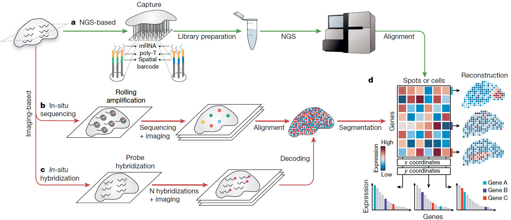
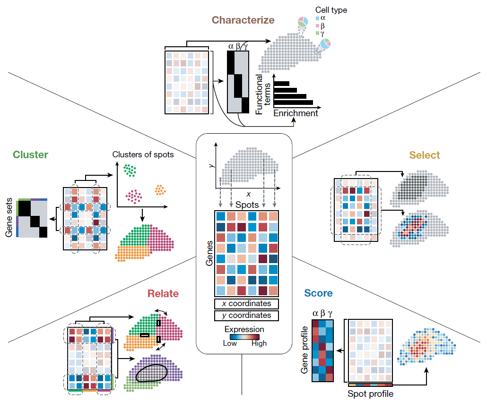
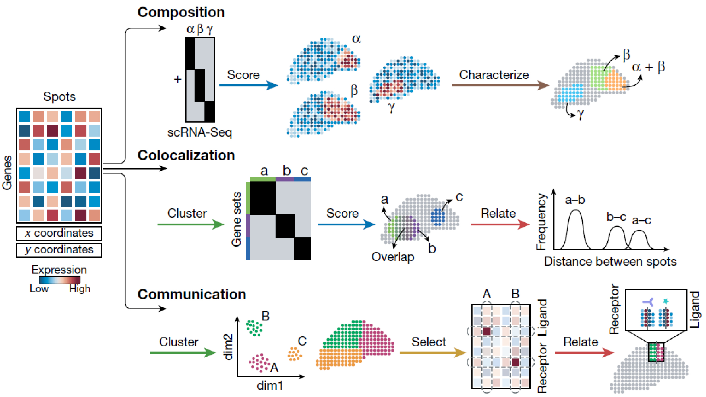

[Rao A. el. al. (2021) Exploring tissue architecture using spatial transcriptomics. Nature](https://www.nature.com/articles/s41586-021-03634-9)

The structure formed by cells within tissues is closely tied to biological functions, making it essential to understand tissue architecture alongside the molecular features of individual cells. Traditional experimental techniques like immunofluorescence or in-situ hybridization allow us to visualize spatial information, but they are limited to detecting only a small number of targets (such as DNA, RNA, or proteins). On the other hand, single-cell omics methods provide a comprehensive view of molecular features at the cell level but lack spatial context.

To overcome these limitations, Spatial Transcriptomics (ST) was developed. This technology allows for the extraction of hundreds to thousands of molecular features at the single-cell level while simultaneously preserving spatial information. First introduced in 2016, ST has since <mark>evolved into two major categories</mark>: <mark>NGS-based and image-based methods.</mark> <mark>The latter can be further divided into in-situ sequencing and in-situ hybridization techniques.</mark>

NGS-based methods offer high-throughput capabilities, enabling unbiased research. In contrast, most image-based methods are targeted and limited in the number of features they can detect, though they typically provide much higher sensitivity and resolution.

A recent review discusses how ST can be used for both hypothesis generation and testing, categorizing exploratory data analysis into five key steps: <mark>Cluster, Characterize, Select, Relate, and Score</mark>. Briefly, ST enables researchers to identify and characterize cell populations within tissue structures, determine cell types based on prior knowledge, and analyze colocalization and communication among cell groups. This level of analysis goes beyond what was possible with single-cell RNA-seq alone, offering new insights into biological processes.

Despite the promising potential of ST, challenges remain in terms of experimental sensitivity, resolution, and handling the high-dimensional data generated. Issues such as noise reduction, data analysis, and visualization are active areas of development, with various solutions being proposed and tested.