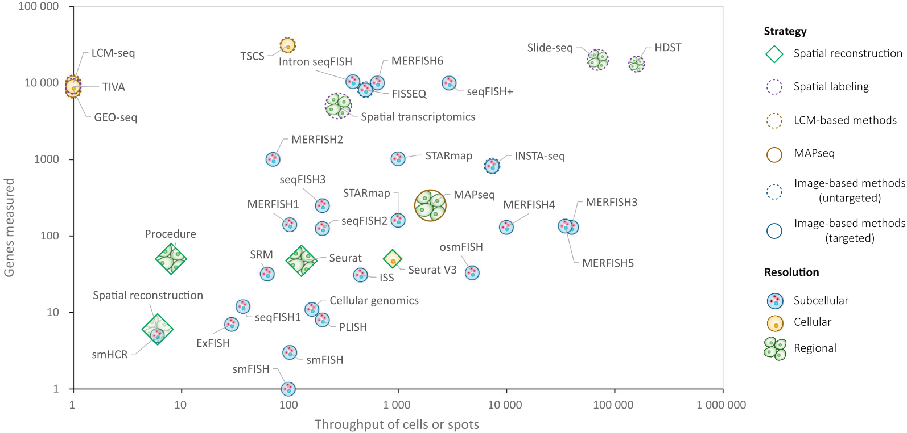
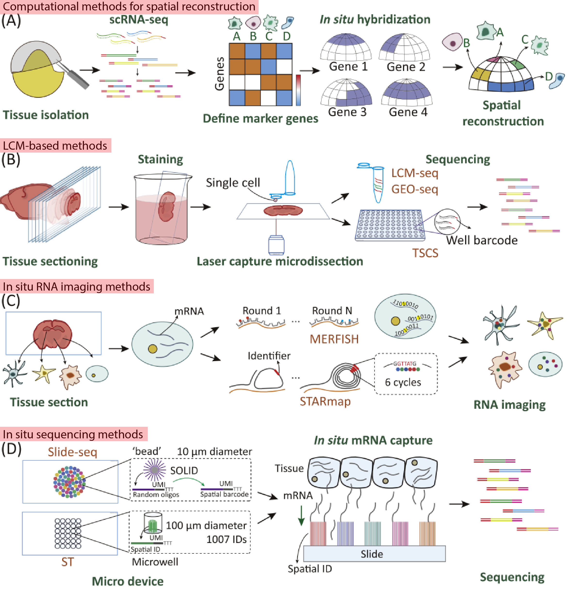

[Liao j. et. al. (2021) Uncovering an Organ’s Molecular Architecture at Single-Cell Resolution by Spatially Resolved Transcriptomics. Trends in Biotechnology](https://www.cell.com/trends/biotechnology/fulltext/S0167-7799(20)30140-2?_returnURL=https%3A%2F%2Flinkinghub.elsevier.com%2Fretrieve%2Fpii%2FS0167779920301402%3Fshowall%3Dtrue)

This paper also delves into the field of Spatial Transcriptomics (ST). While the [previous review by Itai Yanai](https://keun-hong.github.io/exploration/spatial-transcriptomics1/) provided a brief history and experimental overview of NGS-based and image-based approaches, it primarily focused on the analytical aspects of ST. It offered insights into how data generated through experiments can be analyzed, the software tools available, and the strategies behind the development of these tools. However, it lacked detailed information on the experimental methods themselves, leaving a gap for those seeking to understand the techniques at a deeper level.

This current review fills that gap by offering a more comprehensive historical context and focusing on the experimental methodologies. It discusses <mark>two additional, indirect or low-throughput approaches</mark> that were used to obtain spatial information along with molecular features of tissues before the advent of the high-throughput methods. The review also provides a <mark>well-organized overview of the experimental principles and related information (such as target, approach, single-cell capability, resolution, throughput, genes measured, and strategy)</mark> for the techniques used in ST to date.

### Techniques Used Before High-Throughput Methods

1. **Computational Strategies for Spatial Reconstruction**
   - This approach involves <mark>integrating marker gene information</mark> obtained from in situ hybridization with flow cell-based scRNA-seq data to infer the spatial positioning of cells within a tissue.
   - Another method calculates <mark>expression correlations</mark> between cell populations using flow cell-based scRNA-seq data, predicting spatial relevance and virtually placing cells in a hypothetical space.
2. **Laser Capture Microdissection (LCM)-Based Approaches**
   - LCM technology allows for <mark>precise cutting of specific regions within a tissue</mark>. Using this technique, researchers can isolate and dissect clusters of cells from <mark>a particular area of interest in a tissue</mark>, followed by direct scRNA-seq (such as Smart-seq2) on these isolated cells.

This review is valuable for those looking to gain a deeper understanding of the experimental methods used in ST, providing a clear overview of the principles and technical details that underpin these techniques. By exploring both the historical and current methodologies, it offers a comprehensive perspective on the evolution and application of spatial omics in biological research.