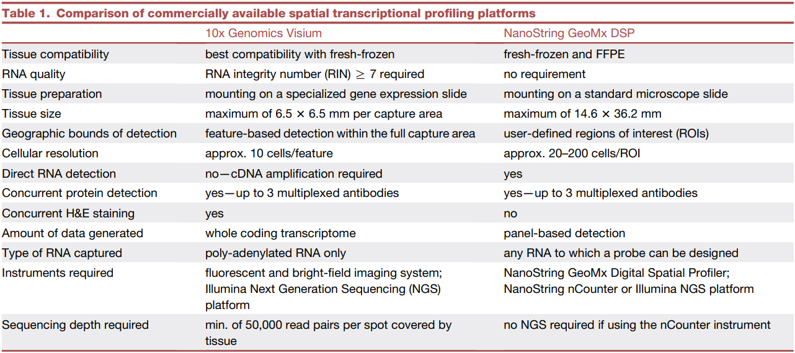

[Bassiouni R. et. al. (2021) Applicability of spatial transcriptional profiling to cancer research. Molecular Cell](https://www.cell.com/molecular-cell/fulltext/S1097-2765(21)00211-2?_returnURL=https%3A%2F%2Flinkinghub.elsevier.com%2Fretrieve%2Fpii%2FS1097276521002112%3Fshowall%3Dtrue)

### Key Insights

Through the previous two papers ([1](https://keun-hong.github.io/exploration/spatial-transcriptomics1/), [2](https://keun-hong.github.io/exploration/spatial-transcriptomics2/)), we gained an understanding of the history, trends, and general experimental and analytical methods associated with spatial transcriptomics (ST). This particular review focuses on <mark>comparing two commercially available ST platforms, 10x Genomics Visium and NanoString GeoMx DSP</mark>, from various perspectives. It provides insights into which situations each platform is best suited for and explores how these technologies can be applied to answer key questions in cancer research.

When it comes to the application of ST in cancer research, the review covers several crucial areas:

- Identifying and localizing transcriptionally distinct cellular populations
- Spatially resolved interrogation of tumor niches
- Understanding the relationship between the tumor microenvironment and treatment response
- Analyzing spatially resolved T cell clonality

### Reflections

In my current research, I’m considering outsourcing a few samples for 10x Genomics Visium (ST) and scRNA-seq, with each sample costing over 6.5 million KRW (4,900 USD). Given the significant investment involved, I’m carefully weighing whether this method will truly answer our research questions or if there might be a more suitable alternative. While the <mark>microwell-based Visium platform has limitations in resolution (approximately 10 cells per spot)</mark>, <mark>newer bead-based technologies like Slide-seq, Stereo-seq, and PIXEL-seq offer the ability to resolve data at the single-cell or even organelle level</mark>. I’m very keen to use these advanced methods, but unfortunately, they are not yet commercially available. Maybe next time, baby.