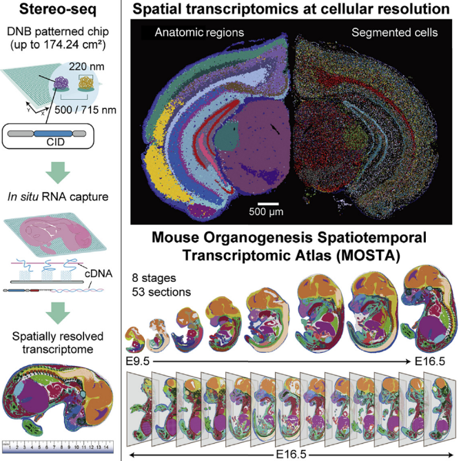
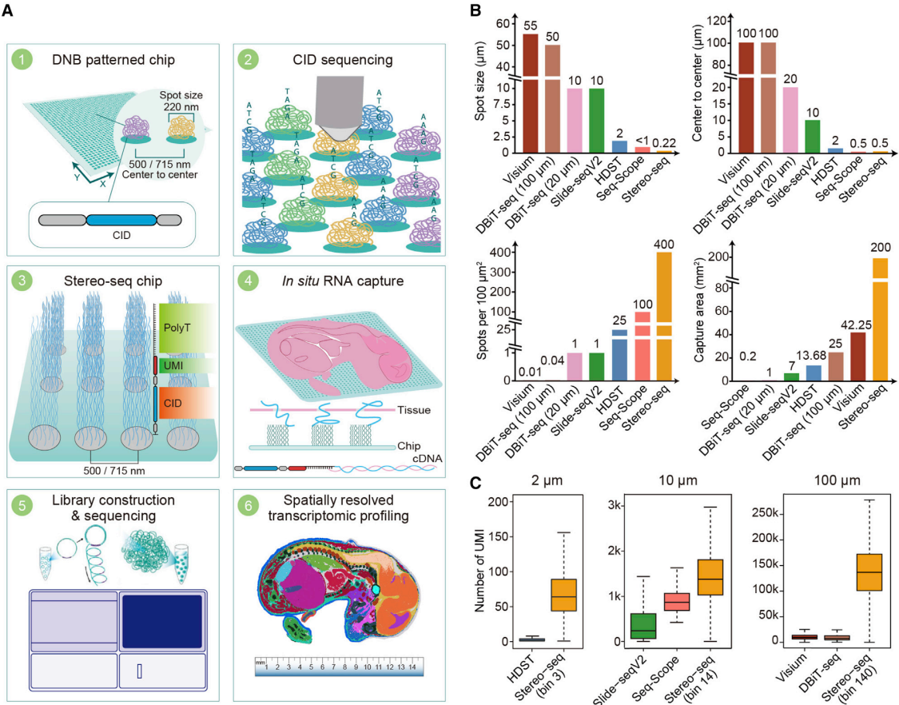
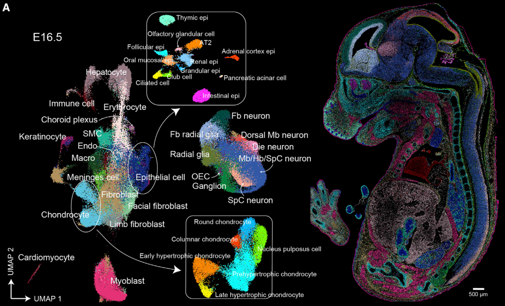

[Chen A. et al. (2022) Spatiotemporal transcriptomic atlas of mouse organogenesis using DNA nanoball-patterned arrays. Cell](https://www.sciencedirect.com/science/article/pii/S0092867422003993)

### Key Insights

In previous reviews by [Itai Yanai](https://keun-hong.github.io/exploration/spatial-transcriptomics1/), [Xiaohui Fan](https://keun-hong.github.io/exploration/spatial-transcriptomics2/), and [Troy A. McEachron](https://keun-hong.github.io/exploration/st-cancer/), we gained a broad understanding of spatial transcriptomics (ST) technologies. This paper focuses on a specific ST technique known as Stereo-seq (Spatial Enhanced Resolution Omics-Sequencing), which leverages DNA nanoball (DNB)-patterned arrays and in situ RNA capture.

In brief, Stereo-seq enables high-definition spatially resolved transcriptomics with a large field of view. Here, "high-definition" refers to single-cell resolution and high sensitivity. When compared to the commercially available 10x Genomics Visium, the results are as follows:

(Note: The size of a single animal cell ranges from 10 to 100㎛. V = Visium, S = Stereo-seq)

1. **Spot size**: V = 55㎛, S = 0.22㎛
2. **Center-to-center distance**: V = 100㎛, S = 0.5㎛
3. **Capture area**: V = 6.5 x 6.5mm, S = 14 x 14mm

These comparisons highlight the significant difference in resolution between the two technologies. While Visium operates at a cellular level (capturing 1-10 cells per spot), Stereo-seq is capable of capturing RNA signals at the organelle level and covers a large area (14mm) sufficient to capture the developmental process of a mouse on a single slide.

The authors further utilized Stereo-seq to create the MOSTA (Mouse Organogenesis Spatiotemporal Transcriptomic Atlas) database. This database captures the central surface of mouse embryos from E9.5 to E16.5 to understand the developmental process from a spatial perspective. For E16.5, where development is nearly complete, they captured 13 sections from a single mouse to obtain 3D spatial information.

Through MOSTA, researchers can observe a plethora of features, including cell composition, location, and changes in tissues during development, key regulons and regulon networks driving development at specific times and in specific cell populations, and even the spatial progression of development using RNA velocity.

### Reflections

What struck me most after reading this paper is the rapid pace of technological advancement. When I first started learning bioinformatics during my undergraduate years, I was amazed by bulk RNA-seq. But within just a few years, the field has progressed so far.

With a single experiment now generating an unprecedented amount of data, deep learning is becoming increasingly prevalent in bioinformatics. The ability to accurately annotate images (e.g., H&E staining) in multimodal analyses could significantly enhance diagnostic accuracy and personalized treatment strategies. It feels like the possibilities are expanding rapidly.

Whereas we once used bulk data to retrospectively infer single-cell signals through deconvolution, methods to trace spatial information from single-cell data are now being developed. It seems plausible that soon, tools will emerge to deconvolute signals at the organelle level.

The pace of progress in this field is truly remarkable, and it’s exciting to imagine where these advancements will lead us next.