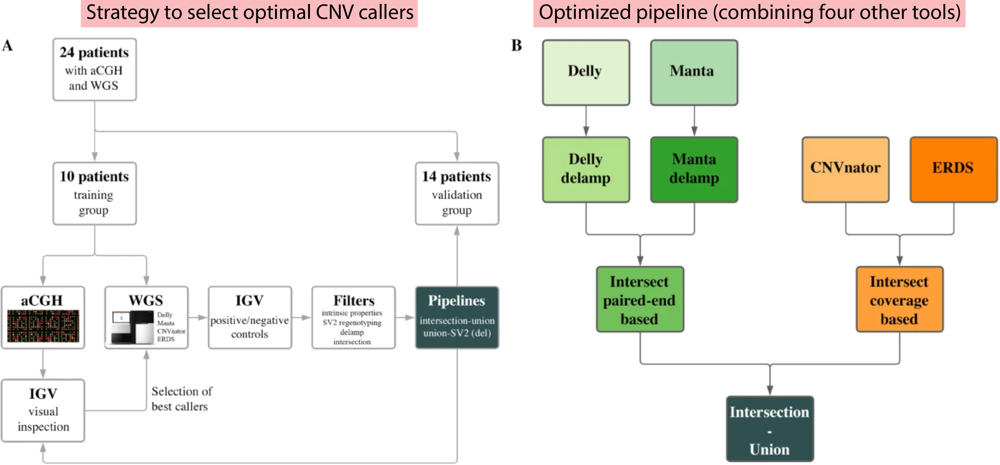

[Coutelier M. (2021) Combining callers improves the detection of copy number variants from whole-genome sequencing. European Journal of Human Genetics](https://www.nature.com/articles/s41431-021-00983-x)

### Key Insights

Structural variations (SVs) refer to DNA changes larger than 50 base pairs and include copy number variations (CNVs) such as deletions, duplications, and insertions, as well as copy number neutral variants like inversions and translocations. SVs play a crucial role in human evolution and disease development. Traditionally, <mark>molecular karyotyping, aCGH (array comparative genomic hybridization), and SNP arrays</mark> have been used to capture these variations. However, with the advent of Next-Generation Sequencing (NGS) technology, particularly Whole Genome Sequencing (WGS), it has become possible to investigate SVs with unparalleled resolution, even in non-coding regions. Despite these advances, the variability between different SV callers is still significant, preventing WGS from fully replacing aCGH.

To address this challenge, the author conducted the following research:

1. **Profiling and comparing SV Callers**: Various SV callers that employ different <mark>strategies, such as discordant read pairs, split-reads, depth of coverage, or local read assembly</mark>, were profiled and compared on the same dataset.
2. **Combining high-efficiency tools**: The study developed a method for combining four of the most efficient tools identified during the profiling.
3. **Validation against aCGH**: The new method was validated to ensure it could effectively replace aCGH.
4. **Additional validation**: Further validation was performed using the NA12878 benchmark genome, a gold standard, as well as clinically validated datasets to confirm the method's reliability.

### Reflections

I came across this paper while helping a colleague and found it particularly relevant given the increasing complexity of data and the variety of analysis tools emerging in the bioinformatics field. Although this isn't my primary area of focus, it became clear to me that comparing and summarizing the characteristics of different tools is crucial. This work aids analysts in choosing the most suitable strategies for their specific circumstances.

Moreover, I believe there should be more studies comparing new techniques with older ones when necessary. One reason for this is that while we are well aware of the advantages of WGS—having used it for over a decade—the FDA still considers aCGH as a first-line technique. This presents challenges when drafting patents related to WGS, as there is often a need to provide additional evidence that WGS can replace aCGH.