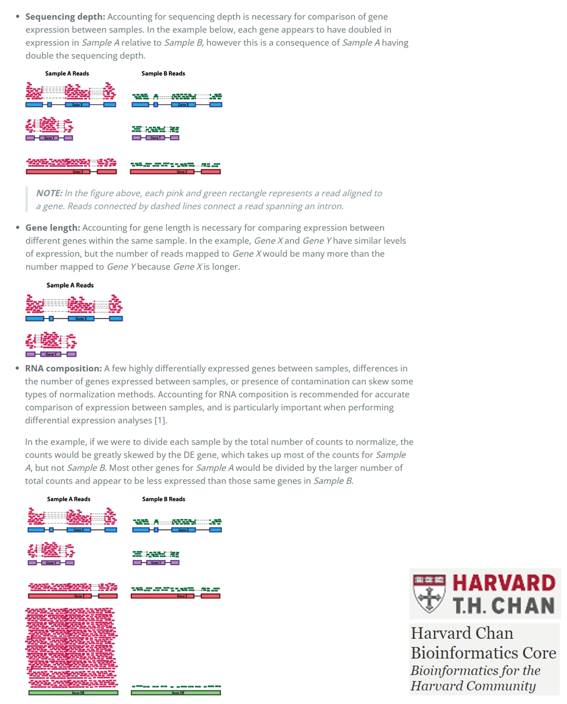

While revising a manuscript, I received a comment stating, "Authors used FPKM for RNA-seq analysis, but for inter-sample comparisons, you should use TPM. Please check if using TPM impacts your results." This prompted me to dive deeper into a topic I hadn't revisited in a while: RNA-seq normalization.

### Considerations for RNA-seq normalization

When normalizing RNA-seq data, three key factors must be considered [7]:

1. Sequencing depth
2. Gene length
3. RNA composition

### Current normalziation methods

The appropriate normalization method depends on the nature of your sample data and the assumptions you make. However, <mark>most current normalization methods are based on the assumption that most genes are not differentially expressed (DE).</mark> 

Common methods under this assumption include RPKM/FPKM, TPM, Quantile normalization, RLE (DESeq2), and TMM (edgeR).

**FPKM**, which considers gene length, is not ideal for inter-sample comparisons because the total expression value of all genes varies significantly, leading to inconsistency. **TPM**, while ensuring that the sum of the normalized values is 1M across samples, is highly sensitive to a few highly expressed outlier genes, which can disproportionately affect the expression values of other genes. Therefore, neither FPKM nor TPM seems suitable. **Quantile** normalization, which adjusts expression values to match the distribution across samples, can increase variation between replicates, potentially leading to errors.

Focusing on RNA composition, methods like **RLE (DESeq2)** and **TMM (edgeR)** provide better results by excluding highly expressed genes and genes with high variability before calculating correction factors.

However, <mark>my research requires not only inter-sample comparison but also gene-level expression comparisons across species</mark>, necessitating the correction of biases introduced by gene length. Using TPM introduces bias when comparing species with significantly different numbers of known genes because it normalizes the total expression to 1M across all genes, which complicates the analysis of 1-to-1 orthologous genes.

### Newly suggested medthod (GeTMM)

While researching this issue, I discovered efforts to incorporate gene length into RLE and TMM, leading me to **GeTMM (Gene length corrected TMM)**. According to the literature (Ref. 1), GeTMM produces results comparable to TMM and RLE in DE analysis while also allowing intra-sample comparisons, much like TPM. I wondered why gene length correction was only applied to TMM and not RLE, and I found that DESeq2 requires integer inputs, which prevents the use of proportion values (read count/gene length) as inputs.

In conclusion, <mark>GeTMM seems to offer a balanced approach for normalization in my study, where both gene-level and species-level comparisons are crucial.</mark> It provides the necessary correction for gene length biases while maintaining robust results in DE analysis.

### Reference

1. [Smid M. et. al (2018) BMC Bioinform](https://bmcbioinformatics.biomedcentral.com/articles/10.1186/s12859-018-2246-7)
2. [Dillies M-A. et. al. (2021) Brief. Bioinform](https://academic.oup.com/bib/article/14/6/671/189645)
3. [Evans C. et. al. (2017) Brief. Bioinform](https://academic.oup.com/bib/article/19/5/776/3056951)
4. [Abbas-Aghababazadeh F. et. al. (2018) PloS one](https://journals.plos.org/plosone/article?id=10.1371/journal.pone.0206312)
5. [Abrams Z.B. et. al. (2019) BMC Bioinform](https://bmcbioinformatics.biomedcentral.com/articles/10.1186/s12859-019-3247-x)
6. [Zhao Y. et. al (2021) J. Transl. Med](https://translational-medicine.biomedcentral.com/articles/10.1186/s12967-021-02936-w)
7. [Count normalization with DESeq2](https://hbctraining.github.io/DGE_workshop/lessons/02_DGE_count_normalization.html)