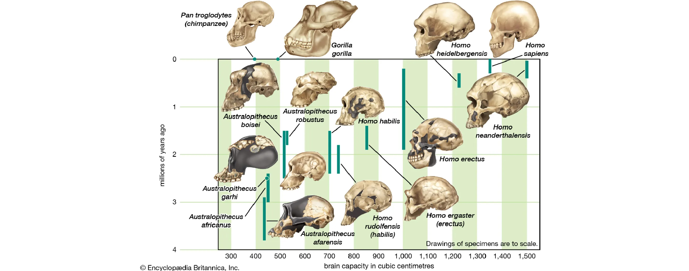
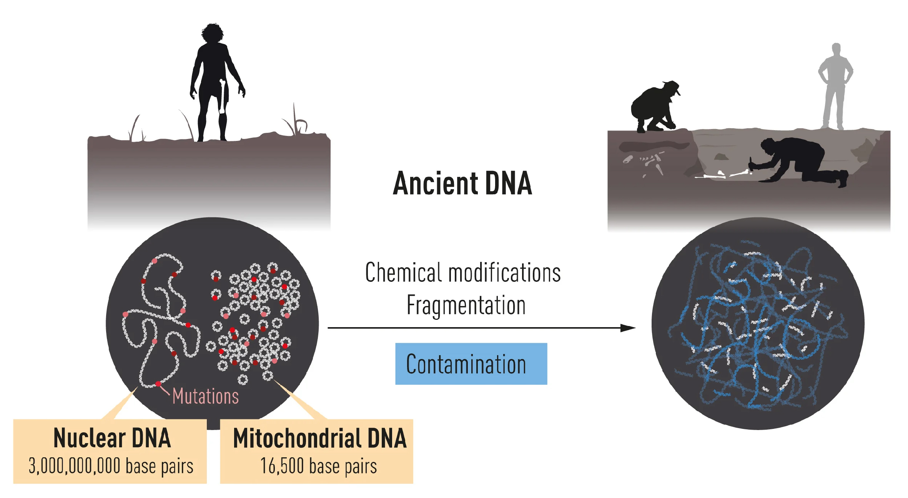
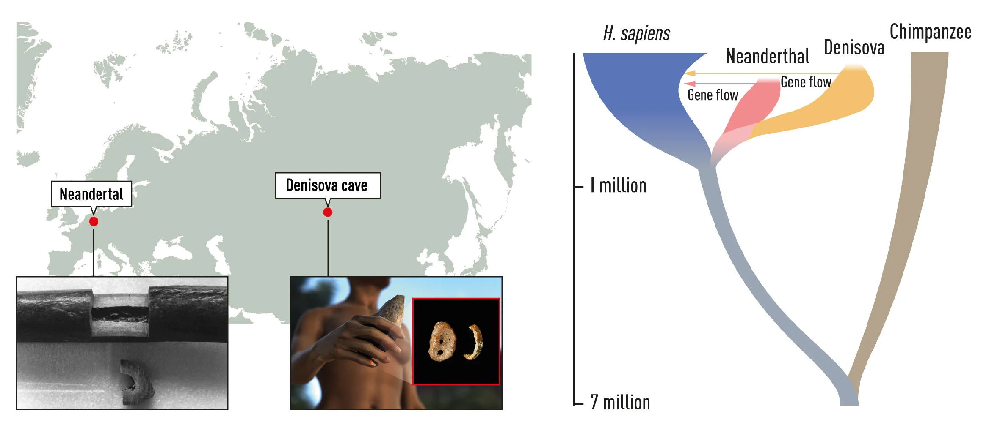
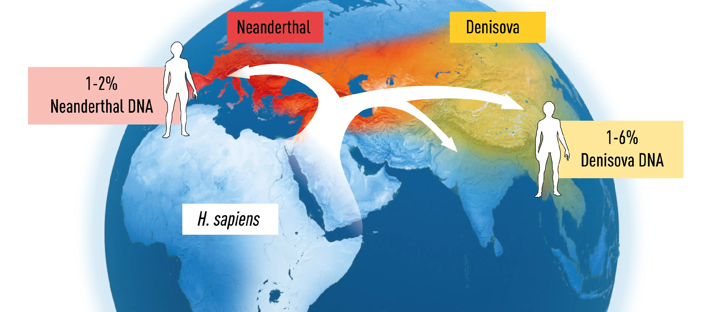

As a child attending church for several years, I constantly found myself questioning the teachings I received. One particular question that I often struggled with was, "If humans evolved, then why don't we have a continuous series of fossils showing the progression from chimpanzees to humans?" Although I now see this question as naive, it was one of many that fueled my skepticism.

This skepticism gradually turned into a deep curiosity about human evolution and religion. My doubts only grew stronger after reading Yuval Noah Harari's *Sapiens*, which explores the history of human evolution.

Today, I was captivated by a video from the YouTube channel "[안될과학](https://www.youtube.com/watch?v=NfpyYP2_xs8)" which provided a fascinating explanation of Svante Pääbo's Nobel Prize-winning research on human evolution. His determination to answer his own questions and his pioneering work in a new scientific field left a strong impression on me.

### The Beginnings of his Research

- From a young age, Pääbo was fascinated with Egypt and mummies.
- While pursuing his PhD in a virology lab, he secretly extracted DNA from mummy samples and submitted a paper as the sole author to *Nature Letters*. However, it was later discovered that the DNA he found likely came from contamination rather than the mummies themselves.

### The Birth of paleogenomics

- Undeterred by this setback, Pääbo identified three key challenges in retrieving ancient DNA and developed methods to overcome them, leading to the birth of paleogenomics:
  1. **Contamination Prevention**: Ensuring that sampling is done in a perfectly controlled, clean environment.
  2. **DNA Amplification**: Utilizing PCR and NGS technologies.
  3. **Filtration/Enrichment of Ancient DNA (aDNA)**: Using enzymes to specifically degrade bacterial DNA, which constitutes the majority of DNA fragments, and selectively recovering damaged DNA that has been preserved over long periods, allowing the identification of ancient DNA amidst contamination.
- Pääbo began his postdoctoral research in the lab of Allan C. Wilson, who had proposed the "Mitochondrial Eve" hypothesis, suggesting that all modern humans inherited their mitochondrial DNA from a single woman in Africa. In this lab, Pääbo worked on Neanderthal mitochondrial DNA research.
- In 2010, just nine years after the human genome was published as part of the Human Genome Project, Pääbo published the Neanderthal genome in the journal *Science*.

### Research on human evolution

- **Neanderthals**: They appeared outside of Africa about 400,000 years ago and lived in Europe and the Middle East, eventually going extinct around 30,000 years ago. **Homo sapiens**, on the other hand, emerged in Africa around 300,000 years ago and began spreading out of Africa approximately 70,000 years ago. For about 40,000 years, the two species coexisted in overlapping regions. Did they interbreed? Yes. On average, 1-3% of the human genome today is derived from Neanderthals, with a total of 40% of the Neanderthal genome scattered among modern humans.
- **Denisovans**: Was there another human species that coexisted with sapiens? And if so, did they interbreed? Yes! A new species, the Denisovans, was discovered in southern Siberia. It was found that Denisovan DNA constitutes an average of 1-6% (higher than Neanderthal DNA) of the genome in some modern human populations.

### Research on human welfare

- **Toll-like Receptors (TLRs)**: Neanderthal variants in TLRs may have provided immunity against pathogens already present in new environments (which were new to sapiens), aiding in adaptation and survival.
- **COVID-19 Severity**: Some Neanderthal variants (particularly common in Indian populations) have been linked to severe COVID-19 cases.
- **Tibetan Adaptation to High Altitudes**: The EPAS1 gene, crucial for adapting to high altitudes, was found to have Denisovan variants in most Tibetans.
- Comparative studies across species have made it possible to investigate genes related to infections and diseases.

### Research on the uniqueness of modern humans

- Pääbo's team identified 31,389 genetic variants that are common only to modern humans. They are currently researching the functions of these variants.

### Reflections

It seems that research in Korea often tends to follow rather than lead. While many esteemed senior researchers are striving to change this trend, today made me reflect on which field I should aim to pioneer in the future.

Svante Pääbo’s journey from questioning established beliefs to leading groundbreaking research in human evolution is truly inspiring. His work reminds us of the importance of perseverance, curiosity, and innovation in advancing scientific knowledge.

### Referecne

[The Nobel Prize in Physiology or Medicine 2022](https://www.nobelprize.org/prizes/medicine/2022/press-release/)