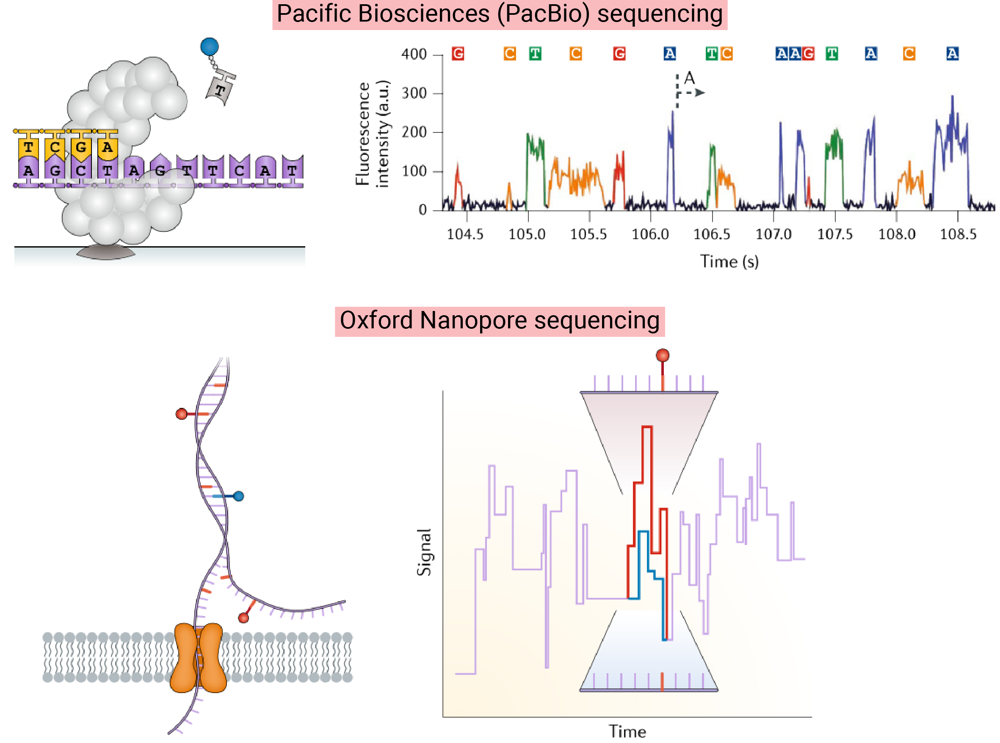

[Sedlazeck F.J. et al. (2018) Piercing the dark matter: bioinformatics of long-range sequencing and mapping. Nature Reviews Genetics](https://www.nature.com/articles/s41576-018-0003-4)

### Key Insights

- As genome structure presents considerable intra- and inter-species complexity and diversity, complete understanding is a big challenge to date.
- Despite advances with first- and second-generation sequencing complemented by other technologies, which have enabled the construction of human and other species' genomes, substantial 'dark matter' within the genome remains inaccessible due to the limitations of previous sequencing techniques.
- Thanks to <mark>Long-read sequencing (PacBio SMRT and Oxford Nanopore) in conjunction with Linked-reads sequencing (10X), Hi-C-based analysis, and optical mapping (BioNano Genomics)</mark>, we are now able to achieve a more gapless and complete reference genome compared to traditional methods.
- Alongside the advent of new technologies, <mark>bioinformatic algorithms and tools</mark> have been continuously developed to process data from each technology and overcome their limitations.
- Traditionally,<mark> haplotype phasing relied on integrating parent-offspring data</mark> through methods like <mark>trio-binning</mark>; however, with the advent of long-read sequencing technologies, approaches that require only the sequencing reads from a single individual are being explored.
- In the past, precise research on <mark>isoforms </mark>was challenging, but it has now become feasible, and the detection of <mark>DNA methylation</mark> is possible through the differences in signals that occur when sequencing single molecules.

### Reflections

Numerous initiatives, including the T2T Consortium, the Human Pangenome Project, the Vertebrate Genomes Project, and their affiliates, are endeavoring to create complete and error-free genomes for various species. They employ pipelines that integrate long-read sequencing with other advanced methods. To deepen my understanding of these technologies, I chose to study this paper.

Just a few years ago, it seemed that these technologies had many limitations, but it’s impressive how quickly scientists have collaborated to overcome emerging challenges.

