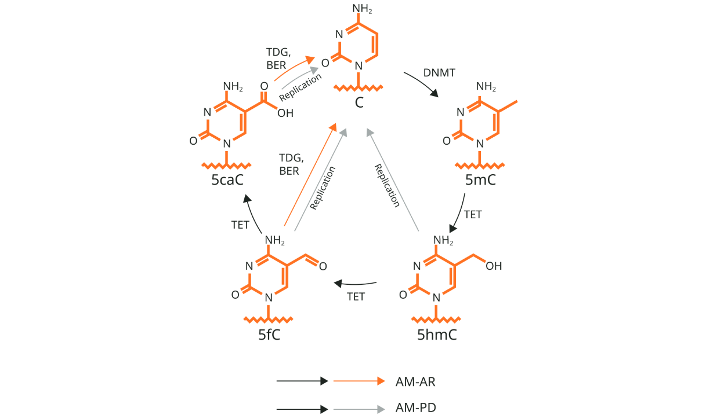
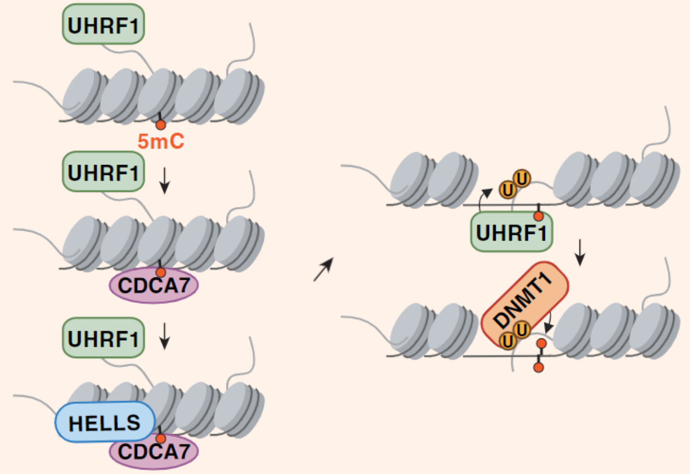
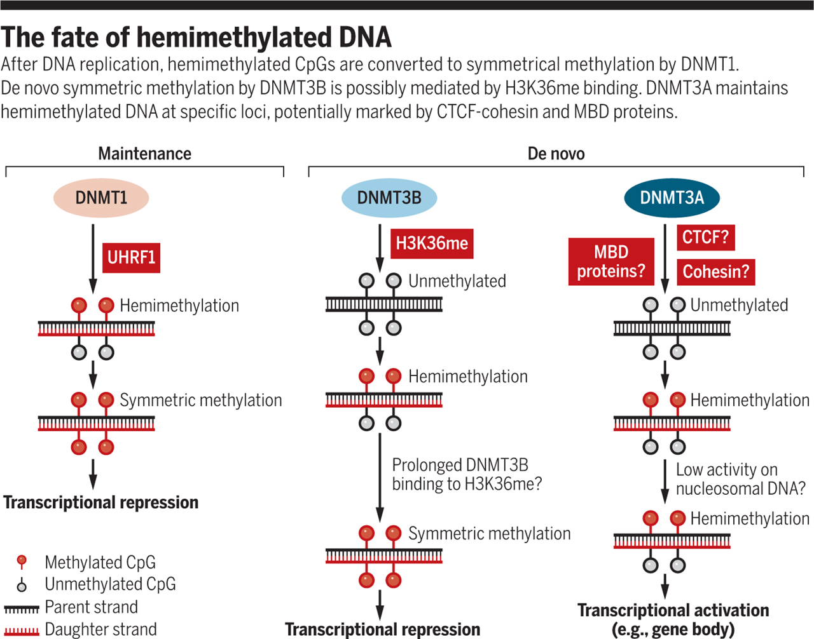

[Wassing I.E. et al. (2024) CDCA7 is an evolutionarily conserved hemimethylated DNA sensor in eukaryotes. Science Advances](https://www.science.org/doi/10.1126/sciadv.adp5753)

### DNA methylation

DNA methylation is one of the major chemical modificaions and commonly acts as repressive regulator controlling DNA-binding protein and gene expression [2]. This mechanism is broadly conserved in eukaryotic organism and is also utilized by some of prokaryotic species.

### CDCA7, a sensor of hemimethylated DNA

During DNA replication, the methylation patterns of the parent DNA are copied to the daughter DNA. In this process, UHRF1 recognizes hemimethylated regions and recruits DNMT1, which methylates the daughter strand. However, after replication, when the DNA is packed into chromatin, UHRF1’s access to DNA becomes restricted, raising the question of how UHRF1 recognizes hemimethylated loci in compacted chromatin.

A recent publication revealed that CDCA7 can sense hemimethylated regions on DNA wrapped around histones [1, 3]. It recruits HELLS, a chromatin remodeler, to open the chromatin structure at these sites.

1. CDCA7 recognizes hemimethylated DNA on chromatin.

2. It recruits and activates HELLS, leading to chromatin remodeling.

3. UHRF1, now able to access the DNA, recognizes the hemimethylated DNA and ubiquitinates histone H3 residues.

4. DNMT1, activated by ubiquitylated H3, methylates the daughter strand.

### Hemimethylation

To better understand the regulation of hemimethylation, I explored the related mechanisms.

According to a perspective [4], there are three known types of hemimethylation on DNA:

1. Maintenance of methylation by the UHRF1-DNMT1 complex

2. De novo methylation by H3K36me-DNMT3B

3. De novo methylation by DNMT3A

The first two mechanisms result in the methylation of both DNA strands and are associated with transcriptional repression. However, interestingly, in the third mechanism, hemimethylation is maintained, leading to robust transcription when observed in gene bodies or endogenous retrovirus regions. It is hypothesized that CTCF-cohesin and MBD are directly involved in this process.

### Reference

[2] [DNA methylation and demethylation. Abcam](https://www.abcam.com/en-us/technical-resources/guides/epigenetics-guide/dna-methylation-and-demethylation) [3] [Unlocking the Secrets of DNA: New Genetic Sensor Discovered. SciTechDaily](https://scitechdaily.com/unlocking-the-secrets-of-dna-new-genetic-sensor-discovered/) [4] [Sharif J. et al. (2018) Hemimethylation: DNA's lasting odd couple](https://www.science.org/doi/full/10.1126/science.aat0789)