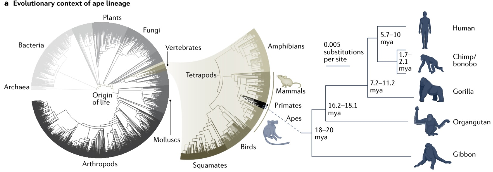
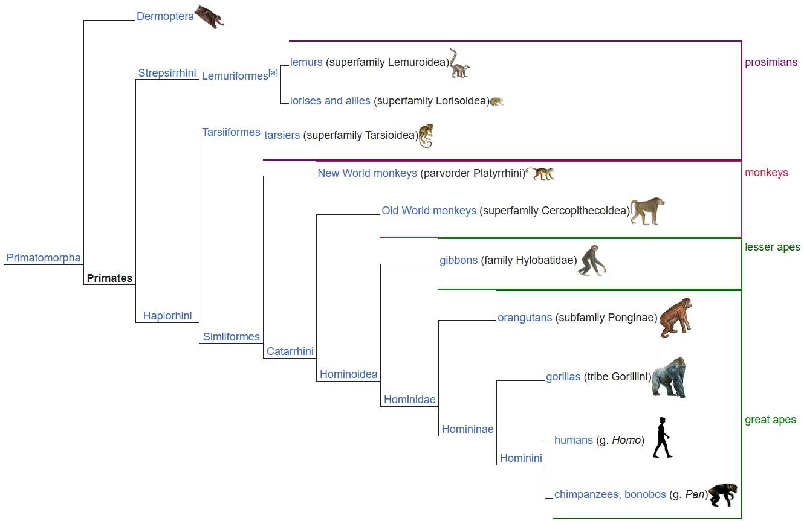
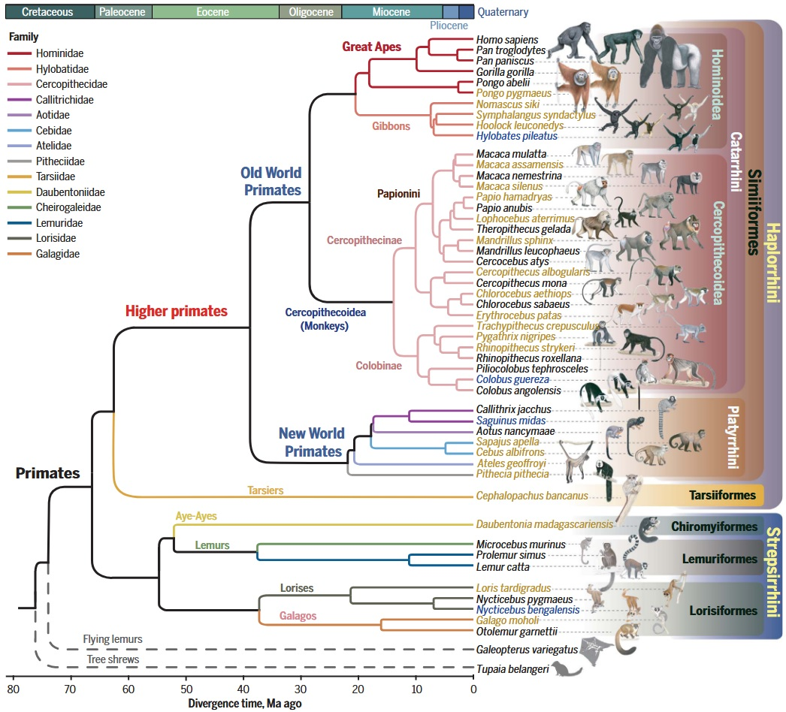
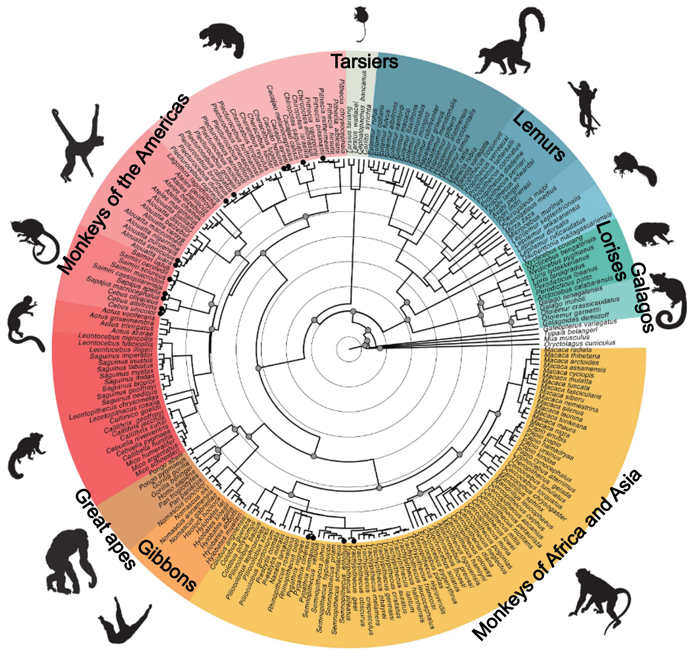
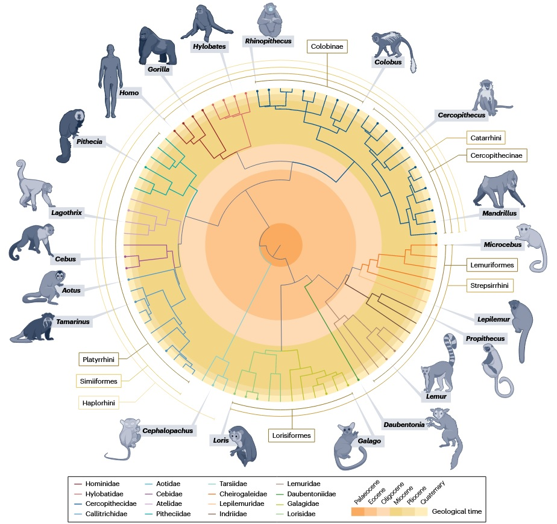
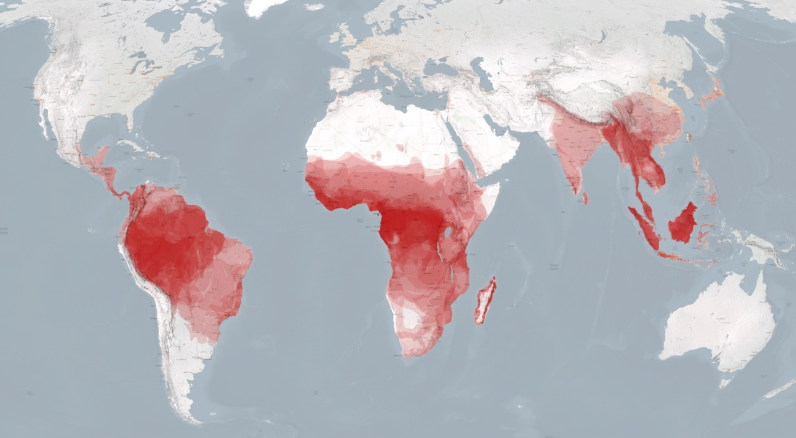
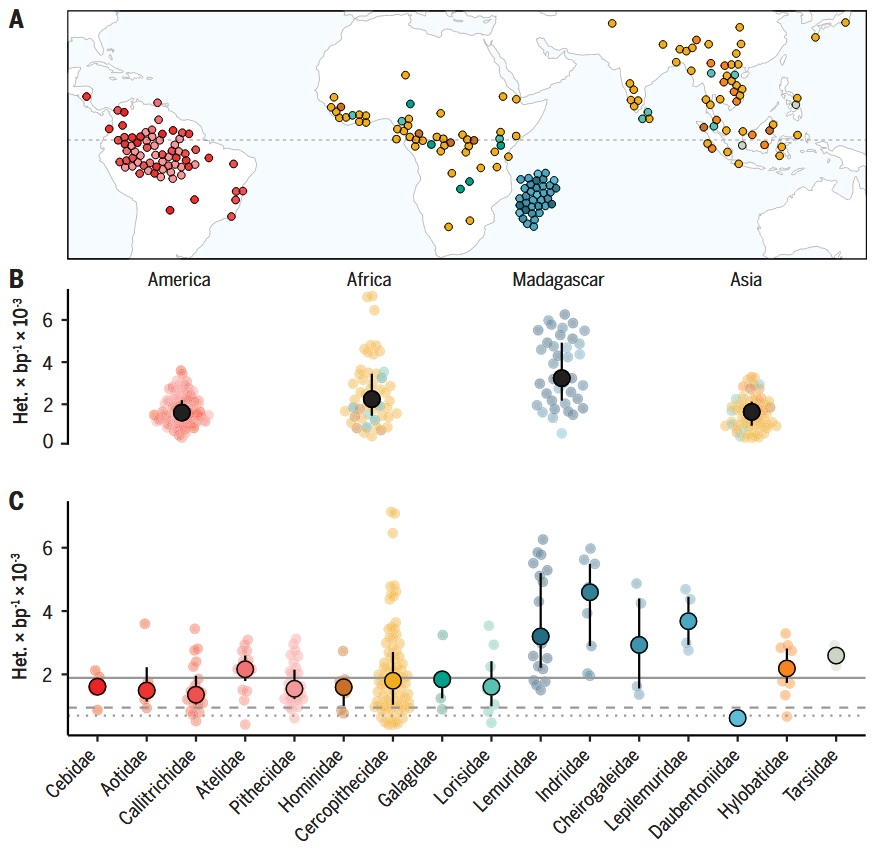
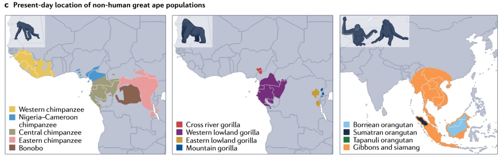
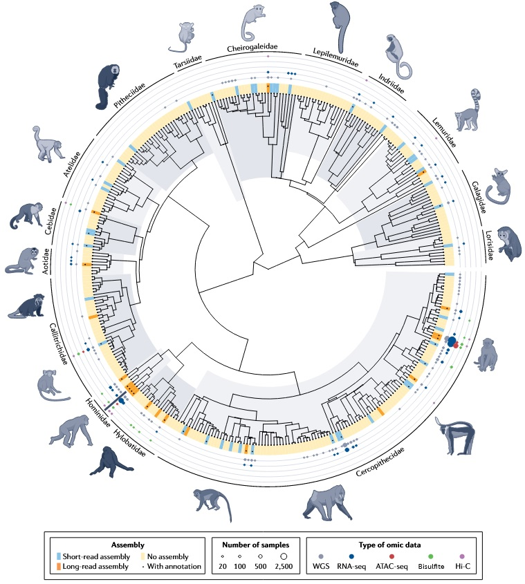

Primates are a morphologically and ecologically diverse order of mammals distributed mainly across the tropical and subtropical regions. Depending on the taxonomy used, ~376–524 extant species are recognized, ranging in body sizes from the ~30 g Madame Berthe’s mouse lemur to >200kg eastern gorillas [1].

## Primates in the tree of life

Primates are vertebrate mammals within the eukaryotic domain [2]: **Eukaryotes → Animals → Vertebrates → Mammals → Primates**

From the origin of life, primates sit on one slender branch of the eukaryotic tree: **Life → Eukaryota → Opisthokonta → Animalia (Metazoa) → Bilateria → Deuterostomia → Chordata → Vertebrata (Craniata) → Gnathostomata → Osteichthyes (Euteleostomi/Teleostomi) → Sarcopterygii → Tetrapoda → Amniota → Synapsida → Mammalia → Theria → Eutheria (Placentalia) → Boreoeutheria → Euarchontoglires → Primates**

 

## Major branches of primates

Living primates comprise two deep branches: **Strepsirrhini** (lemurs, lorises, galagos) and **Haplorhini** (tarsiers and simians). Simians further split into **Platyrrhini** (New World monkeys) and **Catarrhini** (Old World monkeys and apes) [1].

## Building a robust primate phylogeny: two complementary approaches

**1) De novo whole-genome references**

- **What it is:** Generate new, high-contiguity reference assemblies (often long-read + Hi-C), then infer a species tree from whole-genome alignments of orthologous, syntenic sequence blocks.
- **Strengths:** Maximizes **structural resolution** (karyotypes, inversions/fusions), enables clean ortholog calls, detects lineage-specific duplications/TE bursts, and supports broad functional scans (selection, accelerated noncoding regions).
- **Trade-offs:** Costly and time-intensive; practical for **fewer species**, so breadth and within-species variation are limited relative to resequencing designs.

**2) Cross-species resequencing**

- **What it is:** Short-read whole-genome resequencing across **many species** (often multiple individuals/species), mapped to a curated set of references; infer a dated tree using conserved markers (e.g., UCEs).
- **Strengths:** **Breadth and throughput**—cost-effective coverage across the order; simultaneously yields **genetic diversity**, ROH, and demographic summaries; enables comparative estimates of **mutation rates** when combined with generation times.
- **Trade-offs:** Dependent on reference quality and cross-mapping choices; limited power for **structural** evolution compared with de novo assemblies.

**Below is a summary of representative primate studies that applied these strategies.**

### Reference-genome–driven phylogenomics [3]

**Study design & data**

- Produced **27 new high-quality reference genomes** and analyzed ~**50 species** total (new + published), emphasizing previously undersampled New World monkeys and strepsirrhines.

**How the phylogeny is built**

- Extracted ~**433.5 Mbp** of gap-free **syntenic orthologous** sequence, built whole-genome ML trees (ExaML, GTR+GAMMA), and dated nodes with **fossil calibrations** (MCMCtree).

**Primary analyses & questions**

- **Karyotype reconstruction** across primates; rates of rearrangement and hallmark events (e.g., fusions/fissions across key nodes).
- Genome-wide scans for **positive selection**, **lineage-accelerated conserved elements**, and **gene-family expansions**; highlights a surge of genomic innovation on the **Simiiformes** ancestor.
- Divergence times for crown primates and major subclades, with estimates near the **K–Pg boundary** for the primate MRCA.

**Take-home:** Depth per species enables structural and functional inferences that are hard to get from resequencing alone (karyotypes, synteny-aware selection tests).

### Cross-species resequencing atlas [4]

**Study design & data**

- High-coverage whole-genome data for **809 individuals** from **233 species** (covering **86% of genera** and **all 16 families**), yielding a broad **nuclear DNA phylogeny** and updated divergence times.

**How the phylogeny is built**

- Identified ~**3,500 ultraconserved elements (UCEs)** + flanks across genomes; built per-locus ML trees and integrated them with a coalescent **species tree**, then **fossil-calibrated** the timeline.

**Primary analyses & questions**

- **Genetic diversity** (heterozygosity/ROH) across regions and families; diversity correlates with environment/sociality but **not** a simple predictor of extinction risk.
- **Mutation rates**: estimated μ per generation from substitution rates + **generation time** on the dated tree; μ correlates positively with generation time and is further shaped by **effective population size (Ne)** (drift-barrier signal).
- Human-relevance: cross-species catalogs to contextualize **protein-changing variants** and refine “potentially benign” vs pathogenic interpretations.

**Take-home:** Breadth and population-genetic readouts (heterozygosity, ROH, μ, Ne) at an unprecedented scale; ideal for questions about **diversity, demography, and mutation-rate variation** across the order.

Figure below [5] shows a fossil-calibrated, time-scaled phylogeny for 84 extant primate genera. The backbone topology and divergence times primarily follow Kuderna et al. [4]; selected nodes and dates were recalculated using Shao et al. [3] and additional lineage-specific studies—not a simple merge of the two. Filled dots denote genera with high-quality reference genomes.

## Geographical distribution (living primates)

**Global range & density [1].**

Living non-human primates concentrate in the tropics: the **Neotropics** (Central/South America), **Afrotropics** (sub-Saharan Africa, plus **Madagascar**), and **Indo-Malaya** (South/Southeast Asia). Hotspots are the Amazon Basin, Congo Basin, Madagascar, and Sundaland. They are largely absent from deserts and high latitudes, with only a few extra-tropical exceptions (e.g., some macaques).

**Continental and family patterns from a broad resequencing survey.**

Kuderna et al. [4] sampled **809 individuals from 233 species**. Sampling spans the Americas, Africa, Madagascar, and Asia (A). Within-species genetic diversity (heterozygosity) shows **continent-level contrasts** (B) and **family-level spread** (C):

- **Neotropics (Cebidae, Aotidae, Callitrichidae, Atelidae, Pitheciidae):** confined to the Americas; generally moderate diversity with between-family spread.
- **Africa (Hominidae, Cercopithecidae, Galagidae, Lorisidae):** wide geographic breadth; Cercopithecidae shows broad variance, Galagidae includes some high-diversity outliers.
- **Madagascar (Lemuridae, Indriidae, Cheirogaleidae, Lepilemuridae, Daubentoniidae):** island-endemic lineages with a **wide range** of diversity levels across families.
- **Asia (Hylobatidae, Tarsiidae + Asian Cercopithecidae):** concentrated in South/Southeast Asia; generally lower-to-moderate diversity, with family-specific exceptions.

**Lineage-specific present-day ranges [2].**

Great apes provide a clear example of fine-scale distributions:

- **Chimpanzees** (four subspecies) and **bonobos** are confined to **central and western Africa**.
- **Gorillas** occur in **west/central Africa** (western lowland, Cross River) and **eastern Africa** (eastern lowland, mountain).
- **Orangutans** are island endemics in **Southeast Asia** (Borneo, Sumatra, Tapanuli).
- **Gibbons and siamangs** occupy **mainland and insular Southeast Asia**.

## Primate omics resources on the phylogeny

Despite the large species richness, most high-quality resources—reference genomes, WGS, RNA-seq, ATAC-seq, Hi-C, methylomes—are clustered in a **small set of model lineages** (human and great apes; rhesus/cynomolgus macaques; marmoset) [6]. Coverage across many **strepsirrhines** and several **New World monkey** families remains sparse.

**Why this matters:**

- Dense data near humans → powerful for fine-scale evolutionary and disease inference in our closest relatives.
- Sparse data elsewhere → limits tests of trait evolution and comparative constraints across the full phylogeny; results can be **human-centric** or biased.
- Ongoing efforts are widening species coverage, but **annotations and standardized phenotype metadata** still lag behind.

## Glossary

- **Eukaryota**: Cells with nuclei and membrane-bound organelles (animals, plants, fungi, protists).
- **Opisthokonta**: Major eukaryote clade that includes animals and fungi (and their unicellular relatives).
- **Animalia (Metazoa)**: Multicellular, heterotrophic eukaryotes with specialized tissues—animals.
- **Bilateria**: Animals with bilateral symmetry and three germ layers (excludes sponges, cnidarians, ctenophores).
- **Deuterostomia**: Bilaterians in which the anus forms before the mouth in development; includes echinoderms and chordates.
- **Chordata**: Animals that, at some stage, have a notochord, dorsal hollow nerve cord, pharyngeal slits, and post-anal tail.
- **Vertebrata (Craniata)**: Chordates with a skull and usually a vertebral column.
- **Gnathostomata**: Jawed vertebrates (all modern fishes and tetrapods).
- **Osteichthyes (Euteleostomi/Teleostomi)**: “Bony vertebrates” — ray-finned fishes, lobe-finned fishes, and **tetrapods**.
- **Sarcopterygii**: Lobe-finned lineage within Osteichthyes; includes lungfish, coelacanths, and **tetrapods**.
- **Tetrapoda**: Four-limbed vertebrates (amphibians, reptiles, birds, mammals).
- **Amniota**: Tetrapods with an amniotic egg or equivalent membranes (reptiles, birds, mammals).
- **Synapsida**: The amniote lineage leading to mammals; defined by a single temporal opening in the skull.
- **Mammalia**: Hair, lactation, three middle-ear bones; includes monotremes, marsupials, and placentals.
- **Theria**: Mammals excluding monotremes; comprises **Metatheria** (marsupials) + **Eutheria** (placentals).
- **Eutheria (Placentalia)**: Eutheria is the broader placental lineage; **Placentalia** refers to the crown group of living placental mammals.
- **Boreoeutheria**: A major placental clade uniting **Euarchontoglires** and **Laurasiatheria**.
- **Euarchontoglires**: Superclade combining **Euarchonta** (primates + colugos + treeshrews) and **Glires** (rodents + lagomorphs).
- **Primates**: The order comprising **Strepsirrhini** (lemurs, lorises, galagos) and **Haplorhini** (tarsiers + simians).
  - **Simians (Anthropoidea)**: Split into **Platyrrhini** (New World monkeys) and **Catarrhini** (Old World monkeys + apes).
  - **Apes (Hominoidea)**: Lesser apes (gibbons) and great apes (orangutans, gorillas, chimpanzees/bonobos, humans).

## Reference

1. [Primate - Wikipedia](https://en.wikipedia.org/wiki/Primate)
2. Pollen AA et al. [*Nature Reviews Genetics*](https://www.nature.com/articles/s41576-022-00568-4). 2023.
3. Shao Y et al. [*Science*](https://www.science.org/doi/10.1126/science.abn6919). 2023.
4. Kuderna LFK et al. [*Science*](https://www.science.org/doi/10.1126/science.abn7829). 2023.
5. Roos C et al. [*Nature Reviews Biodiversity*](https://www.nature.com/articles/s44358-025-00039-8). 2025.
6. Juan D et al. [*Nature Reviews Genetics*](https://www.nature.com/articles/s41576-022-00554-w). 2023.