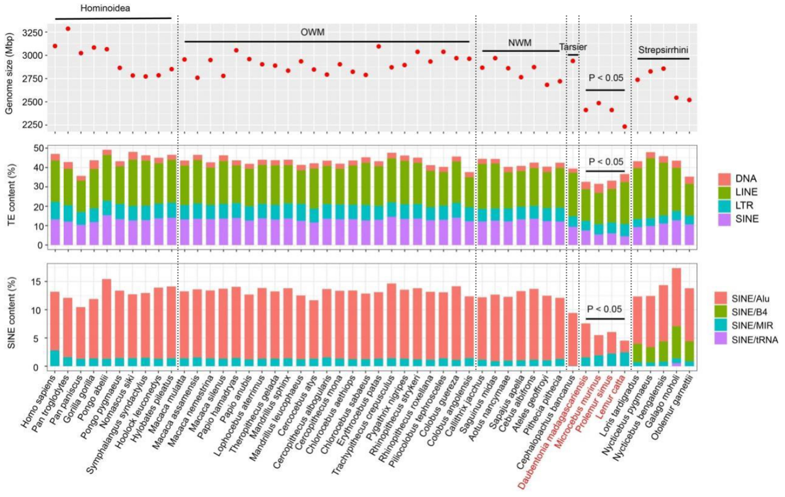
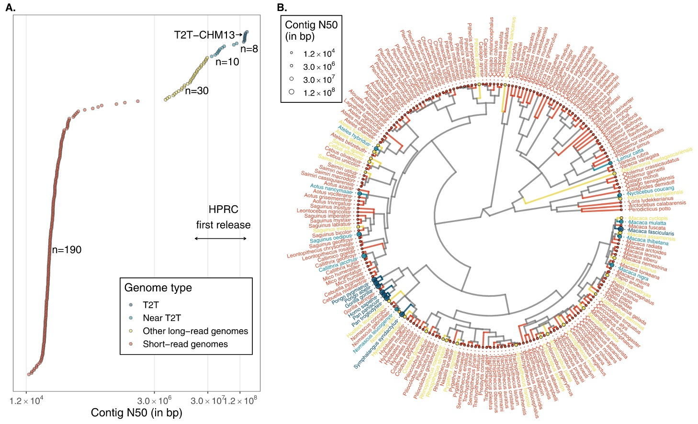

Primates are a diverse mammalian order includes humans and 500+ living species—from ~30 g mouse lemurs to >200 kg gorillas. Building on [Part 1 (phylogeny and distribution)](https://keun-hong.github.io/exploration/primate-phylogeny-distribution/), this post shifts to the molecular view: genome size, karyotype evolution, and reference assemblies.

## Genome size

**Primate genomes generally are on the larger side among mammals.** Across the order, assembled sizes cluster around **~3.0 gigabases (Gb)**, very close to human [1].

- **Apes (Hominoidea):**
  - **Human (Homo sapiens):** **~3.10 Gb**.
  - **Great apes (Pan, Gorilla, Pongo):** **2.87–3.29 Gb** (avg **~3.07 Gb**).
  - **Gibbons (Hylobatidae):** **2.78–2.85 Gb** (avg **~2.81 Gb**; smallest among apes).
- **Old World monkeys (Cercopithecoidea):** **2.76–3.05 Gb** (avg **~2.92 Gb**).
- **New World monkeys (Platyrrhini):** **2.68–2.97 Gb** (avg **~2.85 Gb**).
- **Strepsirrhines:**
  - **Lemurs (Lemuriformes/Chiromyiformes):** **2.23–2.49 Gb** (avg **~2.38 Gb**; clearly smaller).
  - **Lorises & galagos (Lorisiformes):** **2.52–2.86 Gb** (avg **~2.73 Gb**; broadly comparable to monkeys).
- **Outgroup context:** **Tree shrew (Scandentia)** **~2.67 Gb**.

*Reading the table:* “**Genome size (bp)**” reports assembled length. **Contig N50** and **Scaffold N50** summarize contiguity—higher values usually indicate long-read and/or Hi-C–assisted builds.

```bash
PRIMATE EVOLUTION - MAJOR GROUPS ONLY
├─ SCANDENTIA (Tree Shrews)
│  └─ 1 species • 2.67 Gb
│
└─ PRIMATES
   │
   ├─ STREPSIRRHINI (Prosimians)
   │  ├─ LEMURIFORMES (Madagascar Lemurs)
   │  │  ├─ 3 species • 2.23-2.49 Gb
   │  │  └─ Average: 2.38 Gb	  
   │  └─ LORISIFORMES (Lorises & Galagos)
   │     ├─ 3 species • 2.52-2.86 Gb
   │     └─ Average: 2.73 Gb ★ Comparable to other primates
   │
   └─ HAPLORHINI
      ├─ PLATYRRHINI (New World Monkeys; NWM)
      │  ├─ 4 species • 2.68-2.97 Gb  
      │  └─ Average: 2.85 Gb
      │
      └─ CATARRHINI
         ├─ CERCOPITHECOIDEA (Old World Monkeys; OWM)
         │  ├─ 17 species • 2.76-3.05 Gb
         │  └─ Average: 2.92 Gb
         │
         └─ HOMINOIDEA (Apes)
            ├─ HYLOBATIDAE (Lesser Apes)
            │  ├─ 3 species • 2.78-2.85 Gb
            │  └─ Average: 2.81 Gb ★ Smallest
            │
            └─ HOMINIDAE (Great Apes)
               ├─ OTHER GREAT APES
               │  ├─ 5 species (Pan, Gorilla, Pongo)
               │  ├─ Range: 2.87-3.29 Gb
               │  └─ Average: 3.07 Gb
               │
               └─ HOMO SAPIENS ─ 3.10 Gb
```


### Why are simian genomes larger?

Across primates, differences in genome size largely track **transposable elements (TEs)** rather than gene counts. In **Simiiformes**, assembly length increases are driven by **SINE expansions—especially Alu (~11% of the human genome)**, which inflate introns and intergenic regions. **Lemurs** carry far fewer SINEs (Alu ~**3.9%**), matching their smaller assemblies. Alu activity shows lineage-specific bursts: **~40–45 Ma** in Simiiformes (dominated by **AluS/AluSx**) and **~34–39 Ma** in Lorisiformes (**AluJ/AluJb**).

**Mechanism & consequences.** Alu retrotransposition **copies and pastes** short sequences across the genome, increasing bulk DNA and creating substrates for **non-allelic homologous recombination** (structural variation). Some insertions are later **exapted** as regulatory elements, but the primary effect on size is simple **sequence accretion**.

**Bottom line:** Simian genomes trend larger because they experienced **historical waves of Alu expansion**, while lemur lineages—lacking comparable Alu loads—retain **smaller assemblies** despite similar numbers of protein-coding genes.



## Chromosome and karyotype evolution

Primate chromosomes are highly **syntenic**—large blocks of gene order are conserved—yet their counts have shifted through time mainly via **fusions and fissions** (with inversions and translocations layered on top). Current ancestral reconstructions place the diploid number at **2n = 52** for both **Primates** and **Simiiformes** (revising earlier 50), consistent with an early **chromosome-8 fission**. Downstream, **Catarrhini** is inferred at **2n = 46**, and **Hominoidea** at **2n = 48**, steps that explain much of today’s variation.

In living taxa, **humans** carry **2n = 46** owing to the well-known **fusion that formed chromosome 2**, whereas other great apes (chimpanzee, gorilla, orangutan) retain **2n = 48**. **Gibbons** show additional lineage-specific changes (**2n = 44**). Old World monkeys typically fall near **42–46**, while **New World monkeys** often have the **highest numbers** (frequently **2n = 54**). **Strepsirrhines** cluster around **2n = 52**. Tallying large structural events along the path to humans shows an **increasing rearrangement rate**—about **2.38 events/Ma** in **Homininae** and **5.56 events/Ma** in **Hominini.**


## Reference genomes

Primate diversity tops **500+ species**, but **high-quality reference genomes** still cover only a fraction of that breadth. The snapshot below makes it clear [3-4]:

- **Coverage today.** About **~238 species** have at least one assembly on public databases. Most of these are **short-read, fragmented** builds (left cluster in A) [2]. A **smaller subset** now has **long-read** assemblies with chromosome-scale contiguity, and only a **handful** reach **near–telomere-to-telomere (T2T)** quality; **human T2T-CHM13** is the flagship example. B maps these assembly qualities across the primate tree—note how the best genomes are concentrated in a few clades.
- **Why T2T/near-T2T matters.** Long-read assemblies (PacBio HiFi + ultra-long ONT) reveal evolution that short reads miss. A recent eight-species survey spanning ~50 My of primate evolution showed **~27% of the genome affected by structural variation**, and catalogued **>1,600** large, highly divergent regions—over a **third** showing **recurrent** structural changes that touch **hundreds of genes**. This is the level of resolution needed to connect structure to adaptation.
- **Breadth vs depth.** Parallel efforts have delivered **high-coverage short-read data for 233 species [3]**, which is excellent for **variants, diversity, and dated phylogenies**—but **not** a substitute for **chromosome-level references** when the goal is **repeats, segmental duplications, TEs, and structural variants**. The field now needs **both**: breadth for comparative context and **T2T-grade references** for each major lineage (especially under-sampled **strepsirrhines** and several **New World monkey** families).

**Bottom line:** reference coverage across primates is growing, but **truly complete (near-T2T) assemblies are still rare**. The next wave—T2T-quality genomes placed **phylogenetically across the tree**—will turn today’s broad catalog into a platform for high-resolution primate evolution.



This time-calibrated tree of the 84 living primate genera flags branch tips with a ● where a high-quality reference genome exists. At a glance you can see coverage is strongest in apes (e.g., Homo, Gorilla, Hylobates), several Cercopithecidae genera (e.g., Rhinopithecus, Colobus, Cercopithecus, Mandrillus), and key Lemuriformes/Lorisiformes (e.g., Microcebus, Lemur, Propithecus, Lepilemur, Daubentonia, Galago, Loris). Missing circles mark gaps—under-sampled clades that are priorities for future near-T2T assemblies.


## Reference

1. Shao Y et al. [*Science*](https://www.science.org/doi/10.1126/science.abn6919). 2023.
2. Rocha JL et al. [*Current Opinion in Genetics & Development*](https://www.sciencedirect.com/science/article/pii/S0959437X24000820). 2024.
3. Kuderna LFK et al. [*Science*](https://www.science.org/doi/10.1126/science.abn7829). 2023.
4. Roos C et al. [*Nature Reviews Biodiversity*](https://www.nature.com/articles/s44358-025-00039-8). 2025.