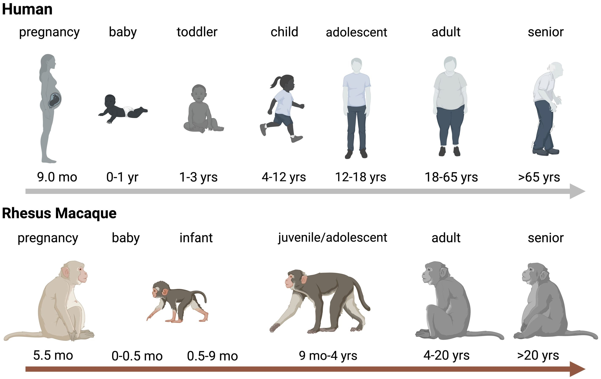
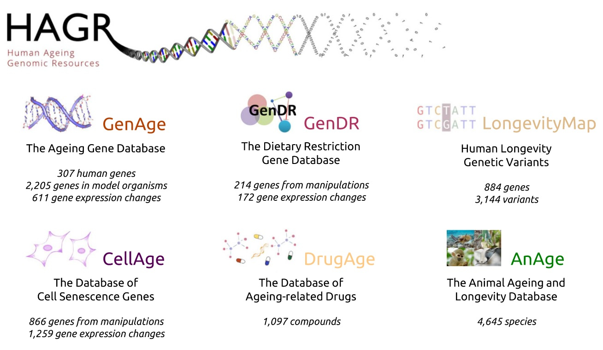
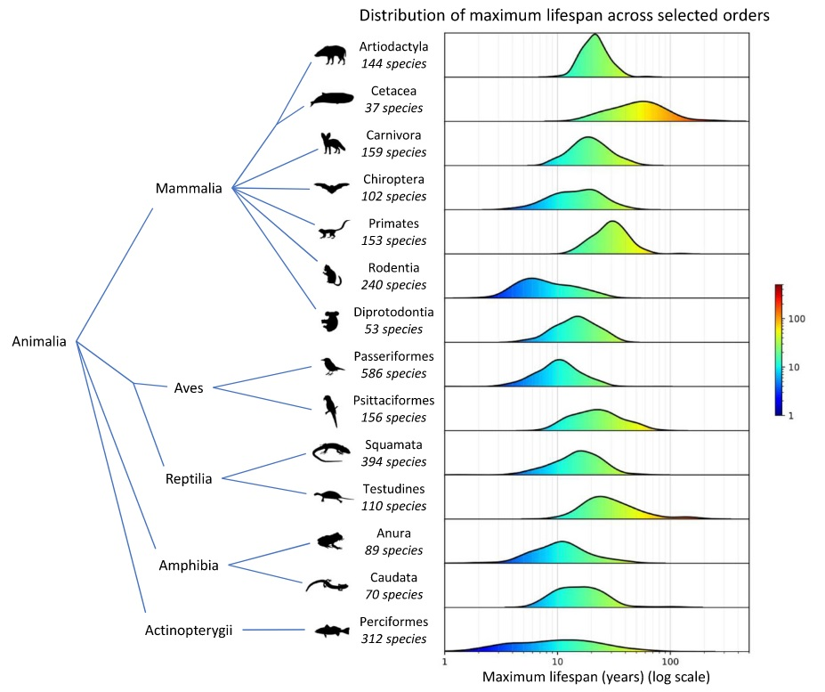
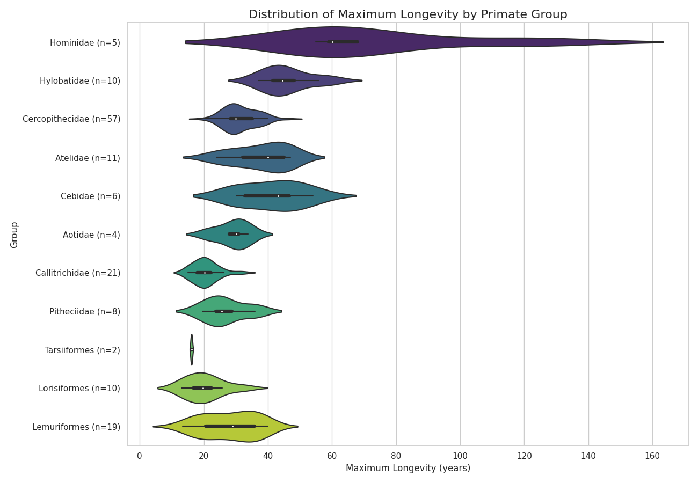
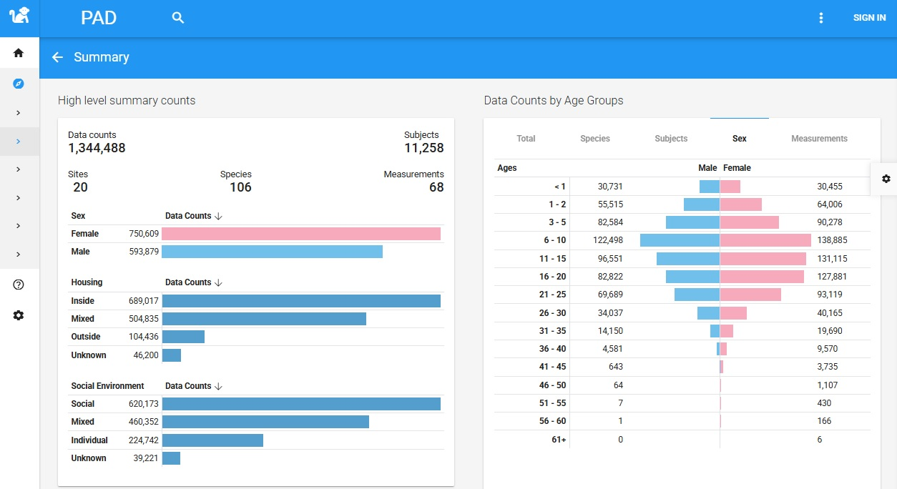
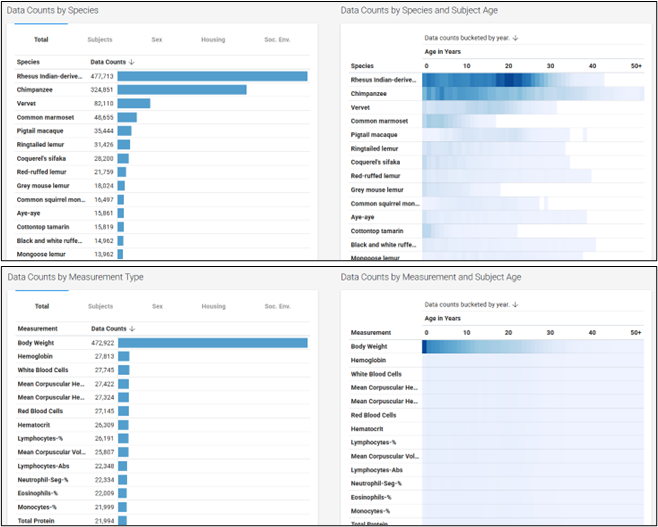

Primates serve as an invaluable paradigm for understanding the complexities of human aging. Their close genetic and physiological kinship with humans, combined with a remarkable diversity in lifespan and aging patterns [1], makes them a living laboratory of evolutionary solutions to longevity. From the mouse lemur, which may live for 10-15 years, to humans, who can exceed 120 years, the primate order presents a collection of what can be described as "multiple natural experiments in longevity". This diversity allows researchers to ask fundamental questions about the genetic, environmental, and physiological factors that govern the aging process.

In recent decades, the study of aging has undergone a profound transformation, shifting towards a "Big Data" paradigm that leverages large-scale, curated datasets to uncover biological patterns that are invisible at smaller scales. The modern imperative in gerontology is to move beyond isolated experiments and integrate vast repositories of information spanning genomics, physiology, and life history. This data-driven approach is essential for unraveling the multivariate nature of aging.

This exploration delves into two foundational databases that empower this approach, each offering a distinct yet complementary perspective on primate aging. The first is [**AnAge**](https://genomics.senescence.info/species/index.html), a macro-level tool that provides a broad, evolutionary canvas for comparing longevity across thousands of animal species. The second is the [**Primate Aging Database (PAD)**](https://primatedatabase.org/), a micro-level resource that offers a deep, longitudinal, and mechanistic view into the biology of aging within our closest relatives.

## The Macro View – Charting Longevity Across the Tree of Life with AnAge

To understand the specifics of primate aging, one must first appreciate the broader evolutionary context in which it occurs. The AnAge database [2] , a core component of the [Human Ageing Genomic Resources (HAGR)](https://genomics.senescence.info/), provides this essential macro-level perspective. HAGR is a comprehensive suite of databases dedicated to the biology of aging, encompassing resources on aging-related genes (GenAge), anti-aging compounds (DrugAge), and cellular senescence (CellAge), among others. Within this ecosystem, AnAge stands out for its vast collection of longevity data, covering 4,645 animal species and serving as the comparative foundation for the entire project.

### Visualizing Lifespan Diversity Across Animalia

The power of AnAge lies in its ability to facilitate large-scale comparisons across the tree of life. A visualization of maximum lifespan across selected animal orders immediately reveals the staggering diversity in longevity.

As the data shows, there are stark contrasts between groups. The order Rodentia, for instance, exhibits a distribution heavily skewed towards shorter lifespans, while the marine mammals of Cetacea (whales and dolphins) demonstrate exceptional longevity. This vast range in lifespan is not a random biological curiosity; it is a direct reflection of deeply rooted evolutionary strategies. Life history theory provides a powerful framework for interpreting this variation, positing a fundamental trade-off between an organism's allocation of energy towards reproduction versus somatic maintenance (i.e., the upkeep and repair of the body). Orders like Rodentia often exist in environments with high extrinsic mortality (e.g., heavy predation) and have thus been selected for a "fast" life history strategy: rapid growth, early reproduction, and a short lifespan. In this context, investing heavily in long-term bodily repair provides little evolutionary advantage. Conversely, orders like Cetacea and Testudines (turtles), which can often escape high extrinsic mortality through large body size or protective armor, benefit from a "slow" life history strategy. This involves slower growth, delayed reproduction, and a greater investment in robust somatic maintenance and repair mechanisms, enabling much longer lifespans. The AnAge data, therefore, is not merely a catalog of lifespans but a graphical representation of these divergent evolutionary solutions to the challenges of survival and reproduction.

### Zooming In: A Focus on Primate Longevity

Transitioning from the broad animal kingdom to the primate order reveals that this same principle of significant variation holds true, albeit on a different scale. By processing AnAge data specifically for primate groups, clear patterns emerge.

The analysis shows that the superfamily Hominidea—which includes humans, great apes, and gibbons—exhibits the highest maximum longevity. Other clades, such as Cercopithecidae (Old World monkeys) and Lemuridae (lemurs), show their own distinct and significantly different distributions. These findings align with general observations that longevity among primates correlates loosely with factors like body size and phylogeny. However, these broad correlations raise more questions than they answer. To move beyond loose associations and understand the specific mechanisms driving these differences, researchers require more granular, longitudinal data on individual animals. This need for a higher-resolution view is what motivates the transition to a more specialized resource: the Primate Aging Database [3].

## The Micro View – A Deep Dive into the Primate Aging Database (PAD)

### Introducing a Premier Resource for Primate Gerontology

While AnAge provides the sweeping evolutionary context, the [Primate Aging Database (PAD)](https://primatedatabase.org/) [3] offers the detailed, physiological data necessary for mechanistic investigation. PAD is a multi-centered, relational database containing biological variables from aging, captive nonhuman primates. As a flagship initiative supported by the U.S. National Institute on Aging (NIA), PAD represents a stable, authoritative, and professionally managed resource for the scientific community. Its core mission is to provide researchers with high-resolution, longitudinal data to explore biomarkers of aging, examine physiological dysregulation across species, and establish normative values that define "healthy aging" in primates.

### The Power of Scale: Quantifying the PAD Data Universe

The value of PAD is immediately evident from its scale. The database contains over 1.3 million data points, collected from over 11,000 subjects representing 106 different species, all sourced from 20 contributing sites, including research facilities, sanctuaries, and zoos. This impressive scope is further enriched by a well-distributed demographic profile. The data is balanced across sexes and covers the entire primate lifespan, from infancy to old age, which is a critical feature for conducting robust longitudinal analyses of aging trajectories. Furthermore, the database captures crucial environmental context, with extensive data on housing (indoor, outdoor, mixed) and social environments (socially housed, individually housed, mixed), allowing for sophisticated analyses of how external factors influence the aging process.

### Deconstructing the Data: Beyond the Counts to the Content

The true scientific power of PAD lies not just in its volume, but in the variety and veracity of its data types. The database moves beyond simple longevity metrics to provide a rich, multi-dimensional portrait of primate health over time. The available data can be broadly categorized into core biological measurements, essential contextual metadata, and fundamental subject demographics.

| Data Category            | Description                                                                                                                                      | Examples                                                                                                                                                    |
| ------------------------ | ------------------------------------------------------------------------------------------------------------------------------------------------ | ----------------------------------------------------------------------------------------------------------------------------------------------------------- |
| **Core Biological Data** | Longitudinal measurements of key physiological and hematological indicators, forming the foundation for biomarker discovery and health tracking. | **Chemistry Analytes:** Triglycerides, Total Protein, Sodium, Uric Acid, Ser Glut Oxaloacetic Transaminase.                                                 |
| **Essential Metadata**   | Contextual information crucial for interpreting biological data and studying the impact of environment and husbandry on aging.                   | Housing Environment (Inside, Outside, Mixed), Social Context (Social, Individual, Mixed), Diet Information, Anesthesia Methods, Site/Institution of Origin. |
| **Subject Demographics** | Foundational information about the individual animals, enabling comparisons across species, sexes, and age groups.                               | Species (e.g., *Macaca mulatta*, *Pan troglodytes*, *Callithrix jacchus*), Sex, Age.                                                                        |

The metadata within PAD—such as housing, social context, and diet—is not merely supplementary information; it is a scientifically critical component that elevates the database from a simple collection of biological values to a powerful tool for investigating Gene-by-Environment (GxE) interactions. This contextual data allows researchers to begin disentangling the effects of intrinsic aging from those of extrinsic factors, a major challenge in human studies. For example, research has shown that psychosocial stress, often linked to lower social status in macaque societies, has measurable impacts on the hypothalamic-pituitary-adrenal (HPA) axis, immune senescence, and reproductive health. The "Social Environment" metadata in PAD provides a direct avenue to explore these relationships on a large scale. A researcher could use the database to compare long-term trends in inflammatory biomarkers between socially-housed and individually-housed animals, effectively testing hypotheses about the physiological cost of social stress on aging. This ability to perform controlled, in-silico experiments is a direct result of the database's thoughtful inclusion of rich metadata.

## Conclusion – Integrating Perspectives for a Holistic Understanding of Aging

The journey from the panoramic evolutionary view offered by AnAge to the high-resolution physiological detail of the Primate Aging Database illustrates a powerful strategy in modern aging research. These two resources are not redundant but are deeply complementary. AnAge provides the broad, evolutionary context, mapping the vast landscape of what is possible in terms of longevity across deep time and generating hypotheses about the forces that shape life history. PAD provides the deep, mechanistic detail required to test those hypotheses, allowing us to probe the question of *how* these longevity patterns are physiologically realized within our closest relatives.

The availability of these databases is a catalyst for ongoing research into the fundamental mechanisms of aging, from genome maintenance and telomere regulation to the systemic influence of endocrine and cardiovascular factors. They provide the statistical power needed to rigorously test long-standing ideas, such as the precise relationship between body size, phylogeny, and lifespan in primates. Ultimately, these powerful databases are not static repositories of facts but dynamic engines of discovery. They are accelerating our quest to understand, and perhaps one day improve, the process of healthy aging in both primates and humans.

## Reference

1. Kk VV et al. [*Frontiers Cellular and Infection Microbiology*](https://doi.org/10.3389/fcimb.2024.1493885). 2024.
2. de Magalhães JP et al. [*Nucleic Acid Research*](https://academic.oup.com/nar/article/52/D1/D900/7337614). 2023.
3. Kemnitz JW. [*Innovation In Aging*](https://academic.oup.com/innovateage/article/3/Supplement_1/S957/5616619). 2019.