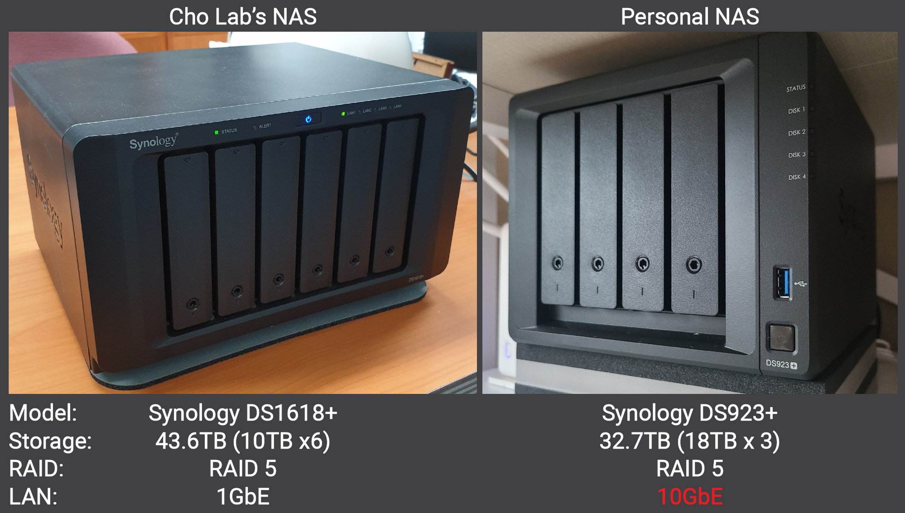
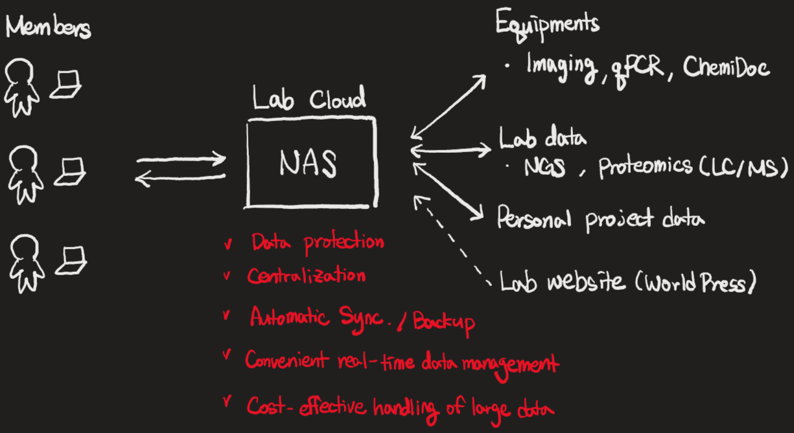

I am currently managing two NAS (Network Attached Storage) systems, one for the lab and one personal, as shown in the picture below. When I joined the current lab for my PhD degree, I persuaded my professor to establish a Lab cloud. Today I'd like to discuss the reasons behind my proposal and why I use NAS for data management.

### Reasons for Persuasion and Advantages of NAS Implementation

1. **Protection Against Sudden Hard Drive Failure:**
   In the past, my 4TB hard drive suddenly failed, requiring a $500 recovery cost. Implementing RAID protects data from unexpected hard drive failures.

2. **Prevention of Data Loss Due to Device Theft:**
   A lab member lost their personal laptop, resulting in the loss of research data. Using NAS prevents data loss from portable device theft.

3. **Centralized Data Management:**
   A large amount of lab-generated data (NGS and proteomics-related) was scattered across multiple external hard drives without any organization. Centralizing data management through NAS ensures better data organization.

4. **Unified Data Management with Automatic Synchronization/Backup:**
   Research-related data and files were managed separately on different computers with manual backups. NAS enables data management under a single system/rule through automatic synchronization and backup.

5. **Real-Time Network-Based Data Management:**
   Data generated by experimental/analytical equipment at different locations was inconveniently transferred and managed via USB. NAS allows for real-time organization and management of files in personal folders via the network, simultaneously with the analysis.

6. **Cost-Effective Handling of Large Data:**
   Web-based solutions like Google Drive are secure but expensive and slow. NAS, although relatively less secure, is better suited for handling large amounts of data.

 

### Choosing Synology for Lab and Personal Cloud Setup

When selecting the Network-Attached Storage (NAS) equipment necessary for setting up a lab cloud, hardware across manufacturers was similar, but significant price differences arose due to software differences. Synology offered optimized OS and applications for NAS, making it the preferred choice.

### Important Considerations During Initial Setup

- **Network and domain configuration**
- **Security settings:** Issuing and registering SSL certificates for HTTPS access.
- **RAID configuration:** To prevent data loss due to hard drive failure (set to RAID 5 to ensure safety even if one drive fails, at the cost of reduced usable capacity).
- **Internal data backup**
- **External access configuration**
- **Creating user accounts for lab members**
- **Assigning different access permissions to each account**
- **Structuring folders according to purpose**

### Learning from a Near Disaster

While the equipment was in use, a sudden fire in the lab nearly resulted in the total loss of the NAS. This incident highlighted the vulnerability of relying on a single NAS and the necessity of data backup across devices located in different locations for complete security. If the budget allows, additional equipment will be set up.

### Complementary Use of NAS and Google Drive

Despite the many advantages of NAS, its stability has some weak points. Therefore, I use both Google Drive (2TB) and NAS simultaneously for different purposes.

### Conclusion

My initial motivation was to enhance the convenience for lab members and prevent data loss, contributing to the lab’s overall progress. Although the first setup consumed significant time, it was a meaningful experience as I learned a lot during the process and broadened my perspective on future data management.