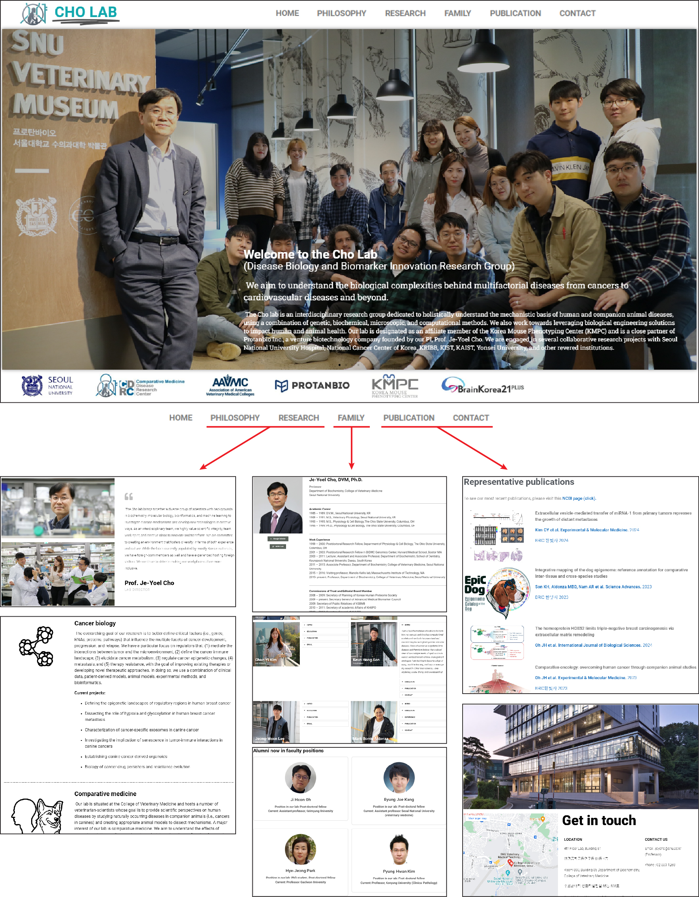
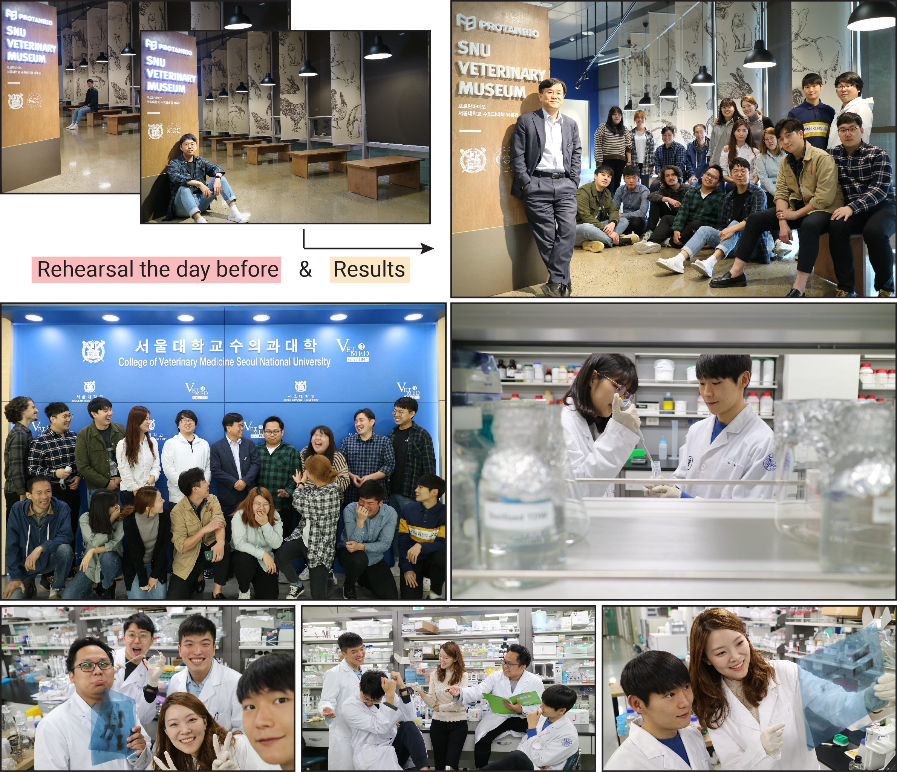
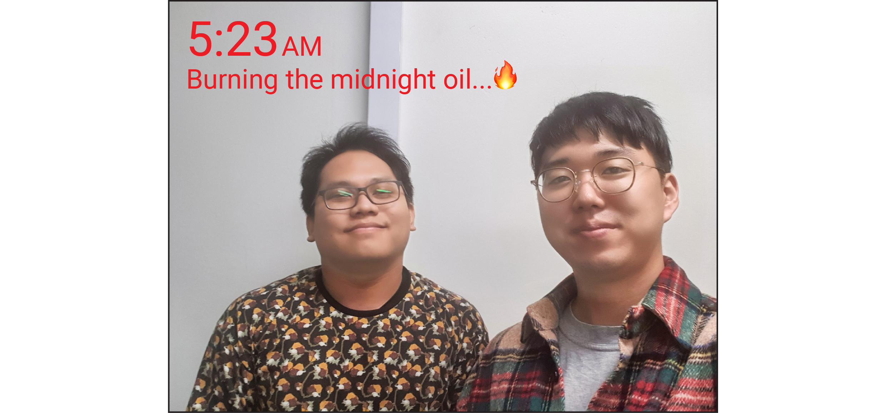
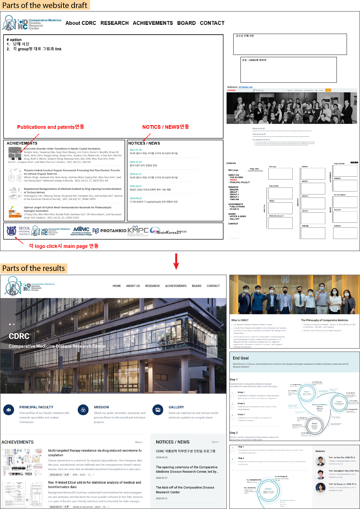
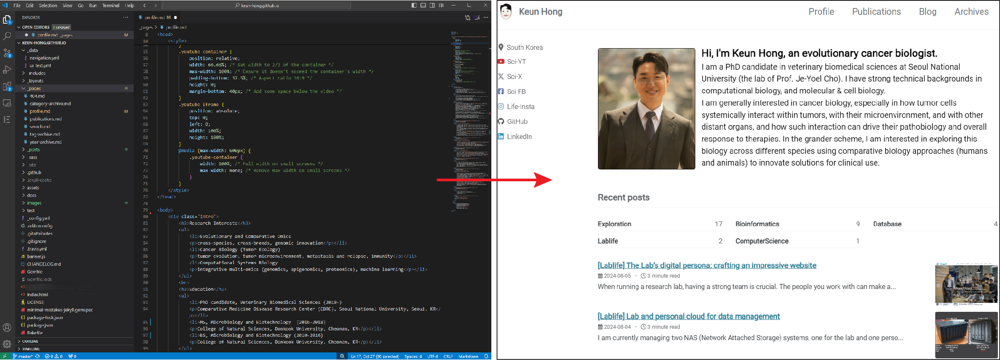

When running a research lab, having a strong team is crucial. The people you work with can make all the difference when facing challenges. This is why recruiting and nurturing the best talent is so important. So, what attracts aspiring researchers to a lab? While the PI's accomplishments are a key factor, I believe a significant part of the decision comes down to the lab's website. An impressive website not only showcases the PI's achievements but also enhances their visibility. Unfortunately, many professors underestimate the importance of their lab's online presence. A website is the lab's digital face, and it can greatly influence the lab's future.

### [1. Lab's website](https://vetbio.snu.ac.kr/)

When I first joined the lab as a Ph.D. student, the existing website was outdated and lacked appeal. Recognizing this, my research partner [Borris](https://sites.google.com/view/borrisaldonza/) and I decided to revamp it. We successfully convinced our PI that an updated and impressive website was essential for attracting new talent and showcasing our research achievements.

We spent the first week investigating and deciding on the best approach to create the new website. Here’s what we considered:

**How to create the website?**

1. **Hiring a professional service:**
   - The costs were too high compared to the expected outcome. Plus, we would still need to prepare all the content ourselves.
2. **Using CSS, HTML, and JavaScript:**
   - I had some basic knowledge, but creating a website from scratch was too challenging for us, and considering the handover, this method was not suitable.
3. **Using website creation platforms:**
   - Platforms like WordPress, Wix, and Google Sites allow you to create websites without coding knowledge. I found Google Sites to be less flexible, and <u>although WordPress had a steeper learning curve, it offered more freedom in page design. So, we chose WordPress.</u>

**Where to host the website?**

1. **WordPress hosting:**
   - This option required monthly or yearly fees, plus additional costs for the domain and SSL certificate.
2. **[Lab cloud (NAS)](https://keun-hong.github.io/lablife/nas/):**
   - Hosting on our own server eliminated server fees. The domain and SSL certificates were provided free by Seoul National University, resulting in no maintenance costs. <u>So, we decided to host the website on our NAS.</u>

After deciding on these critical aspects, we spent the next week planning the site layout and preparing necessary photos, illustrations, and content. This preparation allowed us to build the website effectively.

Through this process, Borris and I were able to complete the website in just two weeks. Convincing our PI to invest in this, collaborating with my partner to envision a future yet to be realized, and bringing that vision to life was incredibly exciting and has become another motivation in my life. Over the years, when we asked new lab members how they learned about our lab, many mentioned that the website had a significant impact on their decision. Hearing this filled me with immense pride. I couldn’t have done it alone, and for that, I am deeply grateful to Borris for his partnership and support.

---

### [2. New center's website](https://cdrc.snu.ac.kr/)

With the establishment of the Comparative Medicine Disease Research Center (CDRC), we needed to create a website. A research professor in our lab and a professor from the third division took on the task of building the website. Utilizing my previous experience, I was responsible for setting up the overall framework. Once again, I realized that while the technical aspects of creating a website are important, the most crucial element is how the content is organized and presented. Ultimately, our plan was successfully implemented into the website that was also built using WordPress.

---

### 3. Personal website

Building on my two previous website creation experiences, I decided to create my personal website, right here. The key considerations were as follows:

- Use a complimentary online repository for stable website operation
- Access to a no-cost domain and SSL certificate
- Capability to design the website with complete flexibility, even if it requires coding and has a learning curve
- Support for blog creation

Considering all these factors, <mark>GitHub Pages</mark> was the best option. For the foundation, I chose Jekyll & Minimal Mistakes, which has a large user base and well-documented resources. Initially, it took a lot of time to adapt and configure the website to meet my exact preferences. However, I am very satisfied with the outcome, as it surpasses the limitations of the WordPress method, allowing me to create exactly what I envisioned.

