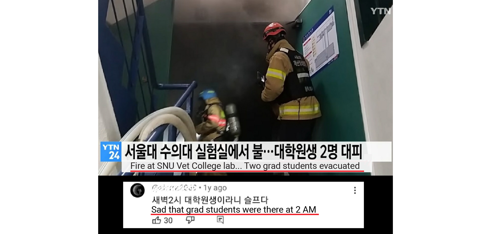

**Tuesday, April 27, 2021, 2:00 AM.** I was deeply engrossed in my analysis work in my lab, listening to music through my headset. 

### The Incident: A sudden crisis

Suddenly, I heard an uncomfortable and unfamiliar sound. I removed my headset and was immediately met with the ear-piercing sound of sirens. Startled, I rushed into the hallway and noticed thick black smoke billowing out from the shared equipment room at the end of the corridor. At the same time, I saw a lab member running towards me from the opposite direction. I quickly instructed him to call 119 for help and sprinted to grab fire extinguishers with both hands. 

However, within seconds, the smoke had thickened considerably, and sparks were flying along with visible flames inside the room. For a few seconds, I considered whether I should try to push through the smoke and attempt to extinguish the fire. But the overwhelming noise of the sirens and the thick, suffocating smoke filled me with fear. Realizing that first aid was no longer possible, I told lab member to evacuate. 

I then ran back to my desk, hastily grabbed the workstation I was working on (my data...), slung my important belongings over one shoulder, and made my way into the hallway. But to my dismay, the entire space, except for the area below my knees, was already filled with smoke. I crouched low and escaped to the first floor.

### Immediate response and damage assessment

Within less than ten minutes, dozens of fire trucks arrived, and I immediately reported the situation to my professor. Professors and key facilities staff arrived shortly after, and by 4:00 AM, the fire had been extinguished, allowing us to assess the damage. 

The scene was beyond words... utterly devastating. All the doors were broken down to check for survivors, and the windows were shattered to release the smoke. As a result, every room was filled with thick, gray ash, with ash water pooling ankle-deep on the floors. All the equipment had lost power.

### The aftermath: Saving what we could

Smoke still lingered in the air, but we knew we had to save the freezers, deep freezers, and countless samples inside. The facilities team worked tirelessly to restore electricity, and a small group of professors and students continued to work through the night, draining the thick ash water until dawn. The entire lab floor was shut down for six months due to the fire.

### Reflections: A day I will never forget

I will never forget that day. The sound of those sirens still echoes in my ears. Whenever the fire alarm sirens go off suddenly for testing, the bad memories of that day come flooding back.

### New opportunities amid challenges

The following year and a half were filled with challenges, but they also brought new opportunities. Fortunately, we secured an alternative space in the adjacent building as part of an SRC grant during that period. This incident provided us with a rare chance to overhaul the outdated systems that had become entrenched in our lab.