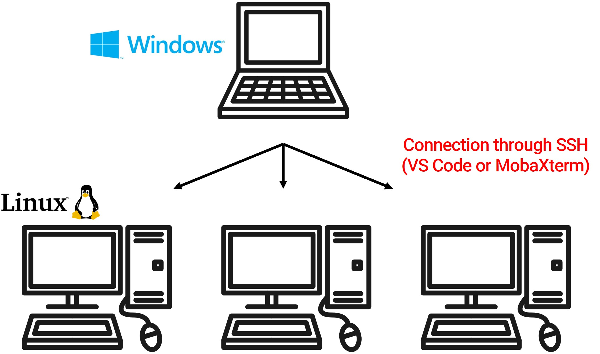

Usually, as I show below , I work using a main windows labtop connecting to several Linux workstations located each other place. But, a workstation is located in a university blocking ssh connection. 

