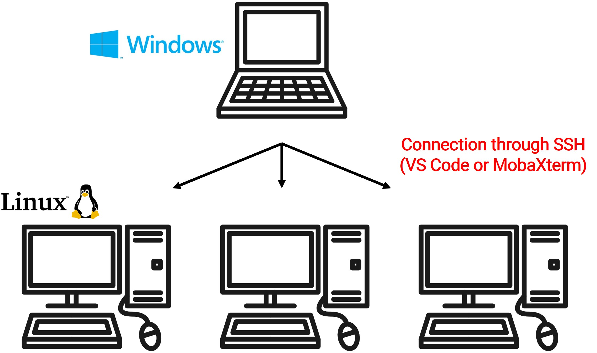
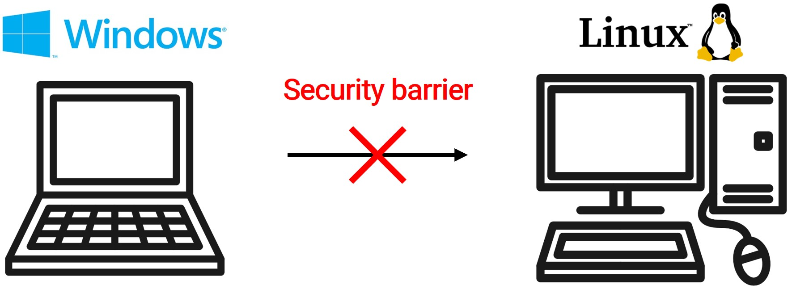
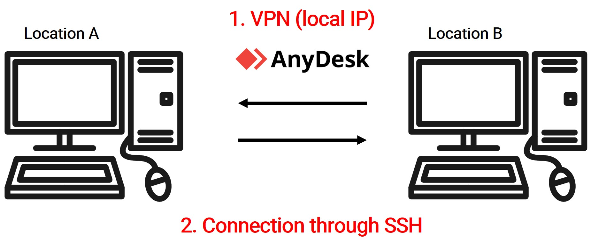
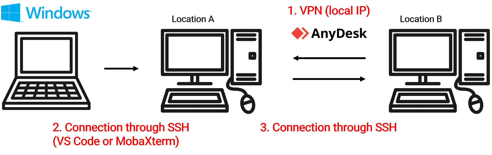
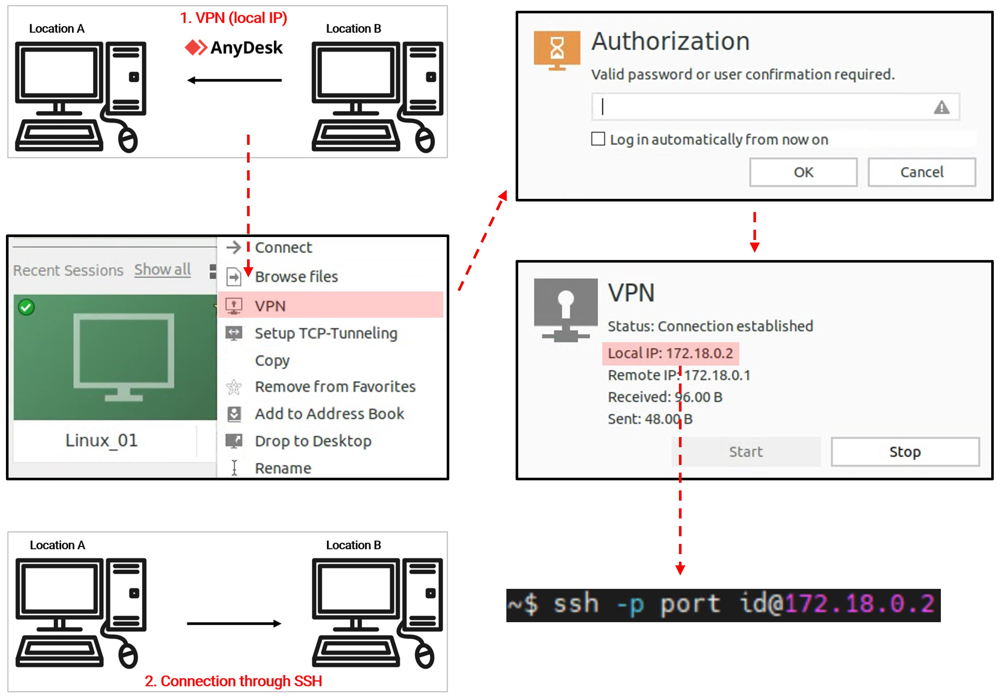

## Bridging Computers with SSH through VPN

### Problem and solution

In my line of work, my primary tool is a Windows laptop that I use to connect to several Linux workstations, each stationed in various locations. One illustration is presented below.

One particular workstation is situated in a university setting. Unfortunately, this institution has restrictions that block SSH connections—presumably for security reasons. While remote control tools like "AnyDesk" and "RustDesk" offered viable alternatives (since they operate using assigned addresses rather than IP addresses), my preference was to maintain a consistent SSH connection.

After extensive research and testing, I stumbled upon a solution. If both computers run on Linux OS (as opposed to Windows), "AnyDesk" can allocate a local IP through its VPN (Virtual Private Network) feature. Using this method, I managed to establish a bridge connection between the two Linux computers via VPN. This allowed for SSH access, just as I had hoped.

In conclusion, with the right tweaks and tools in place, I successfully created a seamless work environment. Now, I can access every workstation from a single laptop, as depicted in the initial image.

---

### Practice!!

