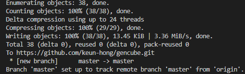

[GitHub - audreyfeldroy/cookiecutter-pypackage: Cookiecutter template for a Python package.](https://github.com/audreyfeldroy/cookiecutter-pypackage?tab=readme-ov-file)

[Cookiecutter PyPackage &#8212; cookiecutter-pypackage 0.9.0 documentation](https://cookiecutter-pypackage.readthedocs.io/en/latest/readme.html#cookiecutter-pypackage)

```bash
pip install -U cookiecutter
cookiecutter https://github.com/audreyfeldroy/cookiecutter-pypackage.git
```

License

프로젝트를 위해 적합한 라이선스를 선택하는 것은 프로젝트의 사용 범위와 공유 방식을 결정하는 중요한 과정입니다. 여기에서 언급된 라이선스 각각의 특성과 주요 내용에 대해 설명하겠습니다.

1. MIT License
   특성: 매우 자유로운 라이선스로 널리 사용되고 있습니다.
   주요 내용: MIT 라이선스를 사용하면, 사용자는 저작권 고지와 함께 소프트웨어를 자유롭게 사용, 복제, 수정, 합병, 출판, 배포, 서브라이선스 설정 및 판매할 수 있습니다. 소프트웨어를 사용하여 발생하는 모든 사고나 손해에 대해 라이선스 부여자는 책임을 지지 않습니다.
2. BSD License
   특성: BSD(Berkeley Software Distribution) 라이선스도 매우 자유로운 라이선스입니다.
   주요 내용: BSD 라이선스는 소스 코드와 바이너리 형태로 소프트웨어를 재배포할 수 있는 권한을 제공하며, 수정된 소스 코드나 파생된 작업을 동일한 라이선스로 배포할 필요가 없습니다. 사용자는 저작권 고지, 조건 목록 및 면책 조항을 포함해야 합니다. 이 라이선스는 '2-clause BSD license' 및 '3-clause BSD license'로 구분될 수 있습니다.
3. ISC License
   특성: ISC(Internet Systems Consortium) 라이선스는 MIT와 비슷한 간단하고 자유로운 라이선스입니다.
   주요 내용: ISC 라이선스는 사용자가 소프트웨어를 사용, 복사, 수정, 재배포할 수 있도록 허용하며, 원작자는 소프트웨어 사용으로 인해 발생할 수 있는 문제에 대한 책임을 지지 않습니다. 저작권 고지와 함께 사용해야 합니다.
4. Apache Software License 2.0
   특성: 기업에 친화적인 라이선스로서 특허 분쟁에 대한 보호를 제공합니다.
   주요 내용: Apache 라이선스는 사용, 복사, 수정, 재배포는 물론, 특허 라이선스도 제공합니다. 또한, 수정된 부분을 명시해야 하며, 변경된 파일에 대한 고지가 필요합니다. 이 라이선스는 사용자가 라이선스의 요구 사항을 준수하는 한 상업적 이용이 가능합니다.
5. GNU General Public License v3 (GPLv3)
   특성: 매우 엄격한 Copyleft 라이선스로, 소프트웨어의 자유를 보장하기 위해 설계되었습니다.
   주요 내용: GPL 라이선스 하에 배포된 소프트웨어는 그 소프트웨어의 모든 파생 작업이 동일한 라이선스를 따라야 합니다. 이는 소스 코드의 공개를 요구하며, 라이선스하에 제공된 소프트웨어를 사용하는 모든 사용자에게 동일한 자유를 부여합니다. 또한, 이 라이선스는 소프트웨어의 사용, 복사, 수정 및 배포를 자유롭게 할 수 있도록 합니다.
6. Not Open Source
   특성: 오픈 소스가 아닌 라이선스는 소스 코드의 공개나 자유로운 사용을 허용하지 않을 수 있습니다.
   주요 내용: 이 방식은 소프트웨어를 상업적으로 판매하거나 사용자에게 제한된 사용 권한을 부여할 때 사용됩니다. 사용자는 일반적으로 소프트웨어를 사용할 수 있는 라이선스를 구매해야 하며, 복사나 수정이 엄격하게 제한될 수 있습니다.
   각 라이선스의 선택은 프로젝트의 목적, 필요한 법적 보호, 그리고 공유하고자 하는 방식에 따라 달라질 수 있습니다. 프로젝트에 가장 적합한 라이선스를 신중하게 고려해 선택하시길 바랍니다.


# Next steps

- Create a repo and put it there.
- Add the repo to your [Travis-CI](http://travis-ci.org/) account.
- Install the dev requirements into a virtualenv. (`pip install -r requirements_dev.txt`)
- [Register](https://packaging.python.org/tutorials/packaging-projects/#uploading-the-distribution-archives) your project with PyPI.
- Run the Travis CLI command `travis encrypt --add deploy.password` to encrypt your PyPI password in Travis config and activate automated deployment on PyPI when you push a new tag to master branch.
- Add the repo to your [Read the Docs](https://readthedocs.io/) account + turn on the Read the Docs service hook.
- Release your package by pushing a new tag to master.
- Add a `requirements.txt` file that specifies the packages you will need for your project and their versions. For more info see the [pip docs for requirements files](https://pip.pypa.io/en/stable/user_guide/#requirements-files).
- Activate your project on [pyup.io](https://pyup.io/).

For more details, see the [cookiecutter-pypackage tutorial](https://cookiecutter-pypackage.readthedocs.io/en/latest/tutorial.html).

# Next stetps (details)

### 1. Create a repo and put it there.

- **What to do**: After generating your project with Cookiecutter, you need to initialize a new Git repository in your project directory. Then, upload this repository to a version control service like GitHub.
- **How to do it**:

```bash
git config user.email "thsrms9216@gmail.com" # your email address
git config --global user.name "keun-hong"    # your user name

cd gencube # your project forder
git init
git add .
git commit -m "Initial project skeleton"
git remote add origin "https://github.com/keun-hong/gencube.git"
git push -u origin master
```



Using Cookiecutter to create a Python package template is a great first step. Once you've downloaded the template from GitHub using the commands you've mentioned, the next steps involve setting up and configuring your project to make it ready for development and distribution. Here's a breakdown of each step in simpler terms to help you understand what to do next:

### 1. Create a repo and put it there.

- **What to do**: After generating your project with Cookiecutter, you need to initialize a new Git repository in your project directory. Then, upload this repository to a version control service like GitHub.

- **How to do it**:
  
  ```bash
  git config user.email "thsrms9216@gmail.com" # your user mail
  git config --global user.name "keun-hong"    # your user name
  
  cd gencube # your project name
  git init
  git add .
  git commit -m "Initial project skeleton"
  git remote add origin "https://github.com/keun-hong/gencube.git"
  git push -u origin master
  ```

### 2. Add the repo to your Travis-CI account.

- **Purpose**: Travis CI is a continuous integration service used to build and test software projects hosted on GitHub.
- **Steps**:
- Go to [Travis-CI](https://travis-ci.com/), sign in with your GitHub account.
- Find your new repository in the list of GitHub repos and activate it.

### 3. Install the dev requirements into a virtualenv.

- **Purpose**: Ensures that your development environment has all the necessary packages required for development and testing.
- **Steps**:

```bash
# 1. Create a Virtual Environment
python -m venv venv 
# 2. Activate the Virtual Environment
source venv/bin/activate  # On Windows use `venv\Scripts\activate`
# 3. Install Required Dependencies
pip install -r requirements_dev.txt
# When you want to deactivate
deactivate
```

it is highly recommended to conduct development within a virtual environment. Using a virtual environment has several significant benefits, particularly for Python development, where <mark>dependency management and project isolation are crucial</mark>. Here’s a detailed explanation of why you should use a virtual environment and the benefits it offers:

##### Why Use a Virtual Environment?

1. **Isolation**: A virtual environment keeps your project’s dependencies separate from those of other projects or from global Python packages on your system. This prevents version conflicts between packages required by different projects.

2. **Consistency**: It ensures that all developers working on the project have the same dependencies installed, which can help reduce "works on my machine" problems when multiple people are working on the same project.

3. **Control**: You have full control over the Python and package versions in your project, which makes it easier to manage dependencies and troubleshoot issues.

4. **Replicability**: It makes it easier to replicate your development environment. This is particularly important when you move from a development to a production setting, or when you are collaborating with others.

5. **Non-sudo Installations**: Since virtual environments are scoped to the user level, you do not need administrative privileges to install new packages. This is particularly useful on shared systems or systems where you do not have root access.

##### Steps to Create and Use a Virtual Environment

Here’s a quick guide on how to set up and use a virtual environment for a typical Python project:

**Step 1: Create the Virtual Environment**

- Run `python -m venv venv`. This command creates a new directory `venv` in your project folder, where it installs a local version of Python and a local version of `pip`. You can name your virtual environment directory anything you like; `venv` is just a common convention.

**Step 2: Activate the Virtual Environment**

- On Linux or macOS, use `source venv/bin/activate` to activate the virtual environment. On Windows, the command is `venv\Scripts\activate`. Activating the environment adjusts the `PATH` so that the local `python` and `pip` are used.

**Step 3: Install Dependencies**

- After activation, any Python or pip commands will use the versions in your virtual environment rather than the global versions. Now you can install dependencies specific to your project without affecting the global Python environment by using `pip install -r requirements_dev.txt`.

**Step 4: Work on Your Project**

- With the virtual environment activated, you can now run Python scripts, use the Python interactive shell, run tests, or perform any other task that requires the Python interpreter.

**Step 5: Deactivate the Environment**

- When you're done working in the virtual environment, you can deactivate it by running the `deactivate` command. This returns your shell to the normal environment, where it uses the global Python settings again.

Using a virtual environment is a best practice in Python development that helps manage project dependencies efficiently and safely, ensuring that your development environment is as clean and organized as possible.

### 4. Complete your code development.

### Recommended Development and Distribution Workflow

1. **Complete Your Code Development**
   
   - Ensure all functionalities of your tool are implemented and working as intended.
   - This includes having all necessary code for searching and downloading reference genomes, gene annotations, and NGS-based data, as described for your GenCube tool.

2. **Create and Test the Local Repository**
   
   - As described, initialize a Git repository, commit your project, and push it to GitHub. This step ensures your code is version-controlled and safely hosted online.
   - Perform thorough local testing to confirm that everything is functioning correctly.

3. **Set Up Continuous Integration (CI)**
   
   - After pushing your code to GitHub, set up Travis-CI or another CI tool to automate the testing of your code. This helps catch bugs or issues early on and ensures your code remains stable with every new commit.

4. **Prepare and Test the Environment**
   
   - Install all development requirements into a virtual environment and test the entire setup to make sure the environment has all necessary dependencies for development and testing. This ensures that other developers or users can set up a similar environment to run your project.

5. **Documentation**
   
   - Prepare comprehensive documentation for your tool. This should include installation instructions, usage examples, and configuration details. You can use tools like Sphinx and host your documentation on platforms like Read the Docs.

6. **Register with PyPI**
   
   - Once the above steps are completed, and you are confident in the stability and functionality of your software, you can proceed to register your project with PyPI. This involves setting up your `setup.py` correctly and ensuring all metadata is accurate and representative of your project.

7. **Release Your Package**
   
   - With everything set, create a release version by tagging your commit and pushing this tag to GitHub. This triggers the CI to build and deploy your package to PyPI, allowing others to easily install it via pip.

8. **Monitor and Maintain**
   
   - After your project is live, continue to monitor its usage, gather user feedback, and make necessary adjustments or improvements. Keep dependencies updated with tools like pyup.io.

### 5. Register your project with PyPI.

- **Purpose**: Allows you to distribute your package so it can be installed by others through pip.
- **Steps**: This generally involves creating an account on [PyPI](https://pypi.org/), and then registering your package using setup tools.

### 6. Encrypt your PyPI password in Travis config.

- **Purpose**: Securely stores your PyPI password for deploying your package.
- **How to do it**: Use the Travis CLI to encrypt your password and add it to the Travis configuration.

```bash
travis encrypt --add deploy.password
```

### 7. Add the repo to your Read the Docs account.

- **Purpose**: Automatically generate and host your project documentation.
- **Steps**:
  - Sign up or log in to [Read the Docs](https://readthedocs.org/).
  - Import your GitHub repository as a new project.
  - Configure it to automatically build docs when you push changes.

### 8. Release your package by pushing a new tag to master.

- **Purpose**: This is how you trigger a new build and deploy to PyPI through Travis CI.
- **Steps**:

```bash
git tag 1.0.0  # Your version number
git push origin 1.0.0
```

### 9. Add a `requirements.txt` file.

- **Purpose**: Specifies production dependencies for your project to ensure it runs everywhere consistently.
- **How to create it**: List all your dependencies and their versions in a file named `requirements.txt`.

### 10. Activate your project on pyup.io.

- **Purpose**: Keeps your dependencies secure by automatically updating them.
- **Steps**: Sign up at [pyup.io](https://pyup.io/), activate your GitHub repository, and configure settings to automate dependency updates.

By following these steps, you'll have a fully configured package ready for continuous integration, automated testing, and release management. These best practices help maintain the project easily and keep it secure and up-to-date.

# 파일에 따른 기능

각 파일은 Python 프로젝트에서 중요한 역할을 수행하며, 그 목적과 일반적으로 포함되는 내용은 다음과 같습니다:

### **\_\_init__**.py

- **목적**: 특정 디렉토리를 Python 패키지로 식별하는 데 사용됩니다. 이 파일은 디렉토리가 모듈을 포함하는 패키지의 일부임을 Python에 알리는 역할을 합니다.
- **내용**:
  - 종종 비어 있거나 최소한의 코드만 포함합니다.
  - 패키지의 초기화 코드, 패키지 레벨에서 사용될 변수들의 선언, 내부 모듈의 임포트를 정의할 수 있습니다.
  - 패키지를 임포트할 때 실행되어야 하는 코드(예: 패키지 범위의 데이터 설정 등)를 포함할 수 있습니다.

### **\_\_main___**.py

- **목적**: Python 패키지가 스크립트로 실행될 때 실행되는 코드를 담습니다. 이 파일은 패키지가 명령줄에서 직접 실행될 때 호출되는 진입점(entry point)을 제공합니다.
- **내용**:
  - 패키지가 실행될 때 필요한 메인 로직이나 실행 코드를 포함합니다.
  - `if __name__ == "__main__":` 블록을 사용하여 패키지가 직접 실행될 때만 코드가 실행되도록 합니다.
  - 사용자 인터페이스 또는 명령줄 인터페이스 초기화, 애플리케이션 로직의 시작점을 정의합니다.

### main.py

- **목적**: 프로그램의 진입점(entry point)입니다. 사용자가 프로그램을 실행할 때 가장 먼저 호출되는 스크립트입니다.
- **내용**:
  - 애플리케이션의 메인 로직이나 실행 흐름을 구성하는 코드.
  - 커맨드 라인 인터페이스(CLI) 설정이나 사용자 인터랙션을 처리하는 코드.
  - 다른 모듈(`utils.py`, `exceptions.py`, `compile.py`)에서 정의된 함수나 클래스의 호출.

### **\_\_main__**.py

- **목적**: 이 파일은 Python 패키지가 스크립트로 직접 실행될 때 작동하는 진입점(entry point)입니다. 즉, 패키지 디렉터리를 실행할 때(`python -m packagename`) `__main__.py`가 호출되어 실행됩니다.
- **특징**:
  - 패키지를 커맨드라인에서 실행 가능하게 만들고 싶을 때 사용됩니다.
  - 이 파일은 패키지의 동작을 시작하거나 패키지가 제공하는 주요 기능을 호출하는 코드를 포함합니다.
  - 대규모 프로젝트에서는 이 파일을 통해 복잡한 초기화 절차나 설정, 다양한 커맨드라인 인자 처리를 구현할 수 있습니다.

### main.py

- **목적**: 일반적으로 단독 스크립트나 애플리케이션의 주 진입점을 제공하는 파일입니다. `__main__.py`와 달리, `main.py`는 특정 패키지에 속하지 않는 독립 실행형 스크립트로 사용될 수 있습니다.
- **특징**:
  - `main.py`는 패키지의 일부가 아닐 수 있으며, 스크립트나 작은 프로그램의 메인 파일로서 사용됩니다.
  - 간단한 프로젝트나 학습 목적의 스크립트에서 주로 볼 수 있습니다.
  - 이 파일에서도 애플리케이션 로직의 시작, 설정 로딩, 사용자 입력 처리 등이 이루어집니다.

### 사용 예

- **`__main__.py` 사용**: 프로젝트 폴더가 다음과 같은 구조를 가지고 있다고 가정해 봅시다.

```markdown
mypackage/
├─ __init__.py
├─ __main__.py
├─ module1.py
└─ module2.py
```

이 경우, 다음과 같이 패키지 디렉터리를 실행할 수 있습니다:

```bash
python -m mypackage
```

- 이 명령은 `mypackage` 내의 `__main__.py` 파일을 실행합니다.

- **`main.py` 사용**: 독립 실행형 스크립트나 작은 프로젝트에서는 다음과 같이 `main.py`를 사용할 수 있습니다:
  
  ```bash
  python main.py
  ```

`__main__.py`와 `main.py` 간의 주된 차이점은 `__main__.py`가 패키지와 함께 사용되어 패키지를 스크립트처럼 실행할 수 있게 해 주는 반면, `main.py`는 보통 패키지 구조의 일부가 아니며 독립적으로 실행되는 스크립트의 진입점을 제공한다는 점입니다.

네, `__main__.py` 파일과 `main.py` 파일은 비슷해 보일 수 있지만, 그 역할과 사용 목적에 차이가 있습니다. 각 파일의 목적과 기능을 구분해 보겠습니다:

### config.py

- **목적**: 애플리케이션의 설정 변수나 환경 변수를 정의하는 데 사용됩니다. 이 파일은 실행 환경에 따라 달라질 수 있는 설정들을 중앙에서 관리할 수 있게 해 줍니다.
- **내용**:
  - 데이터베이스 설정, API 키, 애플리케이션 설정 등 환경에 따라 변할 수 있는 설정을 포함합니다.
  - 종종 외부 설정 파일에서 로드되거나 환경 변수를 읽는 코드를 포함할 수 있습니다.
  - 설정값을 변경함으로써 다른 환경(개발, 테스트, 생산 등)에서의 애플리케이션 동작을 조정할 수 있습니다.

### constants.py

- **목적**: 애플리케이션 전반에 걸쳐 고정된 값을 저장하는 데 사용됩니다. 이 값들은 애플리케이션의 실행 도중 변경되지 않으며, 여러 모듈에서 공통적으로 참조될 수 있습니다.
- **내용**:
  - 숫자 상수, 문자열 상수, 파일 경로 등 변경되지 않는 데이터를 포함합니다.
  - 애플리케이션 내에서 반복적으로 사용되는 값을 중앙에서 관리함으로써 코드의 유지보수를 쉽게 합니다.

이 파일들은 모두 프로젝트의 구조를 명확하게 하고, 코드의 관리 및 유지보수를 용이하게 하는 데 중요한 역할을 합니다. 이러한 파일 구조를 사용함으로써, 프로젝트의 확장성과 이식성을 향상시킬 수 있습니다.

각각의 파일 이름은 특정한 목적을 암시하고 있으며, 파이썬 프로젝트에서 흔히 볼 수 있는 구조입니다. 이 파일들에는 다음과 같은 내용이 들어가는 것이 일반적입니다:

### 

### utils.py

- **목적**: 공통 유틸리티 함수나 헬퍼(helper) 함수를 정의합니다. 이러한 함수들은 애플리케이션 전반에 걸쳐 재사용될 수 있습니다.
- **내용**:
  - 데이터 처리, 문자열 조작, 파일 입출력 등의 반복적인 작업을 위한 함수.
  - 프로젝트에서 공통적으로 사용되는 유틸리티 클래스나 도우미 함수.
  - 범용적으로 사용될 수 있는 기능들이 모여있습니다.

### exceptions.py

- **목적**: 애플리케이션 특정의 예외를 정의합니다. 이를 통해 코드에서 발생할 수 있는 예외적인 상황을 관리하고 명확히 할 수 있습니다.
- **내용**:
  - `Exception` 클래스를 상속받아 사용자 정의 예외 클래스를 만듭니다.
  - 예외 처리 로직을 개선하고, 에러 메시지를 명확하게 하기 위한 구조를 제공합니다.
  - 애플리케이션의 다양한 부분에서 발생할 수 있는 특정 에러를 포착하고 처리하기 위해 사용됩니다.

### compile.py

- **목적**: 이 파일의 이름은 애플리케이션 내에서 컴파일 또는 변환 작업을 수행하는 코드를 포함하고 있다는 것을 암시합니다.
- **내용**:
  - 소스 코드나 데이터를 다른 형태로 변환하는 함수나 클래스를 포함할 수 있습니다.
  - 예를 들어, 언어 컴파일러, 데이터 변환 스크립트 또는 빌드 스크립트 등이 여기에 해당될 수 있습니다.
  - 특정 언어나 플랫폼에 대한 컴파일 과정을 자동화하거나, 대규모 데이터를 처리하고 컴파일하는 작업 등을 포함할 수 있습니다.

이러한 파일들은 프로젝트의 규모와 복잡성에 따라 내용이 달라질 수 있으며, 프로젝트의 요구사항과 개발자의 의도에 맞춰 구조와 내용을 결정할 수 있습니다.

### setup.py

- **목적**: Python 패키지를 설치하고 배포할 때 필요한 설정을 정의합니다. `setuptools` 라이브러리를 사용하여 패키지의 메타데이터, 종속성 정보, 스크립트 등을 설정합니다.
- **특징**:
  - 패키지를 PyPI와 같은 패키지 저장소에 배포할 때 중요합니다.
  - 사용자가 패키지를 쉽게 설치할 수 있도록 `pip install`과 연동됩니다.

### requirements.txt

- **목적**: 프로젝트를 실행하는 데 필요한 외부 패키지의 목록을 제공합니다. 이 파일은 주로 `pip install -r requirements.txt` 명령을 통해 모든 종속성을 한 번에 설치할 수 있도록 합니다.
- **특징**:
  - 프로젝트의 종속성 관리를 단순화합니다.
  - 다양한 개발 환경에서 프로젝트의 일관된 설정을 보장합니다.

### .gitignore

- **목적**: Git 버전 관리 시스템에서 추적하지 않아야 할 파일 및 디렉터리 목록을 지정합니다.
- **특징**:
  - 민감한 정보, 로그 파일, 바이너리 파일, 개발 도구 설정 파일 등을 포함할 수 있습니다.
  - 깔끔한 저장소 유지와 불필요한 파일의 추적을 방지합니다.

### Dockerfile

- **목적**: Docker 컨테이너 내에서 애플리케이션을 실행하기 위한 환경을 구축합니다. Dockerfile은 운영 체제, 필요한 소프트웨어 및 라이브러리, 실행 명령 등을 정의합니다.
- **특징**:
  - 환경 일관성 및 이식성을 제공합니다.
  - 배포 및 테스팅 과정을 표준화합니다.

### .travis.yml 또는 .github/workflows

- **목적**: Travis CI, GitHub Actions와 같은 CI/CD(Continuous Integration/Continuous Deployment) 플랫폼을 사용하여 코드 통합, 빌드, 테스트, 배포 과정을 자동화합니다.
- **특징**:
  - 개발 과정에서 발생할 수 있는 오류를 조기에 발견하고 해결합니다.
  - 푸시 또는 풀 리퀘스트 시 자동으로 테스트와 빌드를 실행합니다.

### LICENSE

- **목적**: 프로젝트의 라이선스를 명시합니다. 이는 다른 사람들이 프로젝트를 어떻게 사용할 수 있는지 법적인 조건을 정의합니다.
- **특징**:
  - 오픈 소스 라이선스(예: MIT, GPL) 또는 상용 라이선스를 사용할 수 있습니다.
  - 프로젝트의 저작권 정보 및 사용 권한을 명확히 합니다.

이 외에도 각 프로젝트의 성격과 필요에 따라 다양한 구성 파일과 스크립트 파일들이 사용될 수 있습니다. 이러한 파일들을 적절히 관리하고 구성하는 것은 프로

# Bioconda

To distribute your package through Bioconda, you'll need to follow the specific guidelines and processes set by the Bioconda project. Here's a step-by-step guide to help you get your package into Bioconda:

### 1. Fork and Clone the Bioconda Recipes Repository

First, fork the [bioconda/bioconda-recipes](https://github.com/bioconda/bioconda-recipes) repository on GitHub, and then clone your fork to your local machine:

```bash
git clone https://github.com/<your-username>/bioconda-recipes.git
cd bioconda-recipes
```

Replace `<your-username>` with your GitHub username.

### 2. Set Up the Bioconda Environment

Bioconda has a specific environment setup to ensure consistency across builds. You need to set up this environment:

```bash
conda create -n bioconda python=3.8
conda activate bioconda
conda install -c conda-forge -c bioconda bioconda-utils
```

### 3. Create a Recipe for Your Package

Navigate to the `recipes` directory and create a new directory for your package:

```bash
cd recipes
mkdir gencube
cd gencube
```

Create a `meta.yaml` file with the following content:

```yaml


package:
  name: "gencube"
  version: "{{ version }}"

source:
  url: https://files.pythonhosted.org/packages/13/af/3d1d8c464a73057afe1835e9b7294c971f71e0959a076203e8cca1205830/gencube-{{ version }}.tar.gz
  sha256: <put_the_correct_sha256_here>

build:
  noarch: python
  number: 0

requirements:
  host:
    - python >=3.6
    - pip
  run:
    - python >=3.6
    - biopython >=1.79
    - pandas >=1.0.0
    - numpy >=1.21.0,<2
    - requests >=2.25.1
    - urllib3 >=1.26.5
    - xmltodict >=0.12.0
    - beautifulsoup4 >=4.9.3
    - tqdm >=4.61.2
    - tabulate >=0.8.9

test:
  imports:
    - gencube
  commands:
    - gencube --help  # Replace this with an actual command to test your tool

about:
  home: "https://keun-hong.github.io/"
  license: "MIT"
  license_file: "LICENSE"
  summary: "GenCube enables researchers to search for, download, and unify genome assemblies and diverse types of annotations, and retrieve metadata for sequencing-based experimental data suitable for specific requirements."
  description: |
    GenCube enables researchers to search for, download, and unify genome assemblies and diverse types of annotations, and retrieve metadata for sequencing-based experimental data suitable for specific requirements.
  dev_url: "https://github.com/keun-hong/gencube"
  doc_url: "https://github.com/keun-hong/gencube"
  doc_source_url: "https://github.com/keun-hong/gencube"
  license_family: "MIT"
  license_file: "LICENSE"

extra:
  recipe-maintainers:
    - "keunhongson"
  identifiers:
    - biotools:gencube
  edam:
    topic: Data_Handling
    operation: Data_Handling
andling
    operation: Data_Handling
```

Replace `<put_the_correct_sha256_here>` with the SHA256 checksum of your tarball. You can get the checksum using:

```bash
wget https://files.pythonhosted.org/packages/13/af/3d1d8c464a73057afe1835e9b7294c971f71e0959a076203e8cca1205830/gencube-0.9.1.tar.gz
sha256sum gencube-0.9.1.tar.gz
```

### 4. Test Your Recipe

Before submitting your recipe, you should test it locally:

```bash
bioconda-utils build recipes config.yml --packages gencube
```

### 5. Commit and Push Your Changes

Add, commit, and push your changes to your forked repository:

```bash
git add recipes/gencube
git commit -m "Add gencube recipe"
git push origin master
```

### 6. Create a Pull Request

Go to the original [bioconda/bioconda-recipes](https://github.com/bioconda/bioconda-recipes) repository and create a pull request from your fork.

### 7. Follow Up

Bioconda maintainers will review your pull request. They may suggest changes or improvements. Be sure to respond to their comments and make any necessary adjustments.

### Example Command Sequence

```bash
# Fork and clone the bioconda-recipes repository
git clone https://github.com/<your-username>/bioconda-recipes.git
cd bioconda-recipes

# Set up the bioconda environment
conda create -n bioconda python=3.8
conda activate bioconda
conda install -c conda-forge -c bioconda bioconda-utils

# Create a recipe for gencube
cd recipes
mkdir gencube
cd gencube

# Create the meta.yaml file
nano meta.yaml
# (Copy the provided meta.yaml content into this file)

# Test the recipe
bioconda-utils build recipes config.yml --packages gencube

# Commit and push your changes
git add recipes/gencube
git commit -m "Add gencube recipe"
git push origin master

# Create a pull request on GitHub
# (Go to your fork and create a pull request to the bioconda/bioconda-recipes repository)
```

By following these steps, you can get your package added to Bioconda, making it available for installation using `conda`. If you encounter any issues or have further questions, feel free to ask!


Update -> git pull origin main